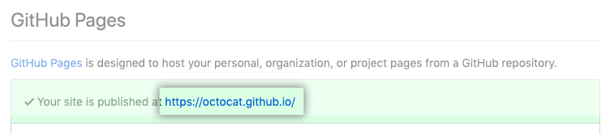

# 如何使用 GitHub Pages 预览 HTML

!!! quote "[GitHub帮助](https://help.github.com/cn/github/working-with-github-pages/creating-a-github-pages-site)"

> GitHub Pages 是一项静态站点托管服务，在上面可以预览HTML页面。

## 步骤

1. 新建仓库，如果您创建的是用户或组织站点，仓库名称必须为 <user\>.github.io 或 <organization\>.github.io。
2. 上传代码到该仓库。
2. 在仓库名称下，单击Settings（设置）。
3. 在“GitHub Pages”下，使用 Source（源）下拉菜单选择发布源（如master branch）。
4. 要查看您已发布的站点，请在“GitHub Pages”下点击您的站点 URL。

