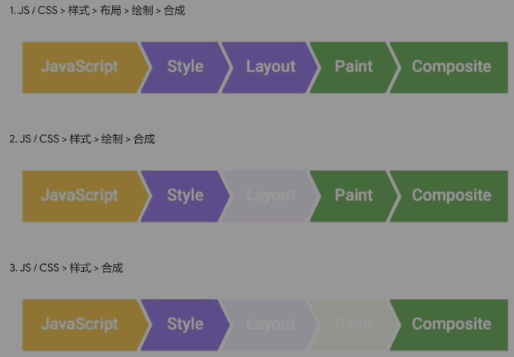

# CSS 知识总结

## 1. 浏览器渲染原理

* 浏览器渲染过程

    1. 根据 HTML 构建 HTML 树 (DOM)
    2. 根据 CSS 构建 CSS 树 (CSSOM)
    3. 将两棵树合并成一棵渲染树 (render tree)
    4. Layout 布局 (文档流、盒模型、计算大小和位置)
    5. Paint 绘制 (把边框颜色、文字颜色、阴影等画出来)
    6. Composite 合成 (根据层叠关系展示画面)

* 如何更新样式

    * 一般我们用 JS 来更新样式
  
        * 比如 div.style.background = 'red'
        * 比如 div.style.display = 'none'
        * 比如 div.classList.add('red')
        * 比如 div.remove() 直接删掉节点

    * 这些方法有什么不同吗

        * 有三种不同的渲染方式 

            
            
            > * 第一种，如 div.remove()
            >
            > * 第二种，如 div.style.background = 'red'
            >
            > * 第三种，如 div.style.transform = 'translateX(100px)'

## 2. CSS 动画的两种做法（transition 和 animation）

1. transition

        transition: all 1s linear;

        #demo.end {
          transform: translateX(200px);
        }

2. animation

        animation: 1s heart infinite alternate-reverse;

        @keyframes heart {
          0% {
            transform: scale(1) rotate(-45deg);
          }
          100% {
            transform: scale(1.2) rotate(-45deg);
          }
        }

