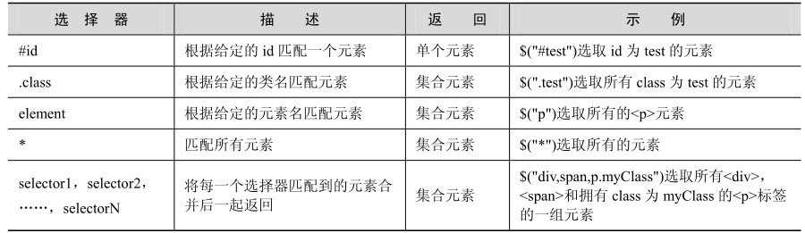
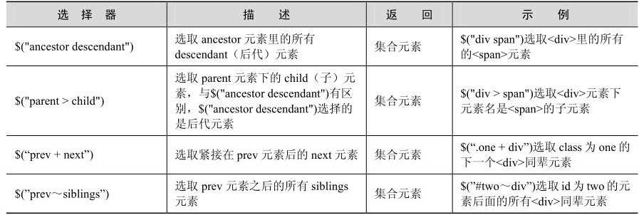
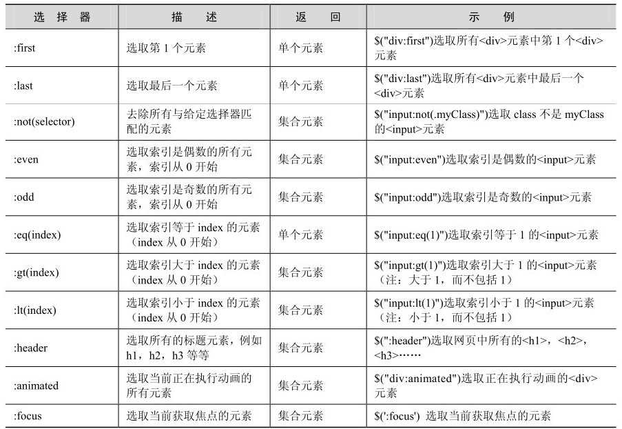
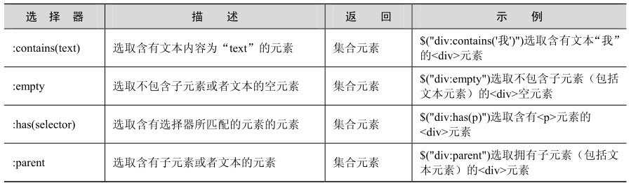
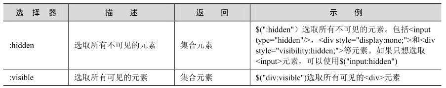
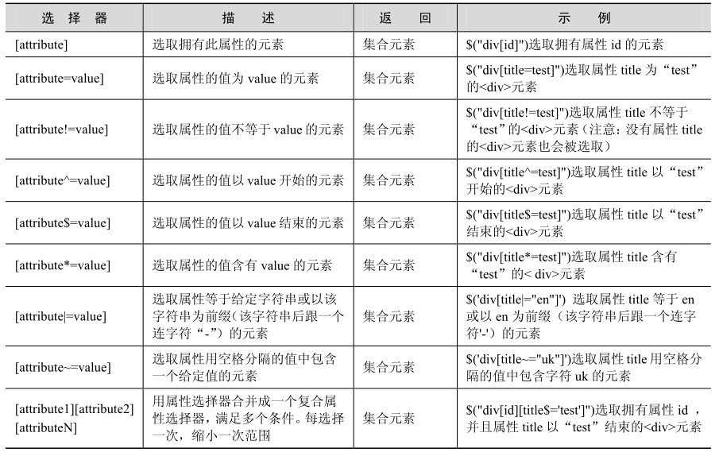
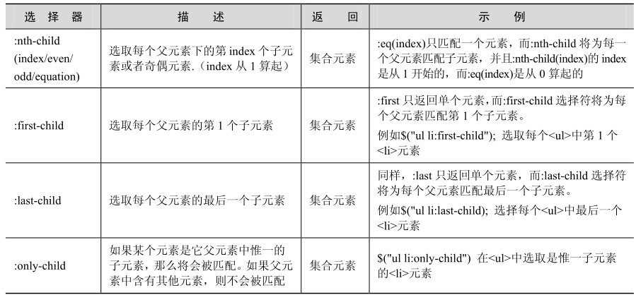
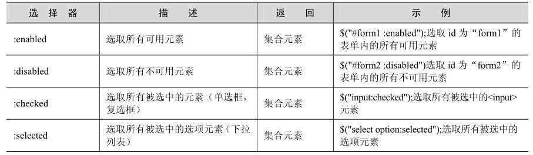
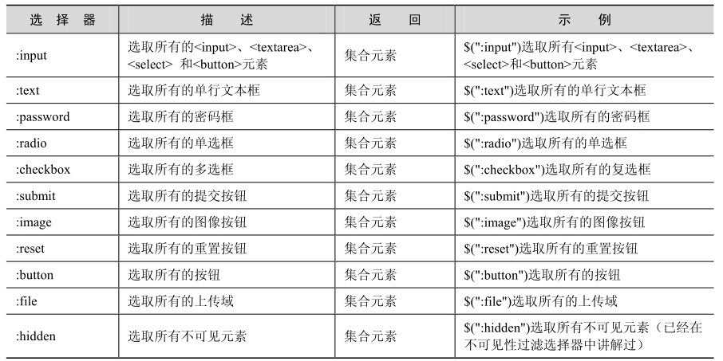
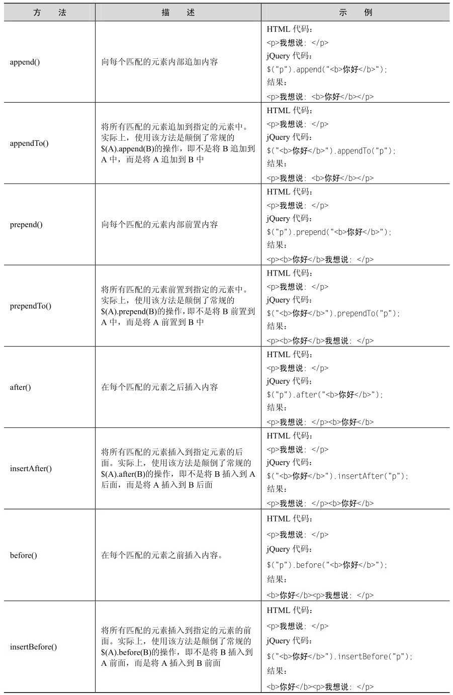

## 1 认识 jQuery

??? note "JavaScript 自身存在 3个弊端"

    * 即复杂的文档对象模型（DOM）、
    * 不一致的浏览器实现和便捷的开发、
    * 调试工具的缺乏。

??? note "jQuery 的优势"

    1. 轻量级
    2. 强大的选择器
    3. 出色的 DOM 操作的封装
    4. 可靠的事件处理机制

        > jQuery 的事件处理机制吸收了 JavaScript 专家 Dean Edwards 编写的事件处理函数的精华，使得 jQuery 在处理事件绑定的时候相当可靠。在预留退路（graceful degradation）、循序渐进以及非入侵式（Unobtrusive）编程思想方面，jQuery 也做得非常不错。

    5. 完善的 Ajax
    6. 不污染顶级变量

        > jQuery 只建立一个名为 jQuery 的对象，其所有的函数方法都在这个对象之下。其别名 $ 也可以随时交出控制权，绝对不会污染其他的对象。该特性使 jQuery 可以与其他 JavaScript 库共存，在项目中放心地引用而不需要考虑到后期可能的冲突。

    7. 出色的浏览器兼容性
    8. 链式操作方式
    9. 隐式迭代

        > 当用 jQuery 找到带有 “.myClass” 类的全部元素，然后隐藏它们时，无需循环遍历每一个返回的元素。相反，jQuery 里的方法都被设计成自动操作对象集合，而不是单独的对象，这使得大量的循环结构变得不再必要，从而大幅地减少了代码量。

    10. 行为层与结构层的分离
    11. 丰富的插件支持

* window.onload 与 $(document).ready() 的对比

??? note "jQuery 对象 和 DOM 对象"

    1. DOM 对象

        可以通过 JavaScript 中的 getElementsByTagName 或者 getElementById 来获取元素节点。
        
        像这样得到的 DOM 元素就是 DOM 对象。

        ``` javascript
        let variable = DOM 对象;
        ```

    2. jQuery 对象

        jQuery 对象就是通过 jQuery 包装 DOM 对象后产生的对象。

        ``` javascript
        let $variable = jQuery 对象;
        ```

??? note "jQurey 对象和 DOM 对象的相互转换"

    1．jQuery 对象转成 DOM 对象

        两种方法：即 [index] 和 get(index) 。

    2．DOM 对象转成 jQuery 对象

        $(DOM对象)


## 2 jQuery 选择器

??? info

    选择器是 jQuery 的根基，在 jQuery 中，对事件处理、遍历 DOM 和 Ajax 操作都依赖于选择器。如果能熟练地使用选择器，不仅能简化代码，而且可以达到事半功倍的效果。

??? abstract "jQuery 选择器的优势"

    ??? note "1．简洁的写法"

        $("#ID") 用来代替 document.getElementById() 函数，即通过 ID 获取元素；
        
        $("tagName") 用来代替 document.getElementsByTagName() 函数，即通过标签名获取 HTML 元素

    ??? note "2. 完善的处理机制"

        即使用 jQuery 获取网页中不存在的元素也不会报错

        需要注意的是，$('#tt') 获取的永远是对象，即使网页上没有此元素。

        因此当要用 jQuery 检查某个元素在网页上是否存在时，不能使用以下代码：

        ``` javascript
        if ( $("#tt") ) {
            // do something
        }
        ```
    
        而应该根据获取到元素的长度来判断:

        ``` javascript
        if ( $("#tt").length > 0 ) {
            // do something
        }
        ```
    
        或者转化成 DOM 对象来判断:

        ``` javascript
        if ( $("#tt")[0] ) {
            // do something
        }
        ```

??? abstract "Selectors (选择器)"

    ??? note "1. Basic (基础选择器)"

        

    ??? note "2. Hierarchy (层级)"

        

        在层次选择器中，第1个和第2个选择器比较常用，而后面两个因为在 jQuery 里可以用更加简单的方法代替，所以使用的几率相对少些。

        $(".one + div"); 等价于 $(".one").next("div");

        $("#prev~div"); 等价于 $("#prev").nextAll("div");

    ??? note "3. 过滤"

        1. 基础过滤

            

        2. 内容过滤

            

        3. 可见性过滤

            

        4. 属性过滤

            

        5. 子元素过滤

            

    ??? note "4. 表单"

        
        


??? abstract "选择器中的一些注意事项"

    ??? note "1. 选择器中含有特殊符号的注意事项"

        选择器中含有 “·” , “#” , “(” 或 “]” 等特殊字符

            ``` javascript
            $("#id\\#b");
            $("#id\\[1\\]");
            ```

    ??? note "2. 选择器中含有空格的注意事项"

            ``` javascript
            // 选取 class 为 "test" 的元素里的隐藏元素
        	var $t_a = $('.test :hidden');
            // 选取 隐藏的 class 为 "test" 的元素
		    var $t_b = $('.test:hidden');
            ```

            后代选择器 和 过滤选择器 的不同


## 3 jQuery 中的 DOM 操作

??? note "根据 W3C DOM 规范（http://www.w3.org/DOM），DOM 是一种与浏览器、平台、语言无关的接口，使用该接口可以轻松地访问页面中所有的标准组件。"

    简单来说，DOM 解决了 Netscape 的 JavaScript 和 Microsoft 的 JScript 之间的冲突，给予了 Web 设计师和开发者一套标准的方法，让他们能够轻松获取和操作网页中的数据、脚本和表现层对象。

??? abstract "DOM 操作的分类"

    一般来说，DOM 操作分为 3 个方面，即 DOM Core（核心）、HTML-DOM 和 CSS-DOM。

    ??? note "1．DOM Core"

        DOM Core 并不专属于 JavaScript，任何一种支持 DOM 的程序设计语言都可以使用它。它的用途并非仅限于处理网页，也可以用来处理任何一种使用标记语言编写出来的文档，例如 XML。
        
        JavaScript 中的 getElmentById()、getElementsByTagName()、getAttribute() 和 setAttribute() 等方法，这些都是 DOM Core 的组成部分。

        ``` javascript
        // 使用 DOM Core 来获取表单对象的方法
        document.getElementsByTagName("form");
        ```

        ``` javascript
        // 使用 DOM Core 来获取某元素的 src 属性的方法
        element.getAttribute("src");
        ```

    ??? note "2．HTML-DOM"

        在使用 JavaScript 和 DOM 为 HTML 文件编写脚本时，有许多专属于 HTML-DOM 的属性。HTML-DOM 的出现甚至比 DOM Core 还要早，它提供了一些更简明的记号来描述各种 HTML 元素的属性。

        ``` javascript
        // 使用 HTML-DOM 来获取表单对象的方法
        document.forms
        ```

        ``` javascript
        // 使用 HTML-DOM 来获取某元素的 src 属性的方法
        element.src;
        ```

        通过上面所说的方法，可以发现获取某些对象、属性既可以用 DOM Core 来实现，也可以使用 HTML-DOM 实现。相比较而言 HTML-DOM 的代码通常比较简短，不过它只能用来处理 Web 文档。

    ??? note "3．CSS-DOM"

        CSS-DOM 是针对 CSS 的操作。在 JavaScript 中，CSS-DOM 技术的主要作用是获取和设置 style 对象的各种属性。通过改变 style 对象的各种属性，可以使网页呈现出各种不同的效果。

        ``` javascript
        // 设置某元素 style 对象字体颜色的方法
        element.style.color = "red";
        ```

??? abstract "jQuery 中的 DOM 操作"

    ??? note "查找节点属性 attr()"

    当创建单个元素时，要注意闭合标签和使用标准的 XHTML 格式。例如创建一个 `<p>` 元素，可以用 `$("<p/>")` 或者 `$("<p></p>")`，但不要使用 `$("<p>")` 或者大写的 `$("<P/>")`。

    ??? note "插入节点"

        这些插入节点的方法不仅能将新创建的 DOM 元素插入到文档中，也能对原有的 DOM 元素进行移动。

        

    ??? note "删除节点"

        jQuery 提供了三种删除节点的方法，即 remove()，detach() 和 empty() 。

        1. remove() 方法作用是从 DOM 中删除所有匹配的元素，传入的参数用于根据 jQuery 表达式来筛选元素。

            当某个节点用 remove() 方法删除后，该节点所包含的所有后代节点将同时被删除。这个方法的返回值是一个指向已被删除的节点的引用，因此可以在以后再使用这些元素。

        2. detach() 和 remove() 一样，也是从 DOM 中去掉所有匹配的元素。但需要注意的是，这个方法不会把匹配的元素从 jQuery 对象中删除，因而可以在将来再使用这些匹配的元素。与 remove() 不同的是，所有绑定的事件、附加的数据等都会保留下来。

        3. 严格来讲，empty() 方法并不是删除节点，而是清空节点，它能清空元素中的所有后代节点

    !!! note "复制节点 clone()"

    ??? note "替换节点"

        replaceWith() 和 replaceAll()

        * replaceWith() 方法的作用是将所有匹配的元素都替换成指定的 HTML 或者 DOM 元素。
        * replaceAll() 方法与 replaceWith() 方法的作用相同，只是颠倒了 replaceWith() 操作

        注意：如果在替换之前，已经为元素绑定事件，替换后原先绑定的事件将会与被替换的元素一起消失，需要在新元素上重新绑定事件。

    ??? note "包裹节点 wrap()"

        ``` javascript
        $("strong").wrap("<b></b>");
        ```

        其他两个方法，即 wrapAll() 和 wrapInner() 。

        1. wrapAll() 方法会将所有匹配的元素用一个元素来包裹。

            注意：如果被包裹的多个元素间有其它元素，其它元素会被放到包裹元素之后。

        2. wrapInner() 方法将每一个匹配的元素的子内容（包括文本节点）用其他结构化的标记包裹起来。


