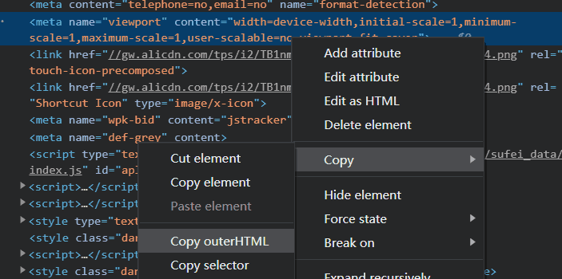

??? note "其他"

    * 箭头函数不支持 this
    * JS 操作 DOM 很慢，因为是跨线程交流。不要频繁地操作 DOM
    
    * [JS 支持 鼠标](https://stackoverflow.com/questions/21054126/how-to-detect-if-a-device-has-mouse-support)
    * [JS 支持 触摸 1](https://stackoverflow.com/questions/3974827/detecting-touch-screen-devices-with-javascript)
    * [JS 支持 触摸 2](https://stackoverflow.com/questions/4817029/whats-the-best-way-to-detect-a-touch-screen-device-using-javascript)
    * [Use Cmder Embedded Git in VSCode](https://github.com/cmderdev/cmder/wiki/Seamless-VS-Code-Integration#use-cmder-embedded-git-in-vscode)
    
    * 正则表达式：\\[\d+\\]
    * setTimeout mdn
    
    * google 搜索：chrome 远程调试 -csdn
    
    * 加样式不如加类，因为类里可以有很多样式
    
    * \#demo .end 
      
        > 表示 demo 后代里的 .end
    
    * \#demo.end
    
        > 表示 demo 拥有 end 的时候
    
    * CSS学习方法同[HTML](3.md#1-html)
    
    * hosts 文件在哪？
    
        > C:\Windows\System32\drivers\etc\hosts
        >
        > /etc/hosts (macOS / Linux)
    
    * `$ hs -c-1 -p 1234`
    * `$ apt-get update`
    * button:hover 展示
      
        > :hov -> 选中 :hover

??? note "tldr"

    ```
    $ npm i -g tldr
    $ yarn global add tldr
    ```

??? note "shebang"

    如果你加了shebang，删掉sh也能执行

??? note "会动的简历"

    ```
    $ yarn global add parcel
    $ yarn global add parcel@1.12.3     // 指定版本
    ```

    ```
    > string[0].charCodeAt()
    < 10
    ```

    !!! note "背景渐变"

        google: css gradient background generator

    * google: js 设置滚动条
    * google: js 设置换行
    * google: html meta viewport 例子

        


??? note "程序员三大难题"

    1. 要不要加 1 (1 offset problem)
    2. 怎么命名 (naming problem)
    3. 缓存失效 (cache problem)

??? note "程序员戒律"

    * 永远不要相信人类
    * 使用最没有歧义的写法

??? abstract "emmet: table + tab"

    !!! note "p{$}*30 + Tab"
    !!! note "div>div>div>div (内嵌)"
    ??? note "div>button{click $}*100"

        ``` html
        <button>click 1</button>
        <button>click 2</button>
        <button>click 3</button>
        <button>click 4</button>
        ...
        <button>click 100</button>
        ```

    ??? note "div{child$}.child*3"

        ``` html
        <div class="child">child1</div>
        <div class="child">child2</div>
        <div class="child">child3</div>
        ```

    ??? note ".content-box"

        ``` html
        <div class="content-box">
        ```

    ??? note ".images*4"

        ``` html
        <div class="images"></div>
        ```

    ??? note ".a+.b+.c+.d+.e"

        ``` html
        <div class="a"></div>
        <div class="b"></div>
        <div class="c"></div>
        <div class="d"></div>
        <div class="e"></div>
        ```

    ??? note "#screen"

        ``` html
        <div id="screen"></div>
        ```

    ??? note "o:h" 

        ``` css
        overflow: hidden;
        ```

    !!! note "span{第$个span元素}*8"
    !!! note "span.ib{第$个inline-block元素}*8"
    ??? note "bg"
 
        ``` css
        background: #000;
        ```

    ??? note "内嵌"

        1. 多行选中,
        2. 搜emmet wrap 个别,
        3. `div* 或 ul>li*`
    ```

??? note "css参数调节：alt + up / down"

    每次增加/减少 0.1


??? note "鼠标放到数字上，再按 Up/Dn 可以调大小"

    > Shift + Up/Dn 每次变10像素
    >
    > 


??? note "完整的 meta:vp"

    > 修改 vscode 默认生成的 meta:vp
    >
    > [英文教程](https://code.visualstudio.com/docs/editor/emmet#_using-custom-emmet-snippets)

    ``` html
    <meta name="viewport" content="width=device-width, initial-scale=1.0, minimum-scale=1.0, maximum-scale=1.0, user-scalable=no">
    ```

??? note "用 wifi 调试手机"

    > Android 必须与电脑是同 IP 段，即在同一个局域网才可以访问。

    1. 电脑开 wifi
    2. cmder 中输入 ipconfig，  

        > 找到电脑开的 wifi 的 ip 地址，  
        >
        > 我的是无线局域网适配器（本地连接\* 12）下面的两个 IPv4 地址，两个都可以用

    3. 手机地址栏输入"pc 的 ip:端口号/..."就能访问到页面了


!!! note "方方邮箱：<fangyinghang@foxmail.com>"

* [typora支持图床](https://zhuanlan.zhihu.com/p/137310314)

* [打字训练](https://dytiger.github.io/index.html)

??? note "脑图："	  

    * 请使用 Mindjet MindManager 打开
    * 另外推荐一款脑图工具 XMind Zen，可以无限期试用。
    * Mindjet 和 XMind 用来做脑图都不错。

??? note "JSBin, js.jirengu.com"

    > JSHint取消

* 代码沙盒：codesandbox.io
* stackblitz


!!! note "WWW = URL + HTTP + HTML"

??? note "制作出网页需要的知识："

    * 域名知识
	* HTTP服务器知识
	* HTML知识
	* 其他