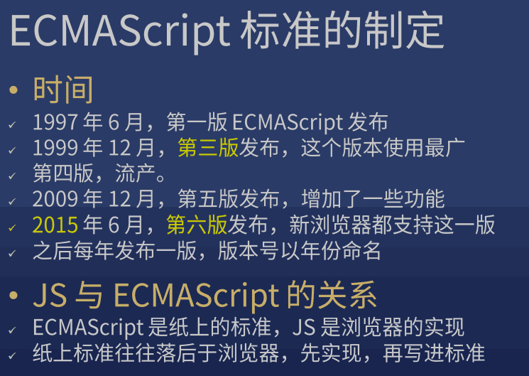
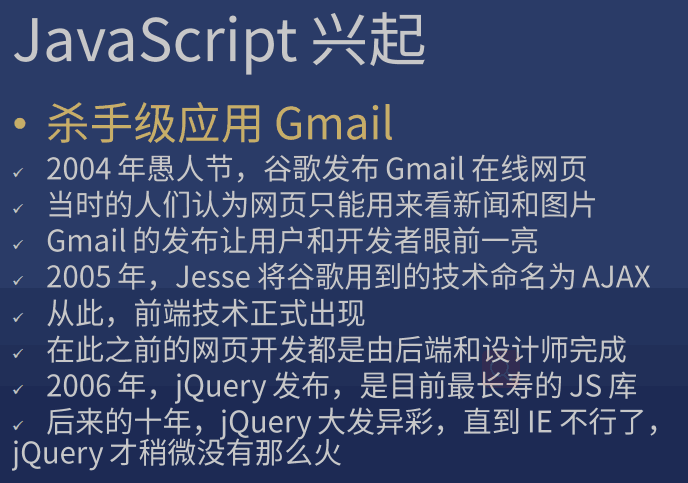
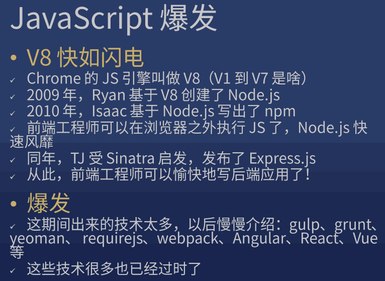

## 1. 目标

* JS 概览

## 2. 主体

* 软要求
  
    1. 逻辑能力
    2. 质疑自己的能力
    3. 抽象思维 (高级程序员必备的能力)

        > 

* 硬要求 (客观上的要求)

    1. 足够的代码量
   
        > 新手：达到 1000 行
        >
        > 熟手：达到 10000 行
        >
        > 专业选手：达到 50000 行

            yarn global add cloc
            cloc --vcs=git .
            // 可以用来统计一个仓库里的有效代码
            // 不相关内容写入 .gitignore

    2. 了解足够多的概念

        > 不仅要会写，还要会说

        * 常用常考

            * 闭包、原型
            * 类、继承
            * MVC、Flux
            * 高阶函数
            * 前端工程化 

    3. 有足够的踩坑经验

* javascript 概述

