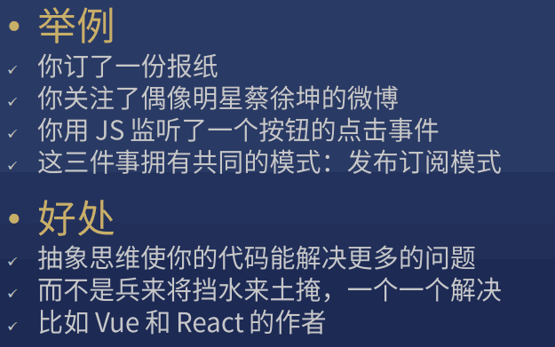
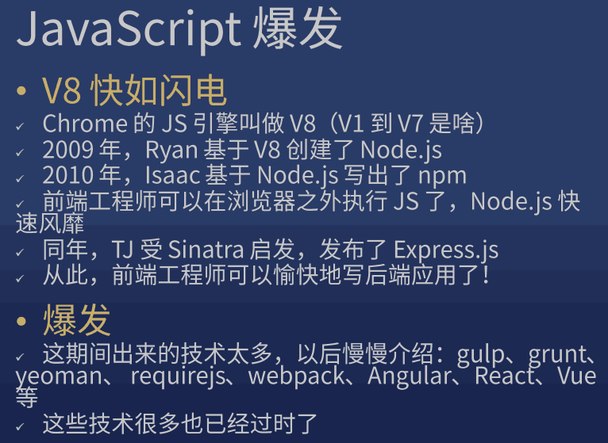
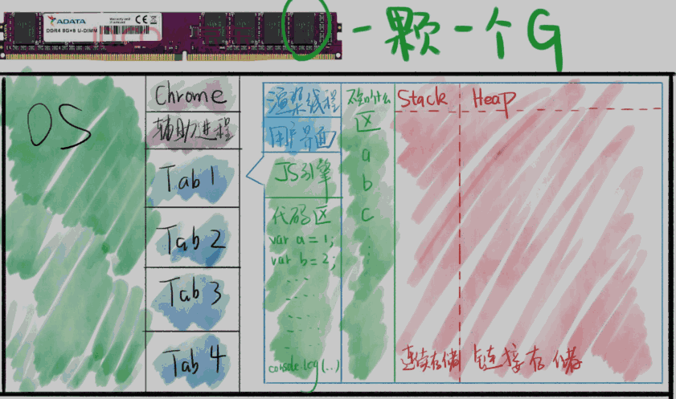
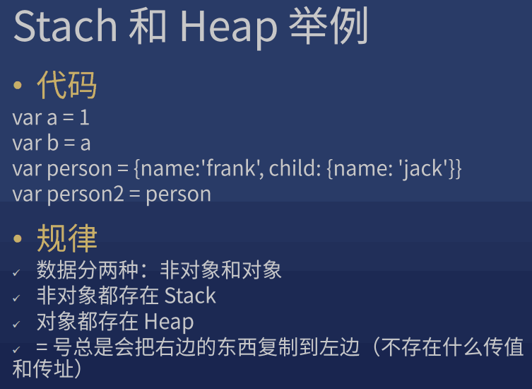
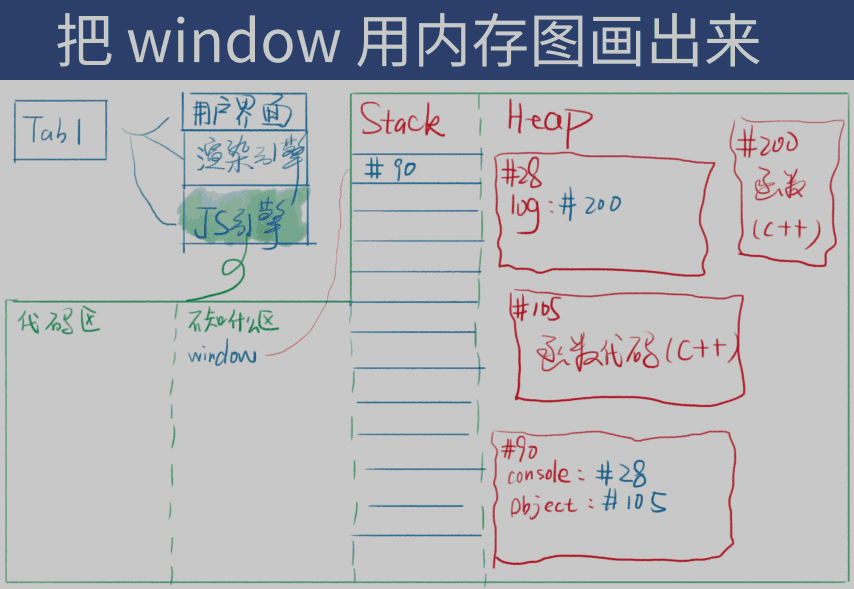
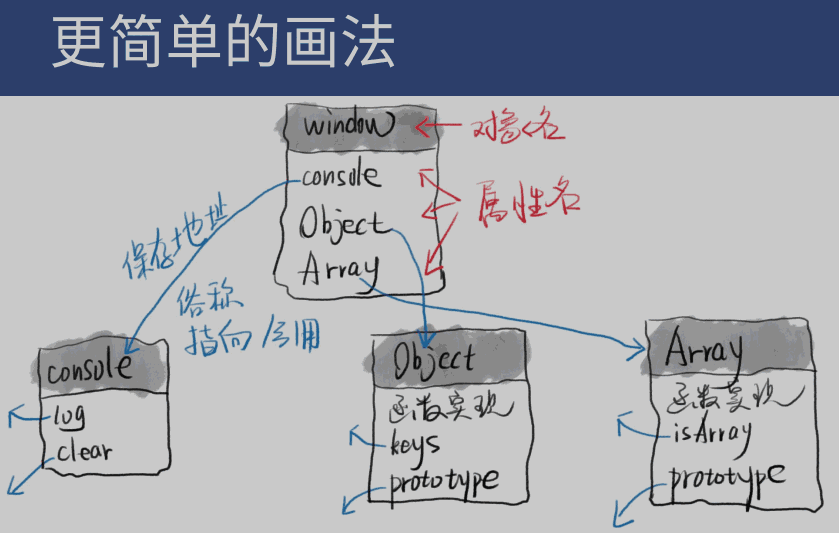

## 1 要求

??? note "软要求"
  
    1. 逻辑能力
    2. 质疑自己的能力
    3. 抽象思维 (高级程序员必备的能力)

        

??? note "硬要求 (客观上的要求)"

    1. 足够的代码量
   
        > 新手：达到 1000 行
        >
        > 熟手：达到 10000 行
        >
        > 专业选手：达到 50000 行

        ``` sh
        $ yarn global add cloc
        $ cloc --vcs=git . // 可以用来统计一个仓库里的有效代码
        ```

    2. 了解足够多的概念

        > 不仅要会写，还要会说

        ??? note "常用常考"

            * 闭包、原型
            * 类、继承
            * MVC、Flux
            * 高阶函数
            * 前端工程化 

    3. 有足够的踩坑经验

??? note "JS 三座大山："

    * this
    * 原型
    * AJAX

## 2 javascript 概述

??? note "历史"

    

    

    

## 3 浏览器 

??? note "打开浏览器"

    

??? abstract "Engine"

    ??? note "主流浏览器的 JS 引擎"

        | 主流浏览器             | JS 引擎        |
        | ---------------------- | -------------- |
        | Chrome, node.js, Opera | V8             |
        | Safari                 | JavaScriptCore |
        | Firefox                | SpiderMonkey   |

    ??? info "MDN 术语表"

        JavaScript引擎是一个 interpreter(解释器) that parses(解析) and executes(执行) a JavaScript program.

    ??? note "主要功能"
    
        * 编译

            > 把 JS 代码翻译为机器能执行的字节码或机器码

        * 优化

            > 改写代码，使其更高效

        * 执行

            > 执行上面的字节码或机器码

        * 垃圾回收

            > 把 JS 用完的内存回收，方便之后再次使用


??? abstract "Rendering engine"

    ??? note "主流浏览器的内核"

        | 主流浏览器    | 内核   |
        | ------------- | ------ |
        | Chrome, Opera | Blink  |
        | Safari        | WebKit |
        | Firefox       | Gecko  |

    ??? note "MDN 术语表"

        渲染引擎是一种在屏幕上绘制文本和图像的软件。
    
        引擎从文档（通常为 HTML）中 提取结构化文本 (draws structured text)，并根据给定的样式声明（通常在 CSS 中给出）正确安排版式 (formats it properly)。
    
    
??? note "执行 JS 代码的准备工作"

    * 提供 API：window / document / setTimeout
    * 上面这些东西都不是 JS 自身具备的功能
    * 我们将这些功能称为 运行环境 (runtime env)
    * 一旦把 JS 放进页面，就开始执行 JS (JS 代码在内存运行)

## 4 内存图（自创）

> 不会画内存图的人才需要区分值和地址

??? note "例图"

    

    ??? info "红色区域"

        * 红色专门用来存放数据，分为 Stack 和 Heap
        * 变量名在 "不知什么区" (每种浏览器的分配规则不同)
        * 上图的区域并不完整 (还有 调用栈、任务队列 等区域)
        * Stack 区特点：每个数据顺序存放
        * Heap 区特点：每个数据随机存放

    ??? note "stack 和 heap 举例"

        

## 5 浏览器提供 window

??? note "下面都挂到 window 上"

    挂在 window 上的东西可以在任何地方直接用

    * console
    * document
    * Object
    
        > var person = {} 等价于 var person = new Object()
    
    * Array (一种特殊的对象)
    
        > var a = [1,2,3] 等价于 var a = new Array(1,2,3)
    
    * Function (一种特殊的对象)
    
        > function f(){} 等价于 var f = new Function()

??? note "把 window 用内存图画出来"

    

    

## 6 每个对象都有一个隐藏属性

??? success "对象"

    ``` javascript
    console.dir(window.Object.prototype): //打印 对象原型 的结构
    ```

    ``` javascript
    var obj = {}
    obj       // {} 里有隐藏属性 __proto__
    obj.toString === window.Object.prototype.toString // true
    ```

??? success "数组"

    ``` javascript
    var a = [1,2,3]
    a         // 隐藏属性 __proto__
    a.push === window.Array.prototype.push // true
    ```

??? success "函数"

    ``` javascript
    function f(){}
    console.dir(f)    // 隐藏属性 __proto__
    ```

    ``` javascript
    Object            // 一般大写都是函数
    console.dir(Object)   // 隐藏属性 __proto__
    ```

??? success "日期"

    ``` javascript
    var d = new Date()
    console.dir(d)    // 隐藏属性 __proto__
    ```

??? note "prototype 和 \_\_proto\_\_ 的区别"

    * 都存着原型的地址
    * 只不过 prototype 挂在函数上，\_\_proto\_\_ 挂在每个新生成的对象上 


