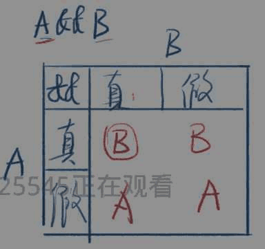
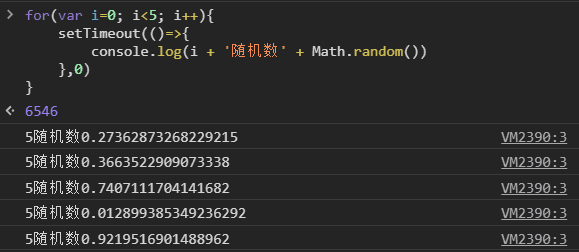
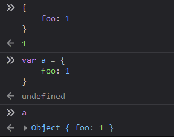
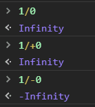
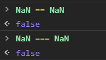
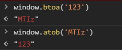
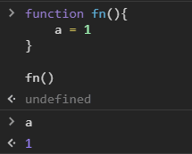
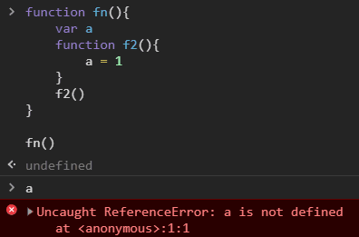
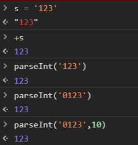

## 1. 目标

* JS 语法
* JS 数据类型和运算符

## 2. 主体

> 对待JS的态度：取其精华，去其糟粕 

### 1) 表达式与语句

* 表达式

    * 1 + 2 的表达式的值为 3
    * add(1, 2) 表达式的值为函数的返回值
    * console.log 表达式的值为函数本身
    * console.log(3) 表达式的值为 undefined

* 语句

    * var a = 1 是一个语句

* 二者的区别

    * 表达式一般都有值，语句可能有也可能没有
    * 语句一般会改变环境 （声明、赋值）
    * 上面两句话并不是绝对的

### 2) 写法

1. 大小写敏感

    * var a 和 var A 是不同的
    * object 和 Object 是不同的
    * function 和 Function 是不同的

2. 空格

    * 大部分空格没有实际意义
    * 只有一个地方不能加回车，那就是 return 后面

3. 标识符

    * 规则
        * 第一个字符，可以是 Unicode 字母（包括中文） 或 $ 或 _
        * 后面的字符，除了上面所说，还可以有数字

    * 变量名是标识符，函数、或属性(property) 也是

4. 好的注释

    * 踩坑注释
    * 为什么代码会写得这么奇怪，遇到什么 bug

### 3) if, &&, ||

* if 语句

    * 表达式里可以非常变态，如 a = 1
    * 最推荐使用的写法

            if (表达式) {
                语句
            } else if (表达式) {
                语句
            } else {
                语句
            }

    * 次推荐使用的写法

            function fn() {
                if (表达式) {
                    return 表达式
                }
                if (表达式) {
                    return 表达式
                }

                return 表达式
            }

* && 短路逻辑

    > A && B && C && D 取第一个假值 或 D
    >
    > 并不会取 true / false

    

* || 短路逻辑

    > A || B || C || D 取第一个真值 或 D
    >
    > 并不会取 true / false

    

* 总结

    * 条件语句

        * if ... else ...
        * switch
        * A ? B : C
        * A && B
        * fn && fn()
        * A || B
        * A = A || B

### 4) for, while, break, continue
* for, while

    
    

* break 和 continue 

    > 退出所有循环 vs 退出当前一次循环

### 5) label

> 用的很少，面试会考 (概率 5%)

* 语法

        foo: {
            console.log(1);
            break foo;
            console.log('本行不会输出');
        }
        console.log(2);

* 面试 

        {
            foo: 1
        }
    
    上面的东西是什么

    

### 6) 数字与字符串

* 区别

    * 功能不同

        * 数字能加减乘除，字符串不行
        * 字符串能表示电话号码，数字不行

    * 存储形式不同

        * JS中，数字是用 64 位浮点数的形式存储的
        * JS中，字符串是用类似 UTF8 形式存储的 （UCS-2）

* 如何存数字：十进制转二进制即可

* 如何存字符

    * ASCII 码
    * 国标 2312
    
    
    * GBK (微软出手了)
    
    * Unicode (万国码)

        * 优点：已收录13万个字符（大于16位），世界通用
        * 缺点：两个字节不够用，每个字符要用三个及以上字节

### 7) JS 中的数据类型

7 种（大小写无所谓）

> 总结：四基两空一对象
>
> 不是数据类型：数组、函数、日期
>
> 它们都属于 object
>
> 1. 数字 number 
> 2. 字符串 string
> 3. 布尔 bool
> 4. 符号 symbol
> 5. 空 undefined
> 6. 空 null
> 7. 对象 object

1. 数字 number

    > 64 位浮点数

    * 写法

        1. 整数
        2. 小数
        3. 科学计数

            > 1.23e4
        
        4. 八进制

            > 0123 或 00123 或 0o123

        5. 十六进制

            > 0x3F 或 0X3F

        6. 二进制

            > 0b11 或 0B11

    * 特殊值

        1. 正0 和 负0

            > 只有一个区别
            >
            > 

        2. 无穷大

            * Infinity、+Infinity、-Infinity

        3. 无法表示的数字

            * NaN (Not a Number)
            * 但它是一个数字 (讲一下历史)

            
            

    * 浮点数

        
        

2. 字符串 string

    > 每个字符两个字节 （阉割版 UTF8）

    * 写法

        1. 单引号

            > '你好'

        2. 双引号

            > "你好"

        3. 反引号

            > \`你好\`
            >
            > 

    * 转义：

        * 写法

            1. 'it\\'s ok'
            2. "it's ok"
            3. \`it's ok\`

        
        

    * 字符串的属性

        > 对象才有属性，为什么字符串也有属性？
        >
        > 等学完对象才能回答

    * string.length
    * 通过下标读取字符: string[index]
    * base64

    
    

3. 布尔 boolean: 

    > true / false

    * 下列运算符会得到 bool 值

        1. 否定运算

            > !value

        2. 相等运算

            > 1 == 2、1 != 2、3 === 4、3 !== 4

        3. 比较运算

            > 1 > 2、1 >= 2、3 < 4、3 <= 4

    * 5个 falsy 值

        > falsy 就是相当于 false 但又不是 false 的值
        >
        > undefined、null、0、NaN、''

    * undefined 和 null

        > 为什么有两种空类型？
        >
        > 这是 JS 的垃圾之处

        * 区别 (没有本质区别)

            1. 如果一个变量声明了，但没有赋值，那么默认值就是 undefined，而不是 null 
            2. 如果一个函数，没有写 return，那么默认 return undefined，而不是 null
            3. 前端程序员习惯上，把非对象的空值写为 undefined，把对象的空值写为 null

### 8) 变量声明

> 指定值，同时也指定了类型
>
> 但是值和类型都可以随意变化

* 三种声明方式

    1. var a = 1

        > 过时的，不好用的方式
        >
        > var 变量提升（看网道）

    2. let a = 1

        > 新的，更合理的方式

        * let声明 规则

            * 遵循块作用域，即 使用范围不能超出 {}
            * 不能重复声明
            * 可以赋值，也可以不赋值
            * 必须先声明再使用，否则报错
            * 全局声明的 let 变量，不会变成 window 的属性
            * for 循环配合 let 有奇效

    3. const a = 1

        > 声明时必须赋值，且不能再改的方式

        * const声明 规则

            * 跟 let 几乎一样
            * 只有一条不同：声明时就要赋值，赋值后不能改

### 9) 类型转换

1. number => string

    * String(n)
    * n + ''

    > bug
    >
    > 

2. string => number

    * Number(s)
    * parseInt(s) / parseFloat(s)
    * s - 0

    

3. x => bool

    * Boolean(x)
    * !!x

4. x => string

    * String(x)
    * x.toString()

    

