# JS 对象 / JS 对象分类

## 1 对象 object (唯一一种复杂类型)

??? example "请不要使用 class，写一个 Person 构造函数"

    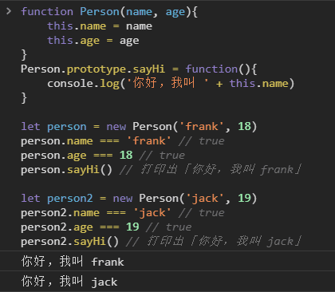

??? example "请用 class 再实现一次上面的功能"

    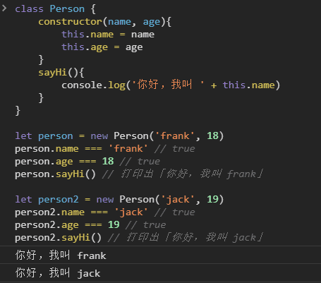


!!! note "定义"

    * 无序的数据集合
    * 键值对的集合

!!! example "声明对象的两种语法"

    ``` javascript
    let obj = { 'name': 'frank', 'age': 18 }
    ```
    
    ``` javascript
    let obj = new Object({'name': 'frank'})
    ```

    ``` javascript
    // 匿名对象: 在对象外加个 ( )
    console.log({ 'name': 'frank', 'age': 18 })
    ```

!!! note "细节"

    * 键名是字符串，不是标识符，可以包含任意字符
    * 引号可省略，省略之后就只能写标识符
    * 就算引号省略了，键名也还是字符串（重要）

## 2 属性

1. 属性名

    > 每一个 key 都是对象的属性名（property）

    !!! note "读对象的属性时"
    
        * 如果使用 [ ] 语法，那么 JS 会先求 [ ] 中表达式的值。(注意区分 表达式 是 变量 还是 常量 )
        * 如果使用点语法，那么点后面一定是 string 常量。

    ??? note "所有的属性名会自动变成字符串"

        !!! example "Object.keys(obj) 可以得到 obj 的所有 key"

            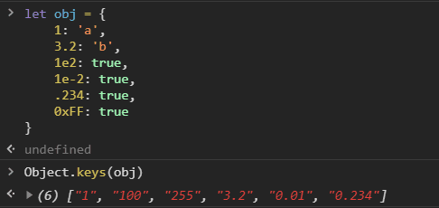

    ??? note "变量作属性名的情况"

        * 不加 [ ] 的属性名会 **自动变成字符串**
        * 加了 [ ] 则会 **当做变量求值**；值如果不是字符串，则会自动变成字符串

        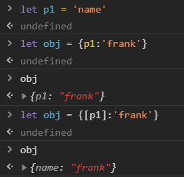

    ??? note "除了字符串，symbol 也能做属性名（超纲知识）"

        > 目前没用，在学习“迭代”时会用到

        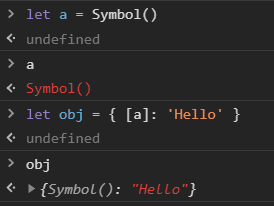


2. 属性值

    > 每个 value 都是对象的属性值

## 3 原型

* 对象的*隐藏属性*

    * JS 中每一个对象都有一个*隐藏属性*
    * *隐藏属性* 储存着 **原型** 的地址
    * 这个 *共有属性* 组成的对象 叫做 **原型**

* 原型

    * 对象的原型也是对象

        > 这个对象里有 toString / constructor / valueOf 等属性

    * `#!javascript obj = {}` 的原型即为 所有对象的原型

        > 这个原型包含所有对象的共有属性，是 对象的根
        >
        > 这个原型也有原型，是 null

    * 原型链

## 4 增删改查 对象的属性

### 4.1 删除属性

* `#!javascript delete obj.xxx` 或 `#!javascript delete obj['xxx']`

* 判断

    ??? example "`#!javascript 'xxx' in obj === false`"

        不含属性名

    ??? example "`#!javascript 'xxx' in obj && obj.xxx === undefined`"

        含有属性名，但是值为 undefined
        
        注意：obj.xxx === undefined 不能断定 'xxx' 是否为 obj 的属性

### 4.2 查看属性（读属性）

1. 单个属性（两种方法）

    ??? example "`#!javascript obj['key']`"

        中括号语法
        
        `#!javascript obj[key] // 变量 key值一般不为 'key'`

    ??? example "`#!javascript obj.key`"

        点语法，建议先它翻译为第一种方法再理解

2. 所有属性

    ??? example "`#!javascript Object.keys(obj)`"

        查看自身所有属性

        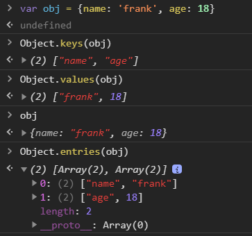


    ??? example "`#!javascript console.dir(obj)`"

        查看自身 + 共有属性

        或者
        
        用 Object.keys 打印出 obj.\_\_proto\_\_

    ??? example "判断: obj.hasOwnProperty('toString')"

        判断一个属性是自身的还是共有的

### 4.3 修改 或 增加属性（写属性）

1. 直接赋值

    ??? example

        ``` javascript
        obj.name = 'frank'
        obj['name'] = 'frank'
        obj['na' + 'me'] = 'frank'
        ```

        ??? example "可以强行 修改或增加 **原型** 上的属性"

            ``` javascript
            Object.prototype.toString = 'xxx'
            ```

            ``` javascript
            // 不推荐用 \_\_proto\_\_，好像有性能问题
            obj.\_\_proto\_\_['toString'] = 'xxx'
            ```

        !!! danger "一般来说不要修改原型，会引起很多问题"

* 批量赋值

    `#!javascript Object.assign(obj, {age: 18, gender: 'man'})`

* 修改隐藏属性

    ??? example "推荐使用 Object.create"

        规范大概的意思是，要改就一开始就改，别后来再改

        ``` javascript
        let obj = Object.create(common)
        obj.name = 'frank'
        let obj2 = Object.create(common)
        obj2.name = 'jack'
        ```

    ??? example "不推荐使用 obj.\_\_proto\_\_ = common"
    
    !!! note "所有 \_\_proto\_\_ 代码都不推荐写"

## 5 例子：正方形

??? question "对象需要分类吗"

    需要

    理由

    1. 有很多对象拥有一样的属性和行为，需要把它们分为同一类

        * 如 square1 和 square2

    2. 但是还有很多对象拥有其他的属性和行为，所以需要不同的分类

        * 比如 Square / Circle / Rect
        * 比如 Array / Function
        * 而 Object 创建出来的对象，是最没有特点的对象


??? example "例子：正方形"

    1. for 循环

        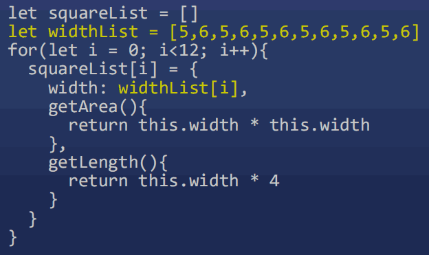

        * 浪费了太多内存
        * 看内存图

        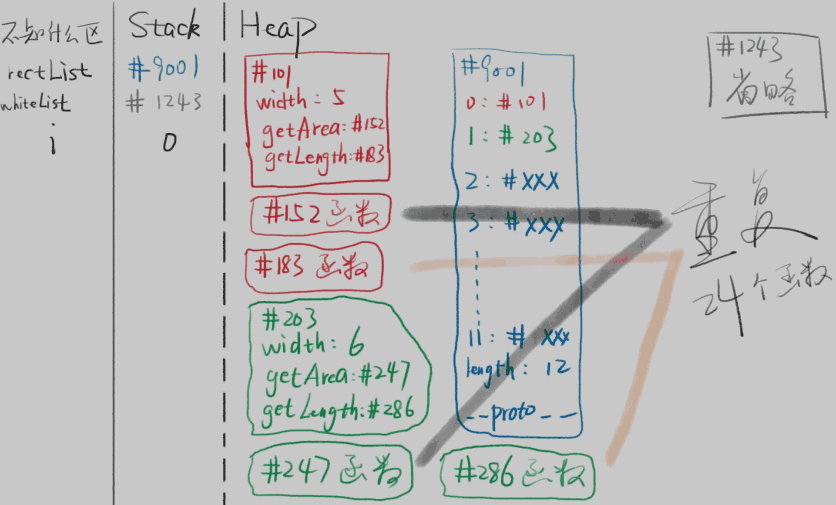

    2. 将共用属性放到原型

        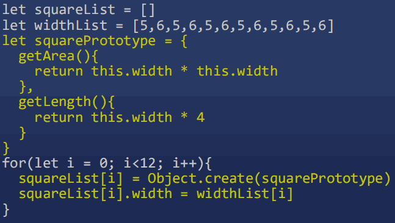

        * 创建 square 的代码太分散了

    3. 把代码抽离到一个函数里，然后调用函数

        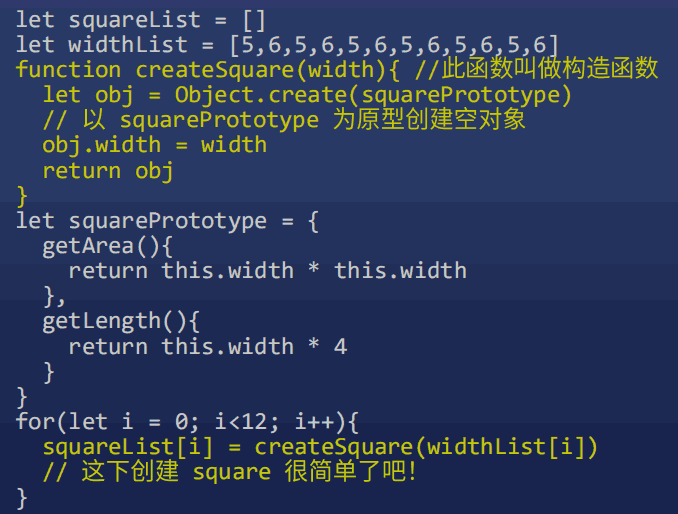

    4. 原型 和 函数 结合

        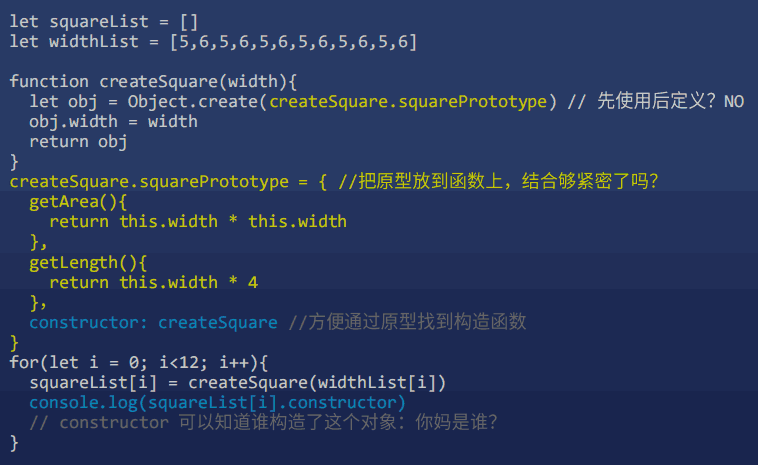

        * 这段代码几乎完美
        * 固定下来，让 JS 开发者直接用

    5. new 操作符

        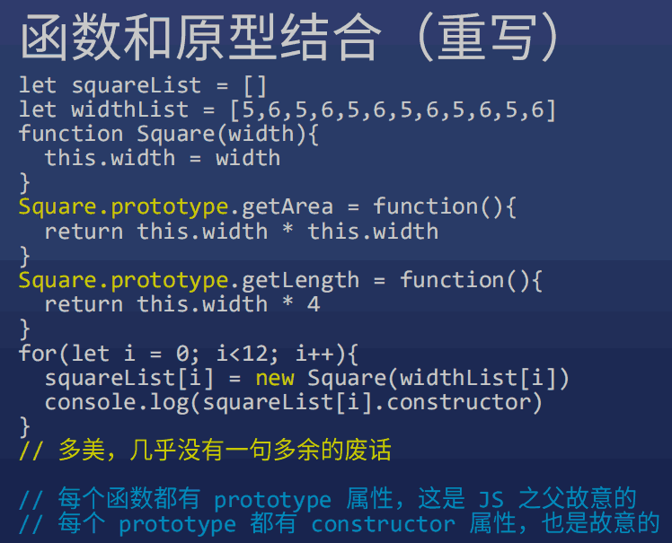


    !!! abstract "总结"

        * new X() 自动做了四件事情

            1. 自动创建空对象
            2. 自动为空对象关联原型，原型地址指定为 X.prototype
            3. 自动将空对象作为 this 关键字运行构造函数
            4. 自动 return this

        * 构造函数 X

            1. X 函数本身负责给对象本身添加属性
            2. X.prototype 对象负责保存对象的共用属性


## 6 代码规范

* 大小写

    * 所有构造函数 (专门用于创建对象的函数) 首字母大写
    * 所有被构造出来的对象，首字母小写

* 词性

    * new 后面的函数，使用名词形式

        > 如 new Person(), new Object()

    * 其他函数，一般使用动词开头
  
        > 如 createSquare(5), createElement('div')

    * 其他规则以后再说


## 7 如何确定一个对象的原型

??? note "对象.\_\_proto\_\_ === 其构造函数.prototype"

    * 原型公式 (JS 里唯一的一个公式)
    * new 做的第二件事

    !!! example

        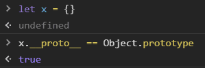

??? question "Object.prototype 是哪个函数构造出来的"

    没有

    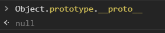


## 8 类型 vs 类 / 数组 / 函数

* 类型

    * JS 数据的分类，有 7 种

* 类

    * 针对于对象的分类，有无数种
    * 常见的有 Array, Function, Date, RegExp 等

* 数组对象

    * 定义一个数组

            let arr = [1,2,3]
            let arr = new Array(1,2,3) // 元素为 1,2,3
            let arr = new Array(3) // 长度为 3

    * 数组对象的自身属性

        > '0' / '1' / '2' / 'length'
        >
        > 注意，属性名只有字符串

    * 数组对象的共用属性
    
        > 'push' / 'pop' / 'shift' / 'unshift' / 'join'
        >
        > 后面单独教这些 API

* 函数对象

    * 定义一个函数

            function fn(x,y){return x+y}
            let fn2 = function fn(x,y){return x+y}
            let fn = (x,y) => x+y
            let fn = new Function('x','y','return x+y')

    * 函数对象自身属性

        'name' / 'length'

    * 函数对象共用属性

        'call' / 'apply' / 'bind'

    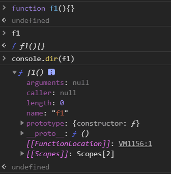
    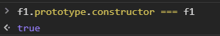

    * 函数的 prototype 属性

        * 所有函数一出生就有一个 prototype 属性
        * 所有 prototype 一出生就有一个 constructor 属性
        * 所有 constructor 属性一出生就保存了对应的函数的地址


### 9) JS 终极一问

* window 是谁构造的

    > Window
    >
    > 可以通过 constructor 属性看出构造者

    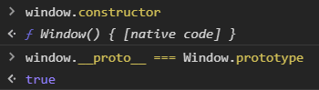

* window.Object 是谁构造的

    > window.Function
    >
    > 因为所有函数都是 window.Function 构造的

    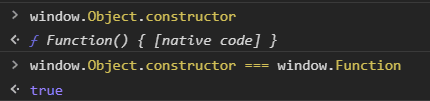

* window.Function 是谁构造的

    > window.Function
    >
    > 因为所有函数都是 window.Function 构造的
    >
    > 浏览器构造了 Function，然后指定它的构造者是自己

    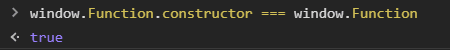


### 10) ES6 引入了新语法

> class 统治天下

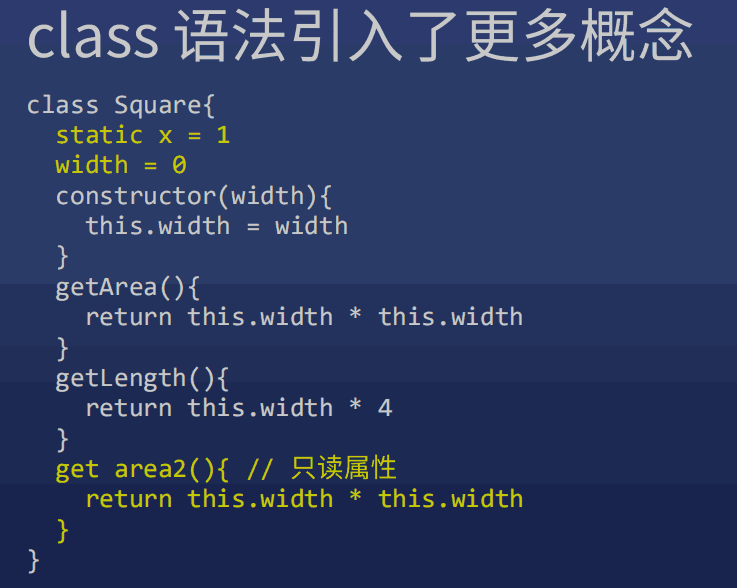


### 11) class 中两种函数写法的区别

> 许多同学对 class 语法的细节不太清楚，这里我总结几个容易混淆的语法，这两种写法的意思完全不一样：
>
> 不要强求完全转换成 ES5
>
> 大部分 class 语法都可以转为 ES5 语法，但并不是 100% 能转，有些 class 语法你意思理解就行，不需要强行转换为 ES5。

语法1：
```
class Person{
    sayHi(name){}
    // 等价于
    sayHi: function(name){} 
    // 注意，一般我们不在这个语法里使用箭头函数
}
//等价于
function Person(){}
Person.prototype.sayHi = function(name){}
```

语法2：注意冒号变成了等于号

```
class Person{
  sayHi = (name)=>{} // 注意，一般我们不在这个语法里使用普通函数，多用箭头函数
}
// 等价于
function Person(){
    this.sayHi = (name)=>{}
}
```
