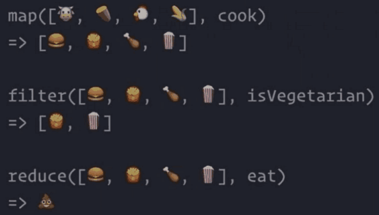

> JS 其实没有真正的数组，只是用对象模拟数组

??? note "JS 的数组不是典型的数组"

    1. 元素的数据类型可以不同
    * 内存不一定是连续的（对象是随机存储的）
    * 不能通过数字下标，而是通过字符串下标

        > 这意味着数组可以有任何 key


## 1 创建一个数组

1. 新建

    ``` javascript
    let arr = [1,2,3]
    ```

    ``` javascript
    let arr = new Array(1,2,3)
    let arr = new Array(3)
    ```

* 转化

    ``` javascript
    let arr = '1,2,3'.split(',')
    let arr = '123'.split('')
    Array.from('123')
    ```

    

* 伪数组

    > 伪数组的**原型链**中并没有数组的原型
    >
    > 没有数组*共用属性* 的 数组，就是**伪数组**

    

    ``` javascript
    let divList = document.querySelectorAll('div')
    let divArray = Array.from(divList)
    ```

* 合并得到新数组

    ``` javascript
    arr1.concat(arr2)
    ```

* 截取一部分

    ``` javascript
    arr1.slice(1) // 从第二个元素开始
    arr1.slice(0) // 全部截取
    ```

    !!! note "注意，JS只提供浅拷贝"

## 2 增删改查 数组中的元素 

### 2.1 删元素

1. 删除头部的元素

``` javascript
arr.shift() // arr 被修改，并返回被删元素
```

* 删除尾部的元素

``` javascript
arr.pop() // arr 被修改，并返回被删元素
```

* 删除中间的元素

``` javascript
arr.splice(index, 1) // 删除index的一个元素
arr.splice(index, 1, 'x') // 并在删除位置添加'x'
arr.splice(index, 1, 'x', 'y') // 并在删除位置添加'x', 'y'
```

* 不用

    1. 跟对象一样 delete

        > 数组的长度没有改变
        >
        > *稀疏数组*

    * 直接改 length 可以删元素

        !!! tip "重要: 不要随便改 length"


### 2.2 查元素

1. 查看所有属性名

    ``` javascript
    Object.keys(arr)
    ```

    ``` javascript
    for(let key in arr){console.log(`${key}:${arr[key]}`)}
    ```

* 查看数字（字符串）属性名和值

    ``` javascript
    // 1. i: 0 - length-1
    for(let i = 0; i < arr.length; i++) {
        console.log(`${i}: ${arr[i]}`)
    }
    ```

    ``` javascript
    // 2. 用 forEach / map 等原型上的函数
    arr.forEach(function(item, index){
        console.log(`${index}: ${item}`)
    })
    ```

    ??? success "例：自己写 forEach 才能理解 forEach"

        ``` javascript
        // 为什么要传入 array 呢？规定如此
        function forEach(array, fn){
            for(let i = 0; i < array.length; i++){
                fn(array[i], i, array)
            }
        }
        ```


* 查看单个属性

    1. 跟对象一样

        ``` javascript
        arr[0]
        ```

    * 索引越界

        ``` javascript
        arr[arr.length] === undefined
        arr[-1] === undefined
        ```

    * 查找某个元素是否在数组里

        ``` javascript
        // 存在 返回索引，否则 返回-1
        arr.indexOf(item)
        ```

    * 使用条件查找元素

        ``` javascript
        // 找第一个偶数
        arr.find(item => item % 2 === 0)
        ```

    * 使用条件查找元素的索引

        ``` javascript
        // 找第一个偶数的索引
        arr.findIndex(item => item % 2 === 0)
        ```

### 2.3 增元素

1. 在尾部加元素

    ``` javascript
    arr.push(newItem) // 修改arr, 返回新长度
    arr.push(item1, item2)
    ```

* 在头部加元素

    ``` javascript
    arr.unshift(newItem) // 修改arr，返回新长度
    arr.unshift(item1, item2)
    ```

* 在中间加元素

    ``` javascript
    arr.splice(index, 0, 'x') // 在index处插入'x'
    arr.splice(index, 0, 'x', 'y')
    ```


### 2.4 改元素

* 反转顺序

    ``` javascript
    arr.reverse() // 修改原数组
    ```

    

* 自定义顺序

    ``` javascript
    arr.sort((a,b) => a-b)
    ```

    

    

    

## 3 数组变换



1. map

    

* filter

    

* reduce

    

    ??? success "例：reduce 实现 map"

        

    ??? success "例：reduce 实现 filter"

        

    ??? success "例：面试题：把数组变成对象"

        

        

