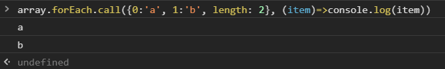

## 1 定义一个函数

1. 具名函数

    ``` javascript
    function 函数名(形式参数1, 形式参数2){
        语句
        return 返回值
    }
    ```

* 匿名函数

    > 上面的具名函数，去掉函数名
    >
    > ``` javascript
    > let a = function(x,y){ return x+y }
    > // 等号右边也叫 函数表达式
    > ```

    ??? failure "fn 声明在 = 右边，fn 的作用域只在 = 右边"

        


* 箭头函数

    ``` javascript
    let f1 = x => x*x
    let f2 = (x,y) => x+y // 圆括号不能省
    let f3 = (x,y) => {return x+y} // 花括号不能省
    let f4 = (x,y) => ({name:x, age:y}) // 直接返回对象会出错，需要加个圆括号
    ```

* 用构造函数


    ??? note "基本没人用"

        ``` javascript
        let f = new Function('x', 'y', 'return x+y')
        ```

        * 在 new fn() 调用中，fn 里的 this 指向新生成的对象，这是 new 决定的
        * 所有函数都是 Function 构造出来的，包括 Object, Array, Function


## 2 函数自身 vs 函数调用

> fn vs fn()

* 函数自身

    ??? note "不会有任何结果，因为 fn 没有执行"

        ``` javascript
        let fn = () => console.log('hi')
        fn
        ```

* 函数调用

    ??? note "打印出 hi，有圆括号才是调用"

        ``` javascript
        let fn = () => console.log('hi')
        fn()
        ```

## 3 函数的要素

### 3.1 调用时机

> 时机不同，结果不同

??? success "例：let setTimeout"

    

    

    * 因为 JS 在 for 和 let 一起用的时候会加东西
    * 每次循环会多创建一个 i


### 3.2 作用域

> 每个函数会默认创建一个作用域

* 全局变量：

    1. 在顶级作用域声明的变量
    2. window 的属性

* 局部变量：其他都是

* 函数可嵌套，作用域也可嵌套

* 作用域规则：就近原则

    > 如果多个作用域有同名变量 a，那么查找 a 的声明时，就向上取最近的作用域

### 3.3 闭包

> 如果一个函数用到了外部的变量，那么这个函数加这个变量就叫做 闭包
>
> 闭包的用途以后讲

### 3.4 形式参数 和 返回值

### 3.5 调用栈

> JS 引擎在调用一个函数前，需要把函数所在的环境 push 到一个数组里，这个数组叫做**调用栈**。
>
> 等函数执行完了，就会把环境 pop 出来，然后 return 到之前的环境，继续执行后续代码

??? note "递归函数实现阶乘"

    ``` javascript
    function f(n){
        return n !== 1 ? n*f(n-1) : 1
    }
    ```

    ??? info "先递进，再回归"

        ```
        f(4)
        = 4 * f(3)
        = 4 * (3 * f(2))
        = 4 * (3 * (2 * f(1)))
        = 4 * (3 * (2 * (1)))
        = 4 * (3 * (2))
        = 4 * (6)
        = 24
        ```

??? question "调用栈最长有多少"

    chrome 大约 11000+ 或 12000+

    

??? note "爆栈"

    如果调用栈中压入的帧过多，程序就会崩溃

### 3.6 函数提升

* 不管你把具名函数声明在哪里，它都会跑到第一行
* `#!javascript let fn = function(){}`，这是赋值，右边的匿名函数声明不会提升 

### 3.7 arguments 和 this (除了 箭头函数)

* arguments (关键字)

    > 调用 fn 即可传 arguments
    >
    > `fn(1,2,3)`，那么 arguments 就是 [1,2,3] 伪数组 

* this

    > 目前可以用 `fn.call(xxx,1,2,3)` 传 this 和 arguments
    
    ??? note "xxx 会被**自动转化成对象**（JS的糟粕）"

        

    ??? note "加 'use strict' 解决问题"

        

    ??? note

        * 在 fn() 调用中， this 默认指向 window，这是浏览器决定的
        * 如果传给 this 的东西不是对象，JS 会自动帮你封装成对象
        * this 是隐藏参数（方方的个人结论）

    ??? question "函数如何获取对象的引用(不通过变量名)"

        ??? note "1. [python](https://repl.it/languages/python3) 用 self 参数"

            

        ??? note "2. JS 用 this 获取对象"

            * person.sayHi() 会隐式地把 person 作为 this 传给 sayHi，sayHi 可以通过 this 引用 person 
            * 两种调用

            ??? note "(1) 小白调用法"

                会自动把 person 传到函数里，作为 this

                ```javascript
                person.sayHi()
                ```

            ??? success "(2) 大师调用法 call (默认用)"

                需要自己手动把 person 传到函数里，作为 this

                ``` javascript
                person.sayHi.call(person)
                ```

                


            ??? success "例1. 第一个参数要作为 this，但是代码里没有用 this，所以只能用 undefined 占位（null也行）"

                

            ??? success "例2. forEach"

                

            ??? success "例3. 自己实现 forEach"

                

            ??? success "例4. 也可以是伪数组"

                

            ??? success "例5. bind 绑定 this"

                

                * 使用 .bind 可以让 this 不被改变
                * `f2()` 等价于 `f1.call({name:'frank'})`
                * vue, react 用到


* 箭头函数

    > 里面的 this 就是外面的 this，因为箭头函数里面没有自己的 this
    >
    > 就算加 call 都没用
    >
    > `this === window`

    

## 4 立即执行函数

??? note "只有 JS 有的变态玩意，现在用得少"

    

??? success "例：! 和 ( )"

    
