> ==, ++, new Number() 这辈子不用

## 1 算术运算符 (数学运算)

??? note "number 运算"

    1. 加减乘除
    * 余数 x % 7

        > -1 % 7 === -1

    * 指数 x ** 3
    * 自增自减 x++ / ++x / x-- / --x

        ??? success "例子"

            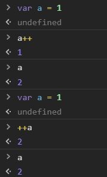

        > 尽量少用，容易记错
        >
        > a++ => a += 1

    * 求值运算符 +x

        ??? success "例子"

            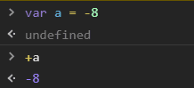

    * 负数运算符 -x

??? note "string 运算"

    连接运算 '123' + '456'

??? failure "不同类型不要加起来"

    把 1 和 '2' 加起来没意义

    * 错误的代码

        * 先把数字变成字符串

            > 1 + '2' === '12'

        * 由于字符串不支持 - ，先把字符串变成数字

## 2 比较运算符

* \>, <
* \>=, <=
* ==(模糊相等), !=
* ===(全等), !==

??? failure "忠告：永远不要使用 ==，用 === 代替"

    == 的问题在于，它总是自作聪明（自动类型转换）

    ??? note "JS 三位一体"

        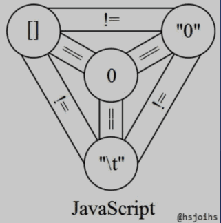

??? note "x === y"

    * 基本类型看值是否相等
    * 对象看地址是否相等

        > [ ] !== [ ]
        >
        > { } !== { }

        !!! note "NaN !== NaN"

## 3 布尔运算符

??? note "或且非"

    * ||
    * &&
    * !

??? note "短路逻辑"

    ??? note "console && console.log && console.log('hi')"

        > 以防 console 不存在报错

        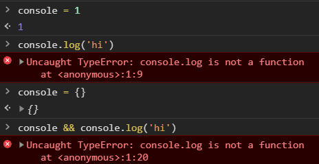

        > IE: console === undefined
        >
        > 防御性编程
        >
        > 可选链语法

    ??? note "a = a || 100"

        a 的保底值

        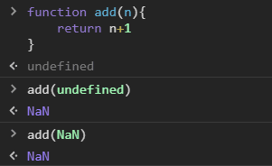

        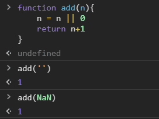

        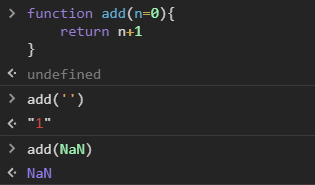


## 4 二进制位运算符

> 位运算不支持小数
>
> 平时工作很少用，面试喜欢问

??? note "或、与、否"

    * |

        > 两个位都为 0，则结果为 0，否则为 1

    * &

        * 判断奇偶

            > 偶数 & 1 = 0
            > 奇数 & 1 = 1

    * ~

??? note "异或"

    ^: 两个位相同，则结果为0，否则为1

    ??? note "交换 a, b 的值"

        ``` javascript
        a ^= b
        b ^= a
        a ^= b
        ```

    ??? success "[a,b] = [b,a]"

        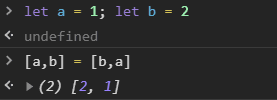

??? note "左移, 右移, 头部补零的右移运算符"

    * << 
    * \>\>
    * \>\>\>

??? note "使用 ~, >>, <<, >>>, | 取整"

    > 不用：window.parseInt()

    ``` javascript
    console.log(~~ 6.83)    // 6
    console.log(6.83 >> 0)  // 6
    console.log(6.83 << 0)  // 6
    console.log(6.83 | 0)   // 6
    console.log(6.83 >>> 0) // 6
    ```


## 5 其他运算符

> 奇葩

* 点运算符

    * 语法

        > 对象.属性名 = 属性值

    * 作用

        > 读取对象的属性值

    ??? question "不是对象，为什么也可以有属性？"

        `#!javascript 'a-b-c'.split('-')`

        !!! note "`#!javascript a.toString()`"

            > 创建，用，滚

            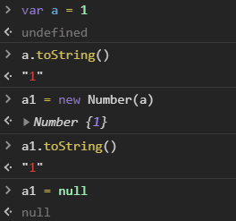

        !!! note "原因：JS 有特殊逻辑"

            点前面不是对象，就把它封装成对象

            * number 会变成 Number 对象
            * string 会变成 String 对象
            * bool 会变成 Boolean 对象

            > 程序员从来不用这三种对象，只用简单类型

* void 运算符

    * 语法

        > void 表达式 或 语句

    * 作用

        ??? note "求表达式的值，或执行语句，然后 void 的值总是为 undefined"

            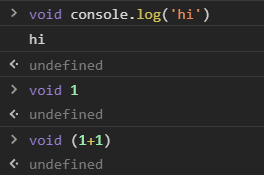


    ??? note "改用 void 可以炫技"

        ```javascript
        <a href="http://baidu.com" onclick="f(); return false;">点击</a>
        ```
        > return 假值可以阻止默认动作

        ```javascript
        <a href="javascript: void(f())">点击</a>
        ```

* 逗号运算符

    * 语法

        > 表达式1, 表达式2, ..., 表达式n

    * 作用

        > 将表达式 n 的值作为整体的值

    ??? note "使用"

        ``` javascript
        let a = (1,2,3,4,5)
        // a 的值为 5
        ```

        ``` javascript
        let f = (x) => (console.log('平方值为'), x*x)
        // 上面的括号不能省
        ```

## 6 运算符优先级

## 7 总结

??? note "最重要的知识"

    > 基于这三个知识和基础知识，可以推出 JS 世界

    1. JS 公式 (唯一公式)

        > 对象.\_\_proto\_\_ === 其构造函数.prototype
        >
        > 用于判断 构造函数之后的对象 的原型

    2. 函数公理

        > 所有函数都是由 Function 构造的
        >
        > 主要用于判断 构造函数 的原型: Object, Array, Function
        >
        > 还有 对象里的方法

    3. 根公理 (公理就是规定好的)

        > Object.prototype 是所有对象的（直接或间接）原型
        >
        > 普通对象：直接
        >
        > 主要用于判断构造 函数之前的对象 的原型
        >
        > 数组、函数：间接

??? note "JS 世界"

    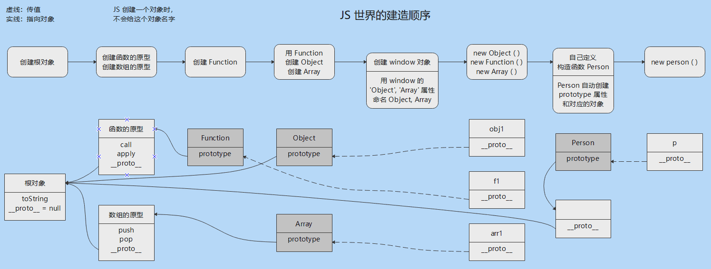

??? note "其他"

    * 约定："的原型" === ".__proto__"

        > 用于判断 构造函数 和 其之后的对象 的原型

    * 构造函数是用来构造对象的
    * 如果对象想要分类，用构造函数给原型链加一环

        > 如果加了一环之后，想再加一环怎么办？
        >
        > 继承里讲

??? note "还有什么没学"

    > 看网道 和 项目中深入理解

    * 错误处理 try...catch...
    * Math / Date / 正则 / JSON


