> 从入门到工作：JavaScript 编程接口

??? success "获取 x 元素的 class 属性"

    * x.className
    * x.getAttribute('class')


??? success "将 div 的宽度设置为 100 像素"

    *  div.style.width = '100px'


!!! note "网页其实是一棵树"

??? question "JS 如何操作这棵树"

    浏览器往 window 上加一个 document 即可

    JS 用 document 操作网页，这就是 DOM

    DOM 很难用，自己封装

## 1 获取属性

??? note "获取元素，也叫标签"

    * 工作用：

        ``` javascript
        // querySelector: 80% css语法能用
        document.querySelector('#idxxx')
        document.querySelectorAll('.red')[0]
        ```

        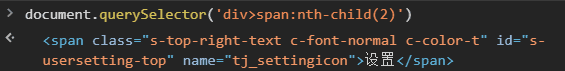

    * 做 demo：

        ``` javascript
        window.idxxx 或 idxxx
        ```

    * 要兼容 IE

        ``` javascript
        document.getElementById('idxxx')
        document.getElementsByTagName('div')[0]
        document.getElementsByClassName('red')[0]
        ```

??? note "获取特定元素"

    * 获取 html 元素

        > document.documentElement

        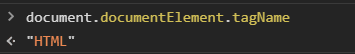

    * 获取 head 元素

        > document.head

    * 获取 body 元素

        > document.body

    * 获取 窗口 （窗口不是元素）

        > window

    * 获取 所有 元素

        > document.all
        >
        > document.all 是第 6 个 falsy 值

        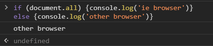

## 2 原型链

??? note "获取到的元素是个对象：原型链"

    ``` javascript
    let div1 = document.createElement('div')
    console.dir(div1) // 看原型链
    ```

    > 自身属性：className, id, style 等等

    1. [HTMLDivElement.prototype](https://developer.mozilla.org/zh-CN/docs/Web/API/HTMLDivElement)

        > 所有 div 共有的属性

        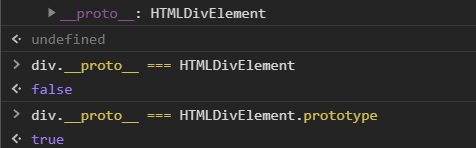

    * HTMLElement.prototype

        > 所有 HTML 标签 共有的属性

    * Element.prototype

        > 所有 XML, HTML 标签 共有的属性
        >
        > HTML, XML, SVG

    * Node.prototype

        > 所有 节点 共有的属性，节点包括 XML 标签文本注释、HTML 标签文本注释等等

    * EventTarget.prototype

        > 最重要的函数属性是 addEventListener

    * Object.prototype


??? note "div 完整原型链"

    > 自身属性 和 共有属性

    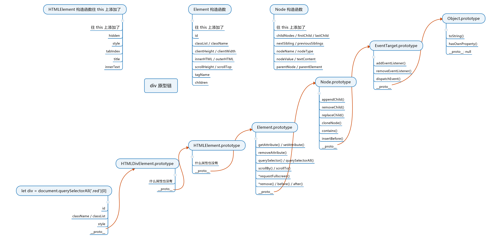


!!! note "[节点类型](https://developer.mozilla.org/zh-CN/docs/Web/API/Node/nodeType)"

    1: Node.ELEMENT_NODE

    3: Node.TEXT_NODE


## 3 节点的增删改查

??? abstract "增"

    ??? note "1. 创建一个标签节点"

        ``` javascript
        let div1 = document.createElement('div')
        document.createElement('style')
        document.createElement('script')
        document.createElement('li')
        ```

    ??? note "2. 创建一个文本节点"

        ``` javascript
        text1 = document.createTextNode('你好')
        ```

    ??? note "3. 标签里插入文本"

        ``` javascript
        div1.appendChild(text1)
        ```

        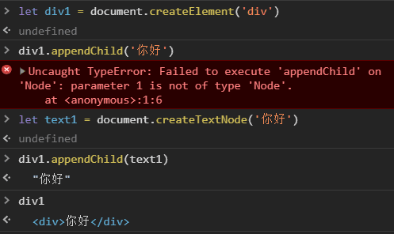

        ``` javascript
        div1.innerText = '你好' 或 div1.textContent = '你好'
        ```

    ??? note "4. 插入页面中"

        你创建的标签默认处于 JS 线程中

        你必须把它插到 head 或 body 里面，它才会生效

        ``` javascript
        // 1
        document.body.appendChild(div)
        ```

        ??? success "在页面显示插入的节点"

            ``` javascript
            document.body.appendChild(div1)
            div1.style.position = 'fixed'
            div1.style.top = 0
            div1.style.left = 0
            div1.style.color = 'red'
            div1.style.backgroundColor = 'white'
            div1.style.fontSize = '100px'
            ```

        ``` javascript
        // 2
        已在页面中的元素.appendChild(div)
        ```

??? note "删"

    * 新方法

        ``` javascript
        childNode.remove()
        x.remove()
        ```

    * 旧方法

        ``` javascript
        parentNode.removeChild(childNode)
        x.parentNode.removeChild(x)
        ```

??? abstract "改"

    ??? note "改属性"

        * 写标准属性

            ``` javascript
            // 改 class
            div.className = 'red blue' // 全覆盖
            div.classList.add('red')
            ```

            ``` javascript
            // 改 style
            div.style = 'width: 100px; color: blue;'
            div.style.width = '200px'
            ```

            ``` javascript
            // 大小写
            div.style.backgroundColor = 'white'
            // 改 data-* 属性
            div.dataset.x = 'frank'
            ```

        * 读标准属性

            ``` javascript
            // 两种方法都可以，但值可能稍微有些不同
            div.classList / a.href
            div.getAttribute('class') / a.getAttribute('href')
            ```

            ``` javascript
            div1.setAttribute('data-x', 'test')
            div1.getAttribute('data-x')
            ```

            ??? success "getAttribute"

                === "html"

                    ``` html
                    <!DOCTYPE html>
                    <html>
                    <head>
                      <meta charset="utf-8">
                      <title>JS Bin</title>
                    </head>
                    <body>
                    <a id=test href="/xxx">/xxx</a>
                    </body>
                    </html>
                    ```

                === "javascript"

                    ``` javascript
                    console.log(test.href)
                    console.log(test.getAttribute('href'))
                    ```

                === "output"

                    "http://js.jirengu.com/xxx"

                    "/xxx"

    ??? note "改事件处理函数"

        * div.onclick 默认为 null

            > 默认点击 div 不会有任何事情发生
            >
            > 但是如果你把 div.onclick 改为一个函数 fn
            >
            > 那么点击 div 的时候，浏览器就会调用这个函数
            >
            > 并且是这样调用的 fn.call(div, event)
            >
            > div 会被当做 this
            >
            > event 则包含了点击事件的所有信息，如坐标


            ``` javascript
            // 当用户点击该 div 时，该代码中的 this 是 div
            // 当用户点击该 div 时，arguments[0] 是事件相关的信息组成的对象
            div.onclick = function(){
                console.log(this)
                console.log(arguments[0])
            }
            ``` 

            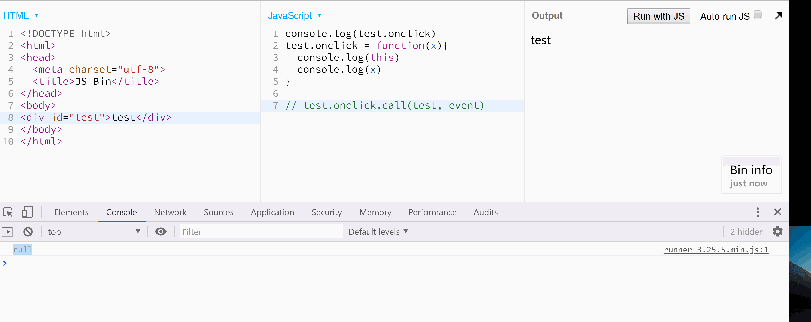

            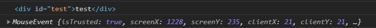

            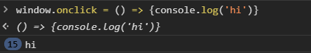

        * div.addEventListener

            > div.onclick 的升级版，之后讲

    ??? note "改内容"

        1. 改 文本内容

            ``` javascript
            // 两者几乎没有区别
            div.innerText = 'xxx'
            div.textContent = 'xxx'
            ```

        * 改 HTML 内容

            ``` javascript
            div.innerHTML = '<strong>重要内容</strong>'
            ```

        * 改 标签

            ``` javascript
            div.innerHTML = '' // 先清空
            div.appendChild(div2) // 再加内容
            ```

    ??? note "改爸爸"

        ``` javascript
        newParent.appendChild(div)
        ```

??? abstract "查"

    ??? note "1. 查爸爸"

        ``` javascript
        node.parentNode 
        或
        node.parentElement
        ```

    ??? note "2. 查爷爷"

        ``` javascript
        node.parentNode.parentNode
        ```

    ??? note "3. 查子代"

        ``` javascript
        // 当子代变化时，两者也会实时变化
        // 优先使用 children
        node.children
        或
        node.childNodes
        ```

    ??? note "4. 查兄弟姐妹"

        ``` javascript
        // 还要排除自己
        node.parentNode.children
        // 还要排除自己
        node.parentNode.childNodes
        ```

        ``` javascript
        // 查看老大
        node.firstChild
        // 查看老幺
        node.lastChild
        // 查看上一个 哥哥/姐姐
        node.previousSibling
        // 查看下一个 弟弟/妹妹
        node.nextSibling
        node.nextElementSibling
        ```

    ??? note "5. 遍历一个 div 里面的所有元素"

        ``` javascript
        // 用到数据结构
        travel = (node, fn) => {
            fn(node)
            if(node.children){
                for(let i=0; i<node.children.length; i++) {
                    travel(node.children[i], fn)
                }
            }
        }
        travel(div1, (node) => console.log(node))
        ```


## 4 DOM 操作是跨线程的

> 浏览器分为 渲染引擎 和 JS 引擎
>
> JS 引擎只能操作 window 对象, object 对象 等

??? node "跨线程操作"

    * 各线程各司其职

        > JS 引擎不能操作页面，只能操作 JS；
        > 
        > 渲染引擎不能操作 JS，只能操作页面

    * 跨线程通信

        > 当浏览器发现 JS 在 body 里面加了个 div1 对象，
        >
        > 浏览器就会通知渲染引擎在页面里也新增一个 div 元素。
        >
        > 新增的 div 元素所有属性都照抄 div1 对象

??? question "document.body.appendChild(div1) 这句 JS 如何改变页面？"

    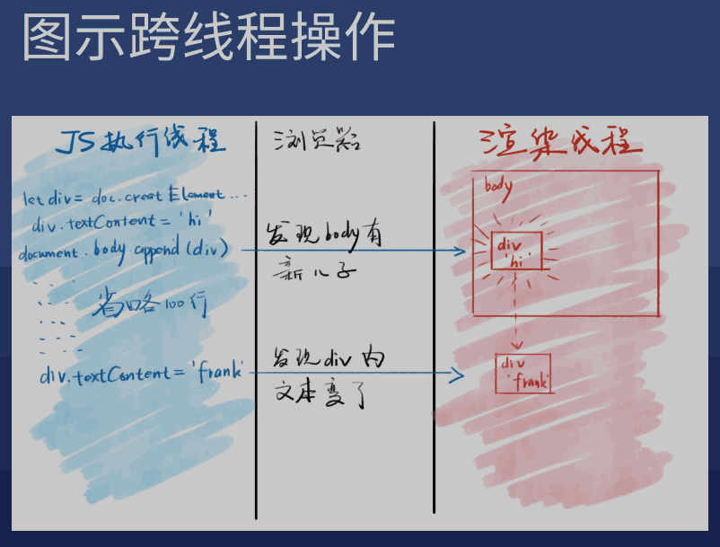

??? node "插入新标签的完整过程"

    * 在 div1 放入页面之前

        > 你对 div1 的所有操作都属于 JS 线程内的操作

    * 把 div1 放入页面之时

        > 浏览器会发现 JS 的意图
        >
        > 就会通知渲染线程在页面中渲染 div1 对应的元素

    * 把 div1 放入页面之后

        > 你对 div1 的操作都有可能会触发重新渲染

        * [div1.title = 'new'](https://css-tricks.com/css-content/#article-header-id-4)

        ??? success "连续操作 div1，浏览器可能会合并成一次操作"

            === "html"

                ``` html
                <!DOCTYPE html>
                <html>
                <head>
                  <meta charset="utf-8">
                  <title>JS Bin</title>
                </head>
                <body>
                <div id="test"></div>
                </body>
                </html>
                ```

            === "css"

                ``` css
                .start{
                  border: 1px solid red;
                  width: 100px;
                  height: 100px;
                  transition: width 1s;
                }

                .end{
                  width: 200px;
                }
                ```

            === "javascript"

                ``` javascript
                test.classList.add('start')
                test.clientWidth // 这句话看似无用，实际会触发重新渲染
                test.classList.add('end')
                ```

??? note "属性同步"

    * 标准属性

        > 对 div1 的标准属性的修改，会被浏览器同步到页面中
        >
        > 如 id, className, title 等

    * data-* 属性

        > 同上

    * 非标准属性

        > 对非标准属性的修改，只会停留在 JS 线程中
        >
        > 不会同步到页面里
        >
        > 如 x 属性

    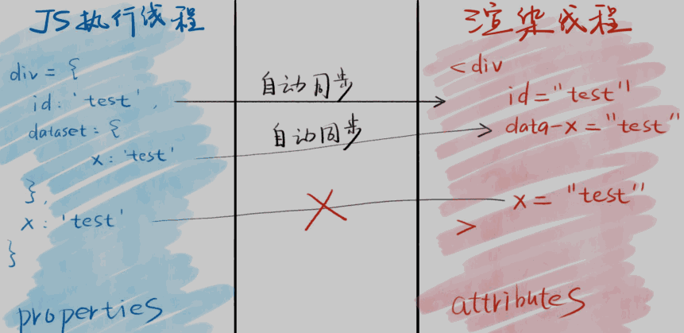


??? abstract "Property vs Attribute"

    * JS 线程中 div1 的所有属性，叫做 div1 的 property
    * 渲染引擎中 div1 对应标签的属性，叫做 attribute

    ??? note "区别"

        * 大部分时候，同名的 property 和 attribute 值相等
        * 但如果不是标准属性，那么他俩只会在一开始时相等
        * 但注意 attribute 只支持 字符串
        * 而 property 支持 字符串、布尔 等类型


