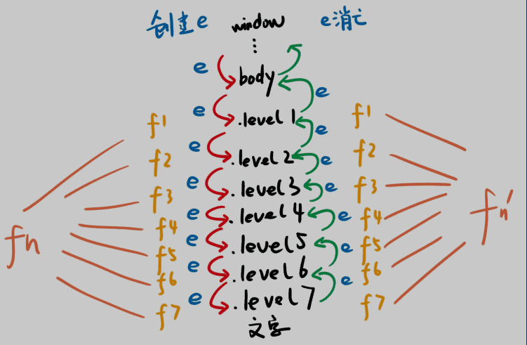
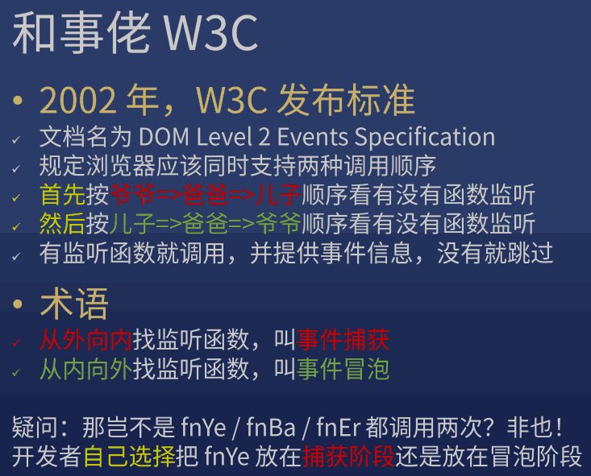
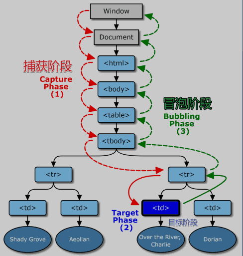
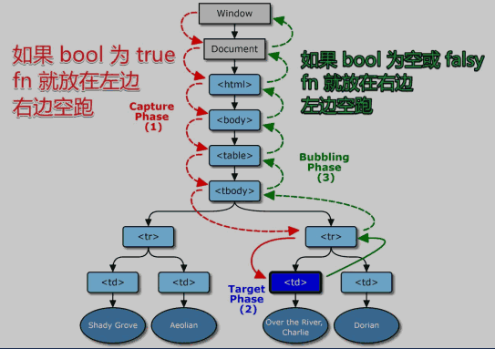

> JS 编程接口

!!! note "mdn"

    * [preventDefault](https://developer.mozilla.org/zh-CN/docs/Web/API/Event/preventDefault)
    * [currentTarget](https://developer.mozilla.org/zh-CN/docs/Web/API/Event/currentTarget)

!!! note "blog"

    * [DOM事件机制](https://juejin.im/post/6844903731079675917)
    * [JavaScript 事件委托详解](https://zhuanlan.zhihu.com/p/26536815)
    * [JavaScript事件委托原理](https://segmentfault.com/a/1190000012313105)

??? note "点击事件"

    addEventListener

    === "html"

        ``` html
        <body>
          <div class="level1 x">
            <div class="level2 x">
              <div class="level3 x">
                <div class="level4 x">
                  <div class="level5 x">
                    <div class="level6 x">
                      <div class="level7 x">

                      </div>
                    </div>
                  </div>
                </div>
              </div>
            </div>
          </div>
        </body>
        ```

    === "css"

        ``` css
        * {
          box-sizing: border-box;
        }
        div[class^=level] {
          border: 1px solid;
          border-radius: 50%;
          display: inline-flex;
        }
        .level1 {
          padding: 10px;
          background: purple;
        }
        .level2 {
          padding: 10px;
          background: blue;
        }
        .level3 {
          padding: 10px;
          background: cyan;
        }
        .level4 {
          padding: 10px;
          background: green;
        }
        .level5 {
          padding: 10px;
          background: yellow;
        }
        .level6 {
          padding: 10px;
          background: orange;
        }
        .level7 {
          width: 50px;
          height: 50px;
          border: 1px solid;
          background: red;
          border-radius: 50%;
        }
        .x{
          background: transparent;
        }
        ```

    === "javascript"

        ``` javascript
        const level1 = document.querySelector('.level1')
        const level2 = document.querySelector('.level2')
        const level3 = document.querySelector('.level3')
        const level4 = document.querySelector('.level4')
        const level5 = document.querySelector('.level5')
        const level6 = document.querySelector('.level6')
        const level7 = document.querySelector('.level7')

        let n = 1

        level1.addEventListener('click', (e)=>{
          const t = e.currentTarget
          setTimeout(()=>{  
            t.classList.remove('x')
          },n*1000)
          n+=1
        })
        level2.addEventListener('click', (e)=>{
          const t = e.currentTarget
          setTimeout(()=>{  
            t.classList.remove('x')
          },n*1000)
          n+=1
        })
        level3.addEventListener('click', (e)=>{
          const t = e.currentTarget
          setTimeout(()=>{  
            t.classList.remove('x')
          },n*1000)
          n+=1
        })
        level4.addEventListener('click', (e)=>{
          const t = e.currentTarget
          setTimeout(()=>{  
            t.classList.remove('x')
          },n*1000)
          n+=1
        })
        level5.addEventListener('click', (e)=>{
          const t = e.currentTarget
          setTimeout(()=>{  
            t.classList.remove('x')
          },n*1000)
          n+=1
        })
        level6.addEventListener('click', (e)=>{
          const t = e.currentTarget
          setTimeout(()=>{  
            t.classList.remove('x')
          },n*1000)
          n+=1
        })
        level7.addEventListener('click', (e)=>{
          const t = e.currentTarget
          setTimeout(()=>{  
            t.classList.remove('x')
          },n*1000)
          n+=1
        })
        ```

    


??? note "target vs currentTarget"

    区别

    * e.target: 用户操作的元素
    * e.currentTarget: 开发者监听的元素，this 是 e.currentTarget，我个人不推荐使用它

??? abstract "捕获，冒泡"

    
    
    

    ??? note "一个特例"

        只有一个 div 被监听（不考虑父子同时被监听），fn 分别在 捕获阶段 和 冒泡阶段 监听 click 事件

        > 答案：谁先监听谁先执行

    ??? note "取消冒泡"

        > 捕获不可取消，但冒泡可以
        >
        > 一般用于封装某些独立的组件

        e.stopPropagation()

    !!! note "有些事件不可取消冒泡"

        google: scroll event mdn


??? question "如何阻止滚动"

    ??? note "scroll 事件不可取消冒泡"

        * 阻止 scroll 默认动作没用，因先有滚动才有滚动事件
        * 要阻止滚动，可阻止 wheel 和 touchstart 的默认动作
        * [google: css hide scrollbar](https://www.geeksforgeeks.org/hide-scroll-bar-but-while-still-being-able-to-scroll-using-css/)

            > 使用 overflow: hidden 可以直接取消滚动条，但此时 JS 依然可以修改 scrollTop

    ??? success "例子"

        === "html"

            ``` html
            <body>
              <div id=x>
                <p>1</p>
                <p>2</p>
                <p>3</p>
                <p>4</p>
                <p>5</p>
                ...
                <p>99</p>
                <p>100</p>
              </div>
            </body>
            ```

        === "css"

            ``` css
            ::-webkit-scrollbar { width: 0 !important }
            ```

        === "javascript"

            ``` javascript
            x.addEventListener('wheel', (e)=>{
              console.log(2)
              e.preventDefault()
            })
            x.addEventListener('touchstart', (e)=>{
              console.log(2)
              e.preventDefault()
            })
            ```


!!! note "[浏览器自带事件](https://developer.mozilla.org/zh-CN/docs/Web/Events)，一共 100 多种事件"

??? success "自定义事件"

    === "html"

        ``` html
        <!DOCTYPE html>
        <html>
        <head>
          <meta charset="utf-8">
          <title>JS Bin</title>
        </head>
        <body>
          <div id=div1>
            <button id=button1>点击触发 frank 事件     
            </button>
          </div>
        </body>
        </html>
        ```

    === "javascript"

        ``` javascript
        button1.addEventListener('click', () => {
          const event = new CustomEvent("frank", {
            "detail": {
              name: 'frank',
              age: 18
            },
            bubbles: true,
            cancelable: false
          })
          button1.dispatchEvent(event)

        })

        button1.addEventListener('frank', (e) => {
          console.log('frank')
          console.log(e)
        })
        ```

??? abstract "事件委托"

    就是把事件监听放在祖先元素（如父元素、爷爷元素）上

    * 优点

        * 省监听数（内存）
        * 可以监听动态生成的元素

    ??? question "给 100 个 按钮添加点击事件"

        监听这 100 个按钮的祖先，等冒泡的时候判断 target 是不是这 100 个按钮中的一个

        === "html"

            ``` html
            <body>
              <div id=div1>
                <span>span1</span>
                <button data-id="1">click 1</button>
                <button data-id="2">click 2</button>
                <button>click 3</button>
                <button>click 4</button>
                <button>click 5</button>
                ...
                <button>click 99</button>
                <button>click 100</button>
              </div>
            </body>
            ```

        === "javascript"

            ``` javascript
            div1.addEventListener('click', (e) => {
              const t = e.target
              if (t.tagName.toLowerCase() === 'button') {
                console.log('button 被点击了')
                console.log('button data-id 是' + t.dataset.id)
                console.log('button 的内容是' + t.innerText)
              }
            })
            ```

    ??? question "要监听目前不存在的元素的点击事件"

        监听祖先，等点击的时候看看是不是我想要监听的元素

        === "html"

            ``` html
            <!DOCTYPE html>
            <html>

            <head>
              <meta charset="utf-8">
              <title>JS Bin</title>
            </head>
            <body>
              <div id=div1>

              </div>
            </body>
            </html>
            ```

        === "javascript"

            ``` javascript
            setTimeout(() => {
              const button = document.createElement('button')
              button.textContent = 'click 1'
              div1.appendChild(button)
            }, 1000)

            /* 封装事件委托
             * 当用户点击 #div1 里的 button 元素时，调用 fn 函数
             * 答案1：判断 target 是否匹配 'button'
             * 答案2：[递归判断](https://github.com/FrankFang/wheels/blob/master/lib/dom/index.js#L2) target / target 的爸爸 / target 的爷爷
             * 整合进 jQuery，有兴趣可以自己实现 $('#xxx').on('click', 'li', fn)
            */
            on('click', '#div1', 'button', () => {
              console.log('button 被点击了')
            })

            function on(eventType, element, selector, fn) {
              if (!(element instanceof Element)) {
                element = document.querySelector(element)
              }
              element.addEventListener(eventType, (e) => {
                const t = e.target
                if (t.matches(selector)) {
                  fn(e)
                }
              })
            }
            ```


??? question "JS 支持事件吗"

    支持，也不支持。本节课讲的 DOM 事件不属于 JS 的功能，属于浏览器提供的 DOM 的功能

    JS 只是调用了 DOM 提供的 addEventListener 而已

    手写一个事件系统，让 JS 支持事件，目前没能力


