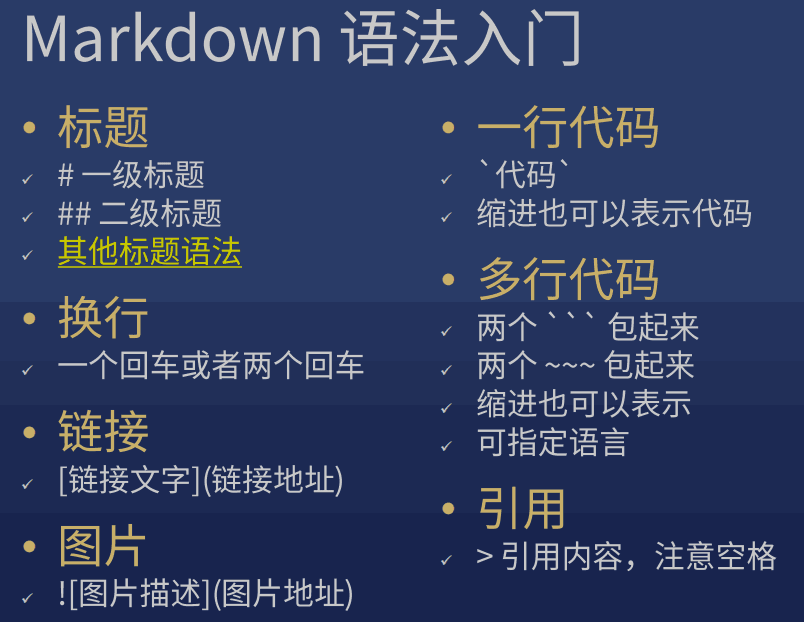

    
## 1 命令行：文件的增删改查

1. 查：

    * 目录：pwd, ls
    * 文件：cat, head, tail, less

2. 增：

    * 目录：mkdir

        ```
        $ mkdir -p a/b/c a/d/c
        ```

    * 文件：touch, echo, cp

        ```
        $ touch 1.txt 2.txt
        ```

        ```
        $ echo -e "haha\nhehe" > 4.txt
        ```

3. 删：rm

4. 其他：

    ```
    $ ls --help | less
    ```

    ```
    $ echo $?
    ```

## 2 &&, ;

* &&

    > 当一条命令成功之后，执行另一条

* ;

    > 不管成功失败，都执行另一条


## 3 git 本地仓库

* 本地仓就是 git init 创建的那个 .git 目录
* 老师为什么推崇使用 git commit -v ? 1. 这个命令可以帮助我们回顾改了些什么; 2. 这个命令可以促使我们写出更长的提交理由
* git branch x 的作用: 会基于本地仓库里最新一次 commit（提交），创建一个新的分支 x
* 运行 reset 命令前，一定要确保重要代码已经提交（commit）了，否则后悔莫及

??? note "git配置："

    ```
    git config --global user.name 你的英文名
    git config --global user.email 你的邮箱
    git config --global push.default simple
    git config --global core.quotepath false
    git config --global core.editor "code --wait"
    git config --global core.autocrlf input
    ```

    ```
    $ git config --global --list
    ```

    !!! note "注意：上面的英文名和邮箱跟 GitHub 没有关系。可以跟 GitHub 的用户名和邮箱保持一致，也可以不一致。我的是一致的。"


??? note "git常用命令："

    * .git目录就是本地仓库  
    
        * 它不会重复复制相同的文件（优化）  
        * 它可以支持多个分支

    ```
    $ git init                    //创建.git目录
    $ git add 路径
    $ git commit -m 字符串         //提交，并说明提交理由
                                  //如果字符串里有空格就要用引号包起来
    $ git commit -v
    ```

    ```
    git log
    git reflog
    git reset --hard xxxxxx     //切换版本
                                //reset会使本地未commit的改动消失
    git branch x                //基于当前commit创建一个新的分支
    git checkout x              //切换到另一个分支
                                //当前目录有未提交的代码，只要跟另一个分支不冲突，就不需要理会
    ```

    ```
    git stash                   //通灵术，如果上面的情况冲突了使用，也可以合并冲突
    git merge x                 //将另一个分支合并到当前分支
                                //可能有冲突，也可能没冲突
    ```

    ```
    git status 
    git status -sb              //查看哪些文件冲突了
                                //解决冲突 -> git add -> git status -sb -> 重复... -> git commit(不需要选项)
    git branch -d x             //删除分支
    ```

## 4 git远程仓库GitHub

??? note "GitHub"

    

??? note "ssh key 验证身份"

    上传代码是用私钥加密的，GitHub用公钥解密。如果解开了，说明是配对的。
    
    * 公钥: GitHub账号  
    * 私钥: 我的电脑
    
    !!! note "HTTPS协议需要每次都输入密码"

??? question "如何生成ssh key："

    > [GitHub帮助](https://help.github.com/en/github/authenticating-to-github/generating-a-new-ssh-key-and-adding-it-to-the-ssh-agent)

    ```
    ssh-keygen -t rsa -b 4096 -C 你的邮箱
    //然后一直回车，直到没有提示

    cat ~/.ssh/id_rsa.pub       //得到公钥内容
    ssh -T git@github.com       //回答yes并回车
    ```

!!! abstract "常用命令"

    ??? note "git clone: 是在我没有代码的前提下，下载整个仓库到本地"

        1. `git clone git@?/xxx.git`
        2. `git clone git@?/xxx.git yyy`
        3. `git clone git@?/xxx.git .    //不会新建目录`

        > [git clone满速下载教程](https://jscode.me/t/topic/789)

    !!! note "git pull: 是在我已经拥有本地仓库的前提下，只下载本地没有的那一部分变更"

    ??? note "git push"

        ```
        git commit  
        git commit -v --amend

        git remote add origin git@github.com:shawnlxf/demo-1.git
        //在本地添加远程仓库的地址
        //origin是远程仓库的默认名字，可以换，建议不要换

        git push -u origin master
        //推送本地master分支到远程origin的master分支
        //-u origin master的意思是设置上游分支，之后就不用再设置了
        ```

??? question "上传到两个远程仓库"

    ```
    git remote add repo2 git@xxxxxx
    git push -u repo2 master
    ```

??? question "如何上传其他分支："

    * 方法1：

        ```
        $ git push origin x:x
        ```

    * 方法2：

        ```
        $ git checkout x
        $ git push -u origin x
        ```

??? note "杂项"

    * GitHub用来备份.git/而已

    * `$ yarn global add git-open`

        > 用 git open 打开GitHub远程仓库首页

    ??? question "如何下载某个分支："

        * 先下载整个仓库，然后git checkout分支名
        * 或者搜命令


    ??? note "国内的代替品"

        * coding.net (腾讯战略投资)
        * gitlab.com
        * 码云 gitee.com (开源中国)

    ??? note "远程仓库"

        1. 只是本地仓库的备份，所以变化都要先commit到本地仓库，然后push到远程
        2. 无法下载部分代码，只能clone整个仓库

```
git pull
git pull repo2 master:x

git remote -v
git remote remove origin2

yarn global add git-open
```

??? note "高级操作："

    ```
    touch ~/.bashrc
    echo 'alias ga="git add"'>> ~/.bashrc
    echo 'alias gc="git commit -v"'>> ~/.bashrc
    echo 'alias gl="git pull"'>> ~/.bashrc
    echo 'alias gp="git push"'>> ~/.bashrc
    echo 'alias gco="git checkout"'>> ~/.bashrc
    echo 'alias gst="git status -sb"'>> ~/.bashrc
    ```

??? note "好看的glog:"

    1. 最后 code ~/.bashrc 在文件最后加上 

        ```
        alias glog="git log --graph --pretty=format:'%Cred%h%Creset -%C(yellow)%d%Creset %s %Cgreen(%cr) %C(bold blue)<%an>%Creset' --abbrev-commit -- | less"
        ```

    2. 重启命令行，或者运行 source ~/.bashrc

??? note "美化历史命令"

    ```
    git rebase -i xxxx
    ```

    

    ??? question "出错怎么办："

        * 看log提示
        * 中止

            ```
            git rebase --abort 可以取消rebase
            ```

        * 继续
  
            ```
            git rebase --continue 可以继续
            ```

??? note "通灵术"
    
    > 不想提交代码，又不想删除代码，那可以找个空间把代码临时藏起来

    git stash / git stash pop

??? note "github pages"

    1. github新建仓库: shawnlxf.github.io
    2. 上传之后进入仓库settings, GitHub Pages -> Source -> master branch 
    3. 把public外的目录上传到github，如果添加远程仓库出错

        ```
        $ git remote set-url origin git@xxxxxx
        ```

## 5 markdown

* GitHub直接预览markdown
* 文件后缀.md 或 .markdown

??? note "markdown 语法"

    

    [其他标题语法](https://markdown-zh.readthedocs.io/en/latest/blockelements/#header)

  


    