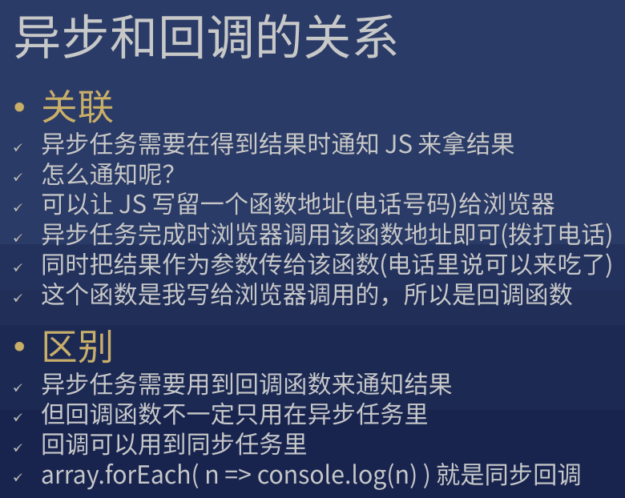
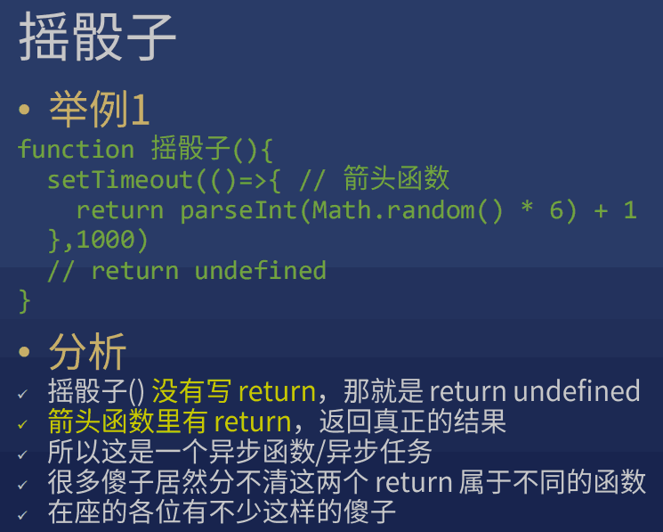
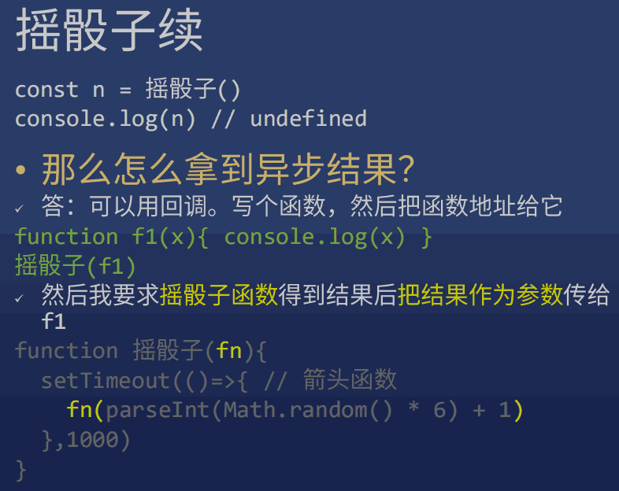
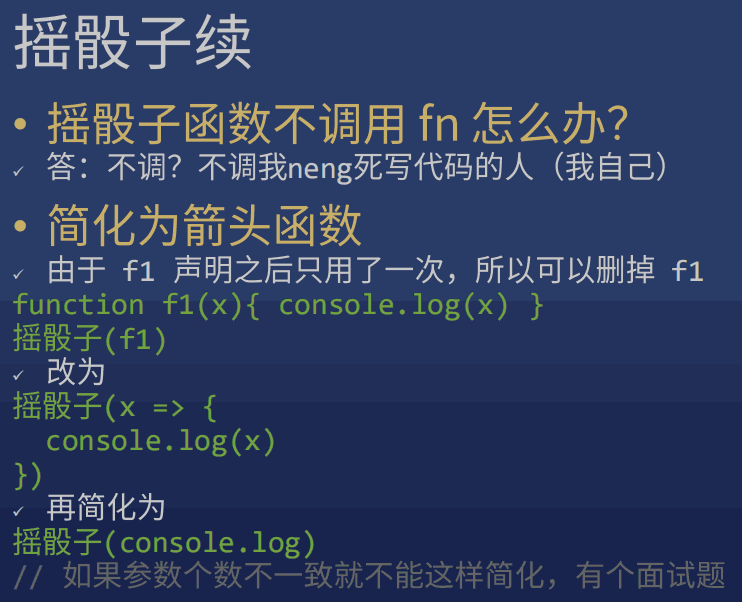
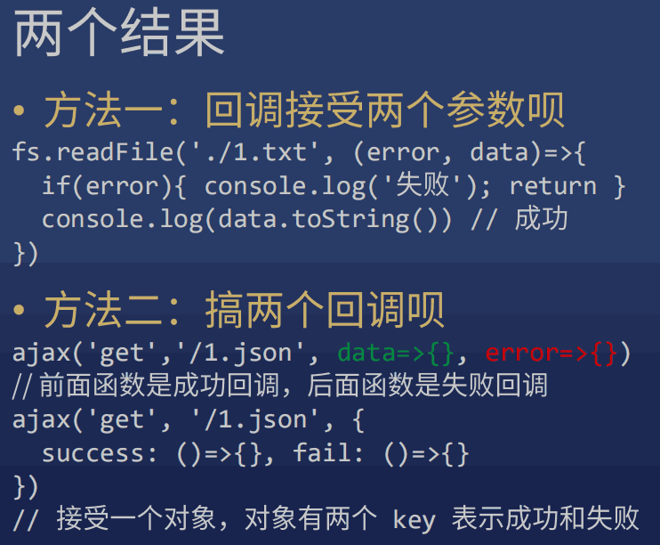
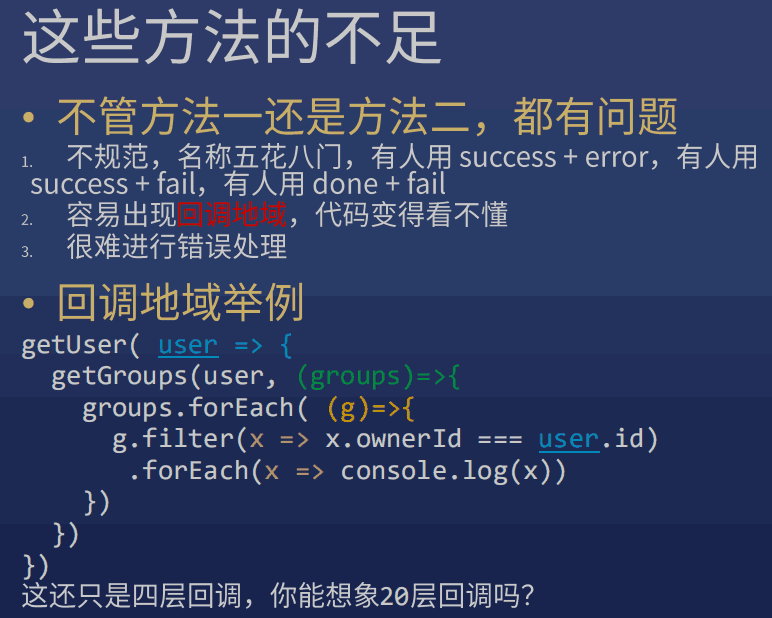
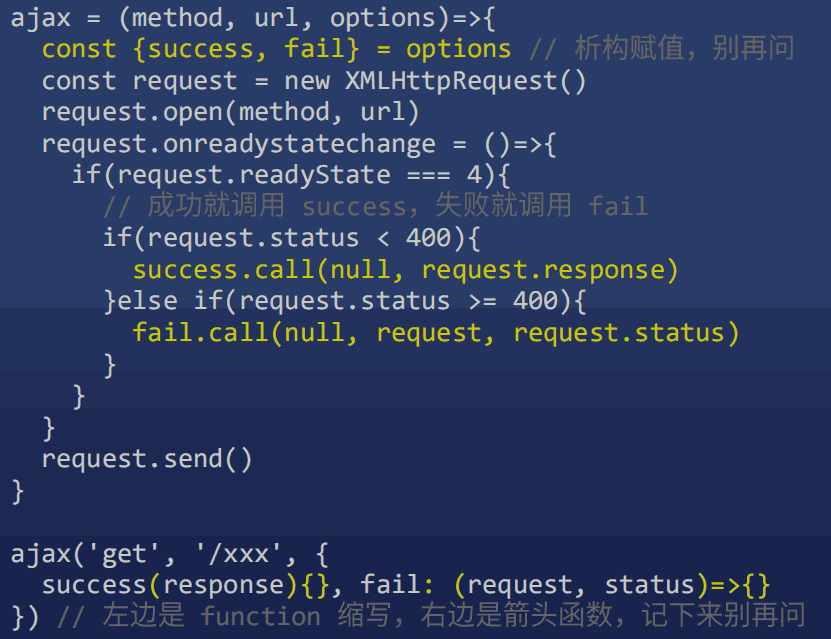
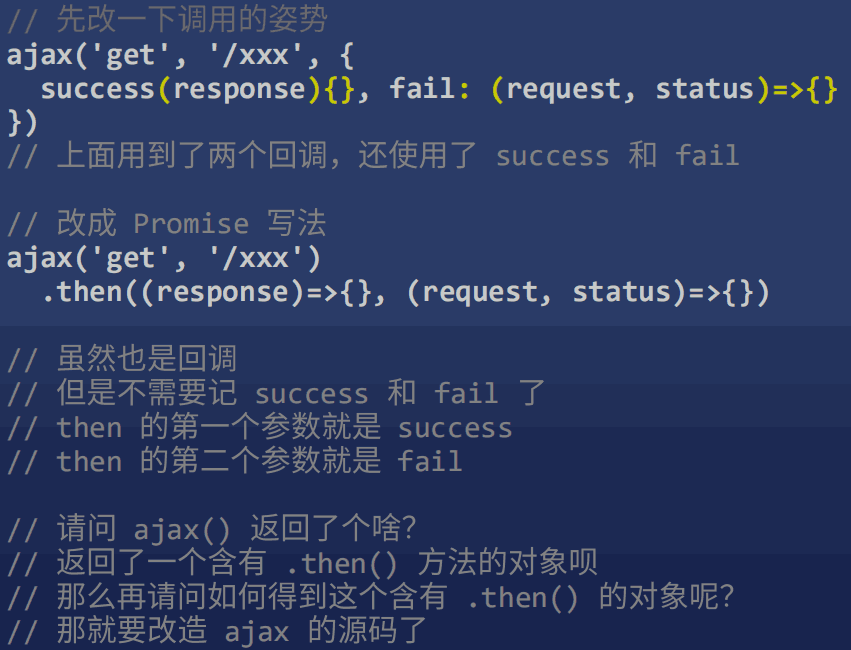
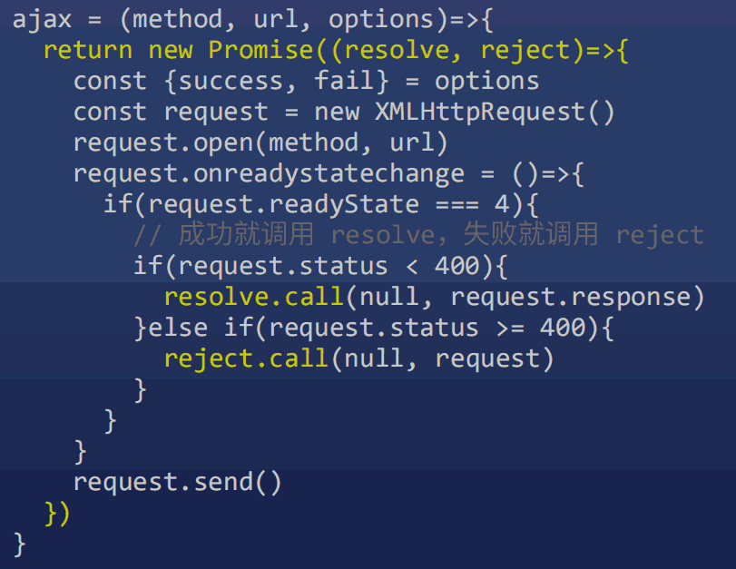

## AJAX 的原理

??? question "如何从 github 复制代码："

    1. 从最后往前选中部分代码
    2. 到开头，按 shift + 点选最开始部分

??? note "node-dev"

    google 搜索 -> 进入 github 的 readme

    ``` bash
    // 安装
    yarn global add node-dev
    ```

    ``` bash
    node-dev server.js 8888
    ```

* google: mdn xmlhttprequest open
* google: mdn onreadystatechange
* google: xml mdn
* google: ajax mdn

??? note "JSON"

    ``` javascript
    // console 输入，输出错误 "Uncaught SyntaxError: Unexpected token ' in JSON at position 1"
    JSON.parse(`{'name':'frank'}`)
    ```

    ``` javascript
    let object
    try {
        object = JSON.parse(`{'name':'frank'}`)
    } catch(error) {
        console.log('出错了，错误详情是')
        console.log(error)
        object = {'name':'no name'}
    }
    console.log(object)
    ```

    ``` javascript
    // console
    > const obj = { "hi":'ho', fn: ()=>{} }
    < undefined
    > JSON.stringify(obj) 
    < "{"hi":"ho"}"
    ```

## 异步与 Promise


* google: mdn 析构赋值

??? question "什么是异步？什么是同步？"

    网上的解释经常混淆异步与回调

    * 同步：如果能直接拿到结果

        > 比如你在医院挂号，你拿到号才会离开窗口

    * 异步：如果不能直接拿到结果

        > 比如你在餐厅门口等位，你拿到号可以去逛街
        >
        > 你可以每 10 分钟去餐厅问一下（轮询）
        >
        > 你也可以扫码用微信接收通知（回调）

    ??? note "异步举例: 以 AJAX 为例"

        request.send() 之后，并不能直接得到 response

        必须等到 readyState 变为 4 后，浏览器回头调用 request.onreadystatechange 函数，我们才能得到 request.response


??? note "回调函数：写了却不调用，给别人调用的函数"

    f2(f1)，可以不写 f1(x) 的 x 参数

??? note "异步和回调的关系"

    

??? question "判断函数是同步还是异步？"

    根据特征 或 文档

    异步函数：如果一个函数的返回值处于以下的内部

    * setTimeout
    * AJAX (即 XMLHttpRequest)
    * AddEventListener
    * 其他 API

    傻X前端才把 AJAX 设置为同步的，这样做会使请求期间页面卡住。

??? note "摇骰子"

    
    
    

    ??? question "面试题"
    
        ``` javascript
        const array = ['1','2','3'].map(parseInt)
        console.log(array)
        // [1, NaN, NaN]
        ```
    
        等同于
    
        ``` javascript
        const array = ['1','2','3'].map((item, i, arr)=>{
            return parseInt(item, i, arr)
            // parseInt('1', 0, arr) => 1
            // parseInt('2', 1, arr) => NaN 1进制没有2
            // parseInt('3', 2, arr) => NaN 2进制没有3
        })
        console.log(array)
        // [1, NaN, NaN]
        ```
    
        ``` javascript
        const array = ['1','2','3'].map((item, i, arr)=>{
            return parseInt(item)
        })
        console.log(array)
        // [1, 2, 3]
        ```
    
        等同于
    
        ``` javascript
        const array = ['1','2','3'].map(item=>parseInt(item))
        console.log(array)
        // [1, 2, 3]
        ```

??? note "如果异步任务有两个结果，成功或失败，怎么办？"

    
    


??? abstract "以 AJAX 的封装为例来解释 Promise 的用法"

    

    Promise 说这代码太傻了，我们改成 Promise 写法

    
    

    * resolve 和 reject 会再去调用成功和失败函数
    * 使用 .then(success, fail) 传入成功和失败函数
    * Promise 还有高级用法，以后说

    ??? note "我们封装的 ajax 的缺点"

        * post 无法上传数据 (request.send)
        * 不能设置请求头 (request.setRequestHeader(key, value))

        解决：

        * 使用 jQuery.ajax (不用掌握，写篇博客即可)
        * 使用 axios (这个库比 jQuery 逼格高)


??? note "axios"

    目前最新的 AJAX 库，抄袭了 jQuery 的封装思路

    * [Axios 作弊表](https://juejin.im/post/6844903569745788941)
    * [axios 中文文档](http://axios-js.com/zh-cn/docs/index.html)
    * [axios github](https://github.com/axios/axios)

    ``` javascript
    // 代码示例
    axios.get('/5.json')
      .then( response =>
        console.log(response) 
      )
    ```

??? note "axios 高级用法"

    * JSON 自动处理

        > axios 如果发现响应的 Content-Type 是 json
        >
        > 就会自动调用 JSON.parse
        >
        > 所以说正确设置 Content-Type 是好习惯

    * [请求拦截器](https://github.com/axios/axios#interceptors)

        > 你可以在所有请求里加些东西，比如加查询参数

    * 响应拦截器

        > 你可以在所有响应里加些东西，甚至改内容

    * 可以生成不同实例（对象）

        > 不同的实例可以设置不同的配置，用于复杂场景


* 初级程序员学习 API（包括 Vue / React 的 API）
* 中级程序员学习如何封装
* 高级程序员造轮子


??? note "[Promise](https://developer.mozilla.org/zh-CN/docs/Web/JavaScript/Reference/Global_Objects/Promise)"

    * Promise 是目前前端解决异步问题的统一方案
    * resolve 和 reject 可以改成任何其他名字，不影响使用，但一般就叫这两个名字
    * resolve 和 reject 都只接受一个参数

## 跨域、CORS、JSONP

??? note "Referer"

    Nerwork -> 选中 XHR -> 点第一个，看 Headers 里的 Referer

    Referer 显示 https://www.baidu.com/

    chrome 地址栏 按左键显示完整路径


node server.js 8888
node server.js 9999

nodepad 以管理员身份运行

C:\WINDOWS\system32\drivers\etc\hosts

加

127.0.0.1 shawn.com
127.0.0.1 qq.com

在终端

ping shawn.com
ping qq.com


百度的 Network 的第一个的 jQuery 

能引用 js 但不能读取 js


