## AJAX 的原理

??? question "如何从 github 复制代码："

    1. 从最后往前选中部分代码
    2. 到开头，按 shift + 点选最开始部分

??? note "node-dev"

    google 搜索 -> 进入 github 的 readme

    ``` bash
    // 安装
    yarn global add node-dev
    ```

    ``` bash
    node-dev server.js 8888
    ```

* google: xml mdn

??? note "JSON"

    ``` javascript
    // console 输入，输出错误 "Uncaught SyntaxError: Unexpected token ' in JSON at position 1"
    JSON.parse(`{'name':'frank'}`)
    ```

    ``` javascript
    let object
    try {
        object = JSON.parse(`{'name':'frank'}`)
    } catch(error) {
        console.log('出错了，错误详情是')
        console.log(error)
        object = {'name':'no name'}
    }
    console.log(object)
    ```

    ``` javascript
    // console
    > const obj = { "hi":'ho', fn: ()=>{} }
    < undefined
    > JSON.stringify(obj) 
    < "{"hi":"ho"}"
    ```

## 异步与 Promise


* google: mdn 析构赋值

??? question "什么是异步？什么是同步？"

    网上的解释经常混淆异步与回调

    * 同步：如果能直接拿到结果

        > 比如你在医院挂号，你拿到号才会离开窗口

    * 异步：如果不能直接拿到结果

        > 比如你在餐厅门口等位，你拿到号可以去逛街
        >
        > 你可以每 10 分钟去餐厅问一下（轮询）
        >
        > 你也可以扫码用微信接收通知（回调）

    ??? note "异步举例: 以 AJAX 为例"

        request.send() 之后，并不能直接得到 response

        必须等到 readyState 变为 4 后，浏览器回头调用 request.onreadystatechange 函数，我们才能得到 request.response


??? note "回调函数：写了却不调用，给别人调用的函数"

    f2(f1)，可以不写 f1(x) 的 x 参数

??? note "异步和回调的关系"

    

??? question "判断函数是同步还是异步？"

    根据特征 或 文档

    异步函数：如果一个函数的返回值处于以下的内部

    * setTimeout
    * AJAX (即 XMLHttpRequest)
    * AddEventListener
    * 其他 API

    傻X前端才把 AJAX 设置为同步的，这样做会使请求期间页面卡住。

??? note "摇骰子"

    
    
    

    ??? question "面试题"
    
        ``` javascript
        const array = ['1','2','3'].map(parseInt)
        console.log(array)
        // [1, NaN, NaN]
        ```
    
        等同于
    
        ``` javascript
        const array = ['1','2','3'].map((item, i, arr)=>{
            return parseInt(item, i, arr)
            // parseInt('1', 0, arr) => 1
            // parseInt('2', 1, arr) => NaN 1进制没有2
            // parseInt('3', 2, arr) => NaN 2进制没有3
        })
        console.log(array)
        // [1, NaN, NaN]
        ```
    
        ``` javascript
        const array = ['1','2','3'].map((item, i, arr)=>{
            return parseInt(item)
        })
        console.log(array)
        // [1, 2, 3]
        ```
    
        等同于
    
        ``` javascript
        const array = ['1','2','3'].map(item=>parseInt(item))
        console.log(array)
        // [1, 2, 3]
        ```

??? note "如果异步任务有两个结果，成功或失败，怎么办？"

    
    


??? abstract "以 AJAX 的封装为例来解释 Promise 的用法"

    

    Promise 说这代码太傻了，我们改成 Promise 写法

    
    

    * resolve 和 reject 会再去调用成功和失败函数
    * 使用 .then(success, fail) 传入成功和失败函数
    * Promise 还有高级用法，以后说

    ??? note "我们封装的 ajax 的缺点"

        * post 无法上传数据 (request.send)
        * 不能设置请求头 (request.setRequestHeader(key, value))

        解决：

        * 使用 jQuery.ajax (不用掌握，写篇博客即可)
        * 使用 axios (这个库比 jQuery 逼格高)


??? note "axios"

    目前最新的 AJAX 库，抄袭了 jQuery 的封装思路

    * [Axios 作弊表](https://juejin.im/post/6844903569745788941)
    * [axios 中文文档](http://axios-js.com/zh-cn/docs/index.html)
    * [axios github](https://github.com/axios/axios)

    ``` javascript
    // 代码示例
    axios.get('/5.json')
      .then( response =>
        console.log(response) 
      )
    ```

??? note "axios 高级用法"

    * JSON 自动处理

        > axios 如果发现响应的 Content-Type 是 json
        >
        > 就会自动调用 JSON.parse
        >
        > 所以说正确设置 Content-Type 是好习惯

    * [请求拦截器](https://github.com/axios/axios#interceptors)

        > 你可以在所有请求里加些东西，比如加查询参数

    * 响应拦截器

        > 你可以在所有响应里加些东西，甚至改内容

    * 可以生成不同实例（对象）

        > 不同的实例可以设置不同的配置，用于复杂场景


* 初级程序员学习 API（包括 Vue / React 的 API）
* 中级程序员学习如何封装
* 高级程序员造轮子


??? note "[Promise](https://developer.mozilla.org/zh-CN/docs/Web/JavaScript/Reference/Global_Objects/Promise)"

    * Promise 是目前前端解决异步问题的统一方案
    * resolve 和 reject 可以改成任何其他名字，不影响使用，但一般就叫这两个名字
    * resolve 和 reject 都只接受一个参数

## 跨域、CORS、JSONP

??? note "跨域关键知识"

    * 同源策略

        浏览器故意设计的一个功能限制

    * CORS

        突破浏览器限制的一个方法

    * JSONP

        IE 时代的妥协

??? note "同源策略：不同源的页面之间，不准互相访问数据"

    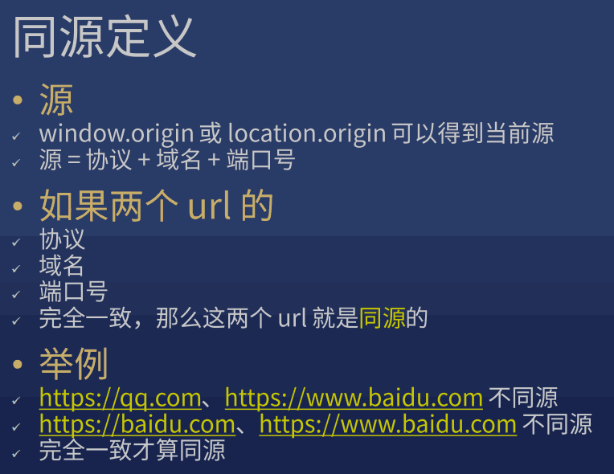
    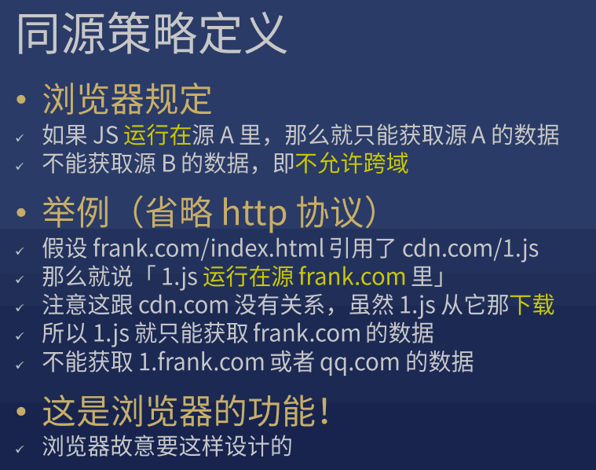

    为了保护用户隐私

    
    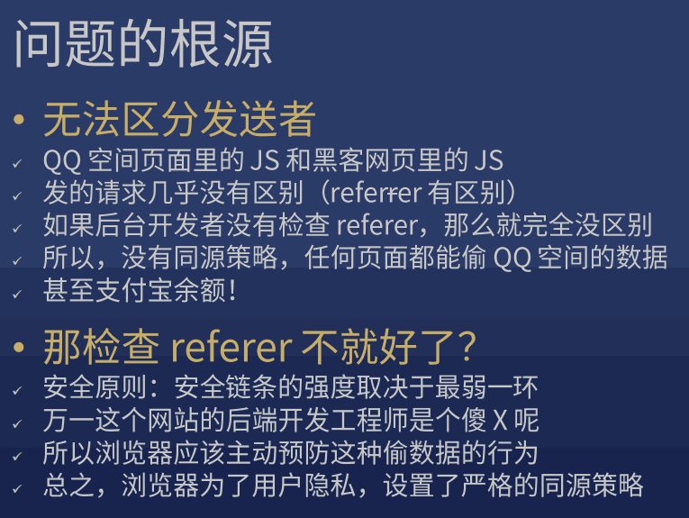
    

??? note "解法"

    * 解法一：[CORS](https://developer.mozilla.org/zh-CN/docs/Web/HTTP/Access_control_CORS#%E7%AE%80%E5%8D%95%E8%AF%B7%E6%B1%82) 分为 简单请求 和 复杂请求

        > IE 6 7 8 9 不支持

    * JSONP: 引用 JS，让 JS 包含数据

        1. qq.com 将数据写到 /friends.js
        2. frank.com 用 script 标签引用 /friends.js
        3. /friends.js 执行 frank.com 事先定义好的 window.xxx 函数，获取到数据


??? note "Referer"

    Nerwork -> 选中 XHR -> 点第一个，看 Headers 里的 Referer

    Referer 显示 https://www.baidu.com/

    chrome 地址栏 按左键显示完整路径

??? note "设置 hosts"

    nodepad 以管理员身份运行 C:\WINDOWS\system32\drivers\etc\hosts，加

    ```
    127.0.0.1 shawn.com
    127.0.0.1 qq.com
    ```

    在终端

    ```
    ping shawn.com
    ping qq.com
    ```

    可以访问 http://qq.com:8888/index.html
    可以访问 http://frank.com:9999/index.html

    百度的 Network 的第一个的 jQuery 

    能引用 js 但不能读取 js

??? question "JSONP 是什么？ 完美回答（优缺点）"

    在跨域时由于当前浏览器不支持 CORS（因为某些条件），必须使用另外一种方式来跨域。于是我们请求一个 JS 文件，这个 JS 文件会执行一个回调，回调里面就有我们的数据。

    回调的名字是可以随机生成的一个随机数，我们把这个名字以 callback 参数传给后台，后台会把函数返回给我们并执行。

    优点：

    1. 兼容 IE
    2. 可以跨域

    缺点：

    1. 由于是 script 标签，读不到 AJAX 那么精确的状态，不知道状态码是什么、响应头 (header) 是什么。只知道成功 (onload) 和失败 (onerror)
    2. 只能发 GET 请求，不支持 POST

## 静态服务器

自动查找对应文件，即静态文件服务器

## 动态服务器 / Ajax 实战：Cookie、Session

* 没有请求数据库，就是静态服务器
* 请求了数据库，就是动态服务器
* 程序员应该懂点数据库，今天直接用 json 文件当做数据库

??? abstract "目标"

    ??? note "目标 1"

        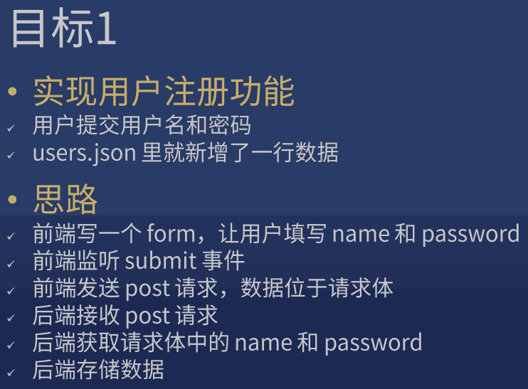

    ??? note "目标 2"

        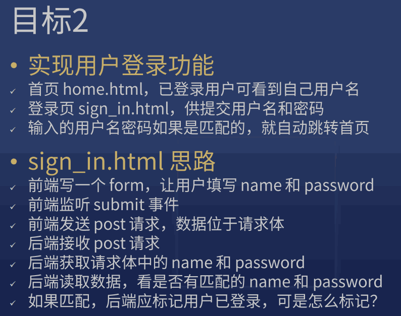

    目标 2 受阻，目标太大了：目标应该尽量小

    * 目标 3：标记用户已登录

    ??? note "Cookie (公园门票) 定义"

        * Cookie 是服务器下发给浏览器的一段字符串
        * 浏览器必须保存这个 Cookie (除非用户删除)
        * 之后发起相同二级域名请求（任何请求）时，浏览器必须附上 Cookie

        有 Cookie 就是登录了，没 Cookie 就没登录

        [Set-Cookie 响应头](https://developer.mozilla.org/zh-CN/docs/Web/HTTP/Headers/Set-Cookie)

    * 目标 4：显示用户名

        > home.html 渲染前获取 user 信息
        >
        > 如果有 user，则将 {{user.name}} 替换成 user.name
        >
        > 如果无 user，则显示登录按钮

    有一个大 bug，用户可以篡改 user_id（开发者工具或者 JS 都能改）    

    ??? note "目标 5"

        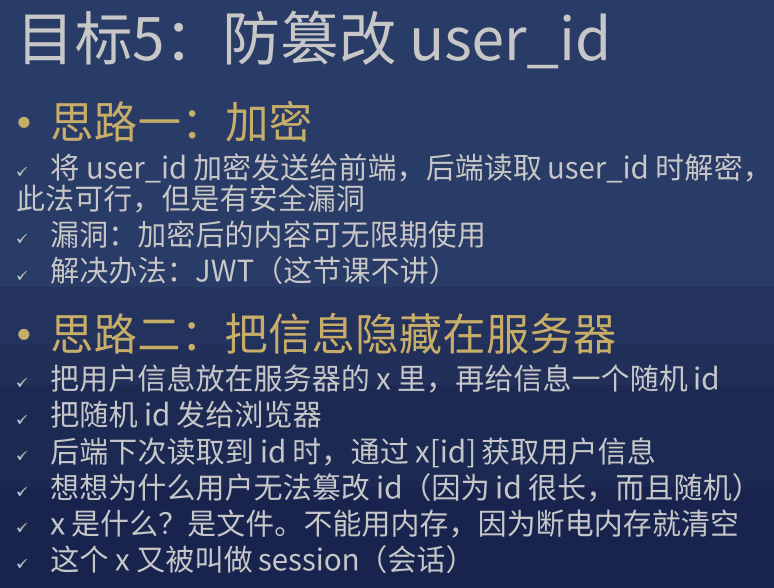

    ??? note "Cookie / Session 总结"

        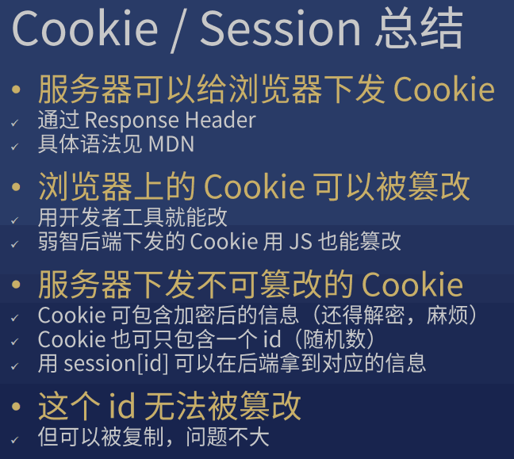

    ??? note "目标 6"

        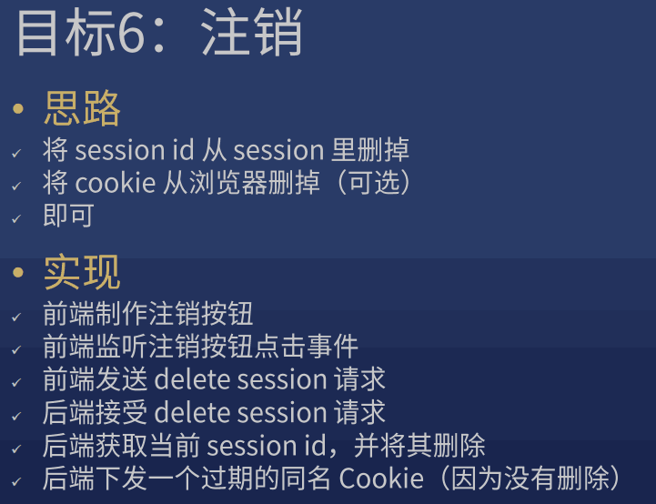

    ??? note "目标 7"

        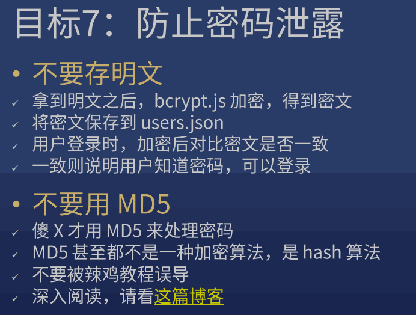

    ??? note "总结"

        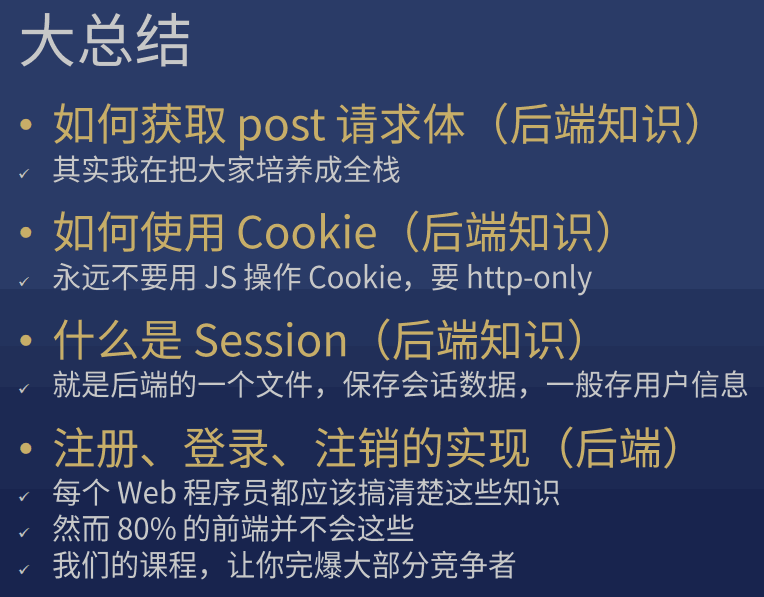
        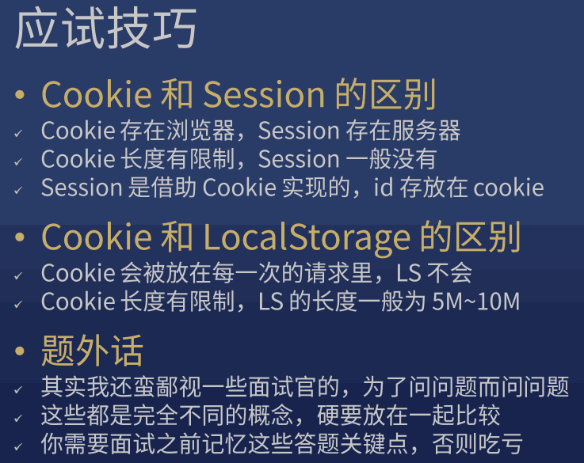
        


??? info

    $ node test.js
    
    users.json: 保留 []，或用 try...catch...，失败了就变成空
    
    json 里只能写 ""

    * JSON.parse(): 反序列化
    * JSON.stringify(): 序列化
    
    Application -> Storage -> Cookies
    
    home.html 读 cookie: 

    1. google: nodejs 中文文档   
    2. 里面的 http
    
    为什么经常要加 toString ?

??? note "session"

    Session 保存在服务器的文件中

    服务器一般会将 Session id 放到 Cookie 中，发放给浏览器

??? question "注销功能一般如何实现"

    安全起见，不能用 JS 删 Cookie，应该使用 HTTP only 的 Cookie，然后 JS 发请求让服务器删 Cookie

    安全起见，除了删除浏览器端的 Cookie，还需要把对应的 Session 数据删掉


