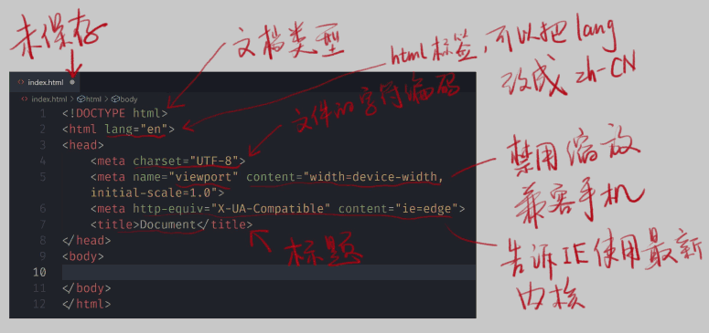

## 1 HTML学习方法

??? note "步骤："

	1. 把所有标签用嘴巴读一遍，了解其内容
	2. 全部忘掉，只记住div和span
	3. 开始学习CSS
	4. 找一个页面，仿写
	5. 发现有更适合的标签，就改用更合适的
	6. 继续写页面

??? note "CRM学习法："

	1. Copy: 抄文档、抄老师
	2. Run: 放在自己的机器上运行成功
	3. Modify: 加入一点自己的想法，然后重新运行

??? note "学一门语言必须学会什么："

	1. 语法 (怎么写代码) 
	2. 如何调试 (怎么知道自己代码写错了)
	3. 在哪查资料 (其实就是为了抄代码)
	4. 标准制定者是谁

## 2 HTML起手式

??? note "Emmet感叹号"

    

    * <html\>
        * wraps 整个 page 的所有内容
        * 根元素

    * <head\>

        * don't show, 包含:
        
            * 关键字 和 页面描述(出现在搜索结果中)
            * CSS
            * character set(字符集) 声明
            * ...

    * <body\>

        * show

## 3 HTML语法

!!! note "标签属性值的引号规则跟命令行一样："

    双引号，单引号，不加都可以

!!! note "标签"

	1. <!DOCTYPE html>
	2. <tag attr=value\>内容</tag\>
	3. <tag attr\>内容</tag\>
	4. <tag attr=value\>

??? note "细节"

	1. 大小写
	2. 引号
	3. 注释
	4. 组合(以后讲)

## 4 HTML排错

1. 看 vscode 的颜色提示
2. 看 webstorm 的颜色提示
3. 使用 HTML5 验证器（在线 / npm 工具）

	> google: w3c validator
    >
    > w3c validator npm

    ```
    $ npm i -g node-w3c-validator
    $ yarn global add node-w3c-validator
    ```

## 5 章节标签

> 表示文章/书的层级 
>
> 都是块级元素, block-level elements

??? note "1. h1–h6: 标题"

    section headings

??? note "2. section: 部分"

    一般来说会有包含一个标题。

??? note "3. article: 文章"

    * Examples include:

        * a forum post(论坛帖子),
        * a magazine or newspaper article,
        * a blog entry.

??? note "4. p: 段落"

    paragraph

??? note "5. header: 头部"

    <header> 元素通常用于包含周围部分的标题（h1 至 h6 元素），但这不是必需的。

??? note "6. footer: 脚部"

??? note "7. main: 主要内容"

??? note "8. aside: 旁支内容"

??? note "9. div: 划分"

## 6 内容标签

??? note "1. ol + li"

    ordered list, list item

??? note "2. ul + li"

    unordered list, list item

??? note "3. dl + dt + dd"

    description list + description term + description details

    > emmet: dl + tab

??? note "4. pre: 预定义格式文本"

    preformatted text

    * 保留空格，换行，Tab
    * monospace, 等宽字体

??? note "5. hr"

    thematic break (horizontal rule)

    > 表示段落级元素之间的主题转换（例如，一个故事中的场景的改变，或一个章节的主题的改变）。  
    >
    > 目前被定义为语义上的，而不是表现层面上。所以如果想画一条横线，请使用适当的 css 样式来修饰。  
    >
    > 空元素

??? note "6. br"

    line break

    ??? note

        Do not use <br\> to create margins between paragraphs; wrap them in <p\> elements and use the CSS margin property to control their size.

??? note "7. a: 锚"

    anchor

    * href: hypertext reference

        creates a hyperlink, 通向其他网页、文件、同一页面内的位置、电子邮件地址或任何其他 URL。

??? note "8. em: 强调, 重读"

    emphasis

??? note "9. strong"

    strong importance, seriousness, or urgency.

??? note "10. code"

    inline code

    > 可以在外面 包 pre
    >
    > By default, the content text is displayed using the user agent's default monospace font.

??? note "11. q"

    inline quotation

        > 内联

??? note "12. blockquote"

    block quotation

        > 块级


## 7 [全局属性](https://developer.mozilla.org/en-US/docs/Web/HTML/Global_attributes)

??? note "所有标签都有的属性"

    1. class
    2. contenteditable
    3. hidden
    4. id
    5. style
    6. tabindex
    7. title

??? note "元素是全页面唯一的，用id；否则，用id"

    ??? failure "不要万不得已不用id"

        1. 因为重复不报错
        2. 有忌讳，console里window.打出的所有单词都不行(window已有的全局属性)   
        3. 可以写但是js无法找到，只能通过document.getElementById('top')  

    ??? note "id的作用："

        1. CSS相关
        2. JS相关
            
            > xxx.style.border = "1px solid red";

    ??? note "tabindex:"

        * 0是最后一个
        * -1：不访问

    ??? note "element.style:"

        * white-space: nowrap;      //不换行  
        * overflow: hidden;         //溢出隐藏  
	    * text-overflow: ellipsis;  //有溢出变..., to:e

    !!! note "title: 完整的内容"

## 8 默认样式

??? question "为什么有默认样式："

    因为HTML发明的时候，CSS还没出生

??? question "怎么看默认样式"

    * chrome开发者工具

        > Elements -> Styles -> user agent stylesheet

!!! note "User Agent: 就是浏览器"

??? note "CSS Reset"

    > 默认样式已经不符合我们的需求

    * 抄大厂代码：
    
        1. 三击选中
        2. 把其中包含 .类名 后面的删去，默认的标签没有class
        3. 命名为reset.css 

            ```
            table {   
              border-collapse: collapse;    //border合并 
              border-spacing: 0             //for IE 
            }    
            ```


