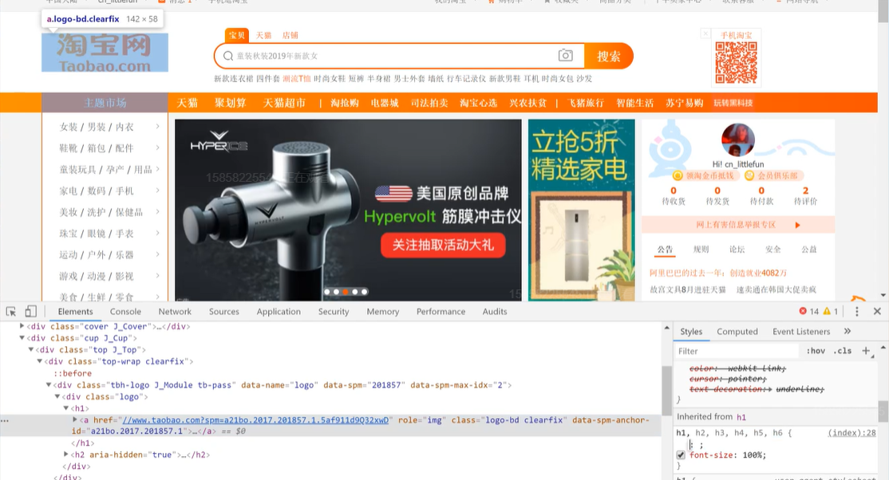
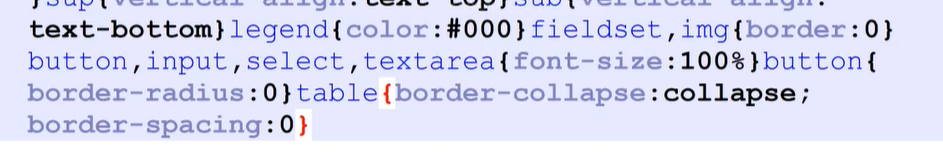

!!! note "测试"

    * id 的全局唯一性没有保障，就算有两个重复的 id，HTML 也不会提示我写错了
    * tabindex 可以是正数，不必是连续的
    * tabindex 可以是 0，表示最后才被 tab 访问
    * tabindex 可以是 -1，表示不可被 tab 访问
    * HTML 代码里的多处空格、回车、tab 等内容，默认会被转化为一个空格

## 1 HTML学习方法

??? note "步骤："

	1. 把所有标签用嘴巴读一遍，了解其内容
	2. 全部忘掉，只记住div和span
	3. 开始学习CSS
	4. 找一个页面，仿写
	5. 发现有更适合的标签，就改用更合适的
	6. 继续写页面

??? note "CRM学习法："

	1. Copy: 抄文档、抄老师
	2. Run: 放在自己的机器上运行成功
	3. Modify: 加入一点自己的想法，然后重新运行

??? note "学一门语言必须学会什么："

	1. 语法 (怎么写代码) 
	2. 如何调试 (怎么知道自己代码写错了)
	3. 在哪查资料 (其实就是为了抄代码)
	4. 标准制定者是谁

## 2 HTML起手式

??? note "Emmet感叹号"

    

    * `<html>`
        * wraps 整个 page 的所有内容
        * 根元素

    * `<head>`

        * don't show, 包含:
        
            * 关键字 和 页面描述(出现在搜索结果中)
            * CSS
            * character set(字符集) 声明
            * ...

    * `<body>`

        * show

## 3 HTML语法

!!! note "标签属性值的引号规则跟命令行一样："

    双引号，单引号，不加都可以

!!! note "标签"

	1. <!DOCTYPE html>
	2. <tag attr=value\>内容</tag\>
	3. <tag attr\>内容</tag\>
	4. <tag attr=value\>

??? note "细节"

	1. 大小写
	2. 引号
	3. 注释
	4. 组合(以后讲)

## 4 HTML排错

1. 看 vscode 的颜色提示
2. 看 webstorm 的颜色提示
3. 使用 HTML5 验证器（在线 / npm 工具）

	> google: w3c validator
    >
    > w3c validator npm

    ```
    $ npm i -g node-w3c-validator
    $ yarn global add node-w3c-validator
    ```


## 8 默认样式

??? question "为什么有默认样式："

    因为HTML发明的时候，CSS还没出生

??? question "怎么看默认样式"

    * chrome开发者工具

        > Elements -> Styles -> user agent stylesheet

!!! note "User Agent: 就是浏览器"

??? note "CSS Reset"

    > 默认样式已经不符合我们的需求

    * 抄大厂代码：
    

        
        

        1. 三击选中
        2. 把其中包含 .类名 后面的删去，默认的标签没有 class，后面的 class 肯定不是用来重置默认样式的
        3. 命名为reset.css 


    ``` css
    * {
      margin: 0;
      padding: 0;
      box-sizing: border-box;
    }
    *::before,
    *::after {
      box-sizing: border-box;
    }
    a {
      color: inherit;
      text-decoration: none;
    }
    input,
    button {
      font-family: inherit;
    }
    ol,
    ul {
      list-style: none;
    }
    table {
      border-collapse: collapse;
      border-spacing: 0;
    }
    ```


