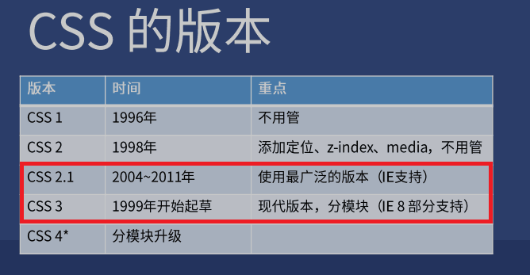
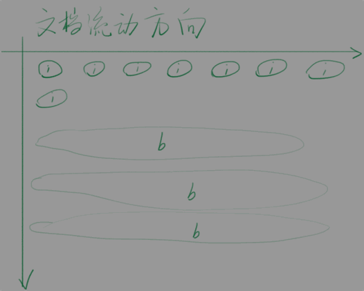
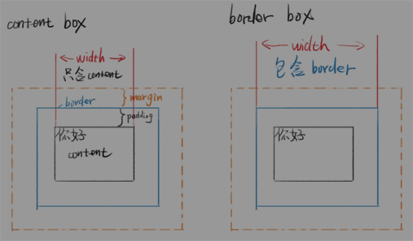

!!! note "测试"

    * 在想搜的词后面加 MDN, 张鑫旭, CSS Tricks
    * 内联元素不接受 width 和 height 设置宽高
    * 内联元素的宽度由其内部的元素宽度总和决定
    * 内联元素的高度由 line-height 间接确定

## 1 层叠指什么？

> 这些特性使得 CSS 极度灵活
>
> 这也为 CSS 后来被吐槽留下了隐患

* 样式层叠

    > 可以多次对同一选择器进行样式声明

* 选择器层叠

    > 可以用不同选择器对同一个元素进行样式声明
    
* 文件层叠

    > 可以用多个文件进行层叠

## 2 CSS 的版本

??? note "CSS 的版本"

    

??? note "CSS标准"

    * google: css spec
    * google: css 2.1 中文版
  
## 3 查询哪些浏览器支持哪些特性

* 使用 caniuse.com

    > 输入你关心的样式，比如 border-radius 或 filter
    >
    > 下方会详细说明兼容 bug 有哪些（翻译成中文）
    >
    > 网站主一开始[自己测试](http://tests.caniuse.com/)了一部分浏览器

## 4 语法: 超级简单

??? note "语法一：样式语法"

    `
    选择器 {
        属性名: 属性值;
        /*注释*/
    }
    `

    !!! note "注意事项"
    
        * 区分大小写
        * 没有 // 注释
        * 最后一个分号可以省略，但建议不要省略

??? note "语法二：at 语法"

    `
    @charset "UTF-8";
    @import url(2.css);
    @media (min-width: 100px) and (max-width: 200px) {
        语法一
    }
    `

    !!! note "注意事项："
    
        * @charset 必须放在第一行，作用是指定当前文件的字符编码（或字符集）
        * 前两个 at 语法必须以分号 ; 结尾
        * @media 语法会单独教学
        * charset 是字符集的意思，但 UTF-8 是字符编码 encoding，这是历史遗留问题

## 5 如何调试 CSS

1. 看 vscode 的颜色提示
2. 看 webstorm 的颜色提示
3. 使用 W3C 验证器（[在线](https://jigsaw.w3.org/css-validator/#validate_by_input)/命令行工具）不用试了

    ??? note "CSS 验证"

        google: w3c css validator

4. 使用开发者工具看警告

    ??? question "如何使用开发者工具"

        * 找到你脑中的标签
        * 看它是否有选择器
        * 看它的样式是否被划掉
        * 看它的样式是否有警告

## 6 Border 调试法

> CSS 的 border 调试法就相当于 JS 的 log 调试法

!!! note "步骤"

    * 怀疑某个元素有问题，就给这个元素加 border
    * border 没出现？说明选择器错了或者语法错了
    * border 出现了？看看边界是否符合预期
    * bug 解决了才可以把  border 删掉

## 7 在哪搜练习素材

> 每个类型的临摹一两个即可
>
> PC 网站、手机网站、UI 套件
>
> 再多无益

??? note "PSD"

    * Freepik 搜索 [PSD web](https://www.freepik.com/search?query=web&type=psd)
    * 365PSD 里的 [UI 套件](https://cn.365psd.com/free-psd/ui-kits) 还行

        > 中文免费 PSD 网站较少，需要多搜一下

??? note "效果图（不提供下载）"

    * dribbble.com 顶级设计师社区
    * 可以用肉眼模仿它

!!! note "商业网站: 直接模仿你常去的网站"

## 8 要理解几个重要的概念

* 文档流 Normal Flow
* 块、内联、内联块
* margin 合并
* 两种盒模型（border-box 更符合人类思维）

??? note "文档流动方向"

    

??? note "inline: span"

    * 不能设置 width, height
    * 可以内嵌 inline
    * 实际高度：line-height 间接（如果字体不一致，实际高度会变），跟 padding 无关
    * line-height 会继承，所以写哪里都一样

??? note "block: div"

    * 默认 width: auto; 不是100%，能有多宽有多宽，不影响其他元素
    * 除非特殊情况，永远不要写 width: 100%; 可以指定 px 或 em

        > 例如，父子都是 div，父不设置 width，子设置 width: 100%，子 div 的 右 border 会顶出

    * 可以设置 width, height
    * 如果 div 里什么都没有，div 的高度为 0

??? note "inline-block"

    * 默认和inline一样
    * 可以设置 width, height

??? abstract "文档流"

    ??? note "流动方向"

        * inline 元素从左到右，到达最右边才会换行
        * block 元素从上到下，每一个都另起一行
        * inline-block 也是从左到右

    ??? note "宽度"

        * inline 宽度为内部 inline 元素的和，不能用 width 指定
        * block 默认自动计算宽度，可用 width 指定
        * inline-block 结合前两者特点，可用 width

    ??? note "高度"

        * inline 高度由 line-height 间接确定，跟 height 无关
        * block 高度由内部文档流元素决定，可以设 height

            > 脱离文档流的不算

        * inline-block 跟 block 类似，可以设置 height

??? note "overflow 溢出"

    * 当内容大于容器

        > 等内容的宽度或高度大于容器的，会溢出

    * 可用 overflow 来设置是否显示滚动条
    * auto 是灵活设置
    * scroll 是永远显示
    * hidden 是直接隐藏溢出部分
    * visible 是直接显示溢出部分
    * overflow 可以分为 overflow-x 和 overflow-y

??? abstract "脱离文档流"

    > 所在的容器不把你算在高度里面

    ??? note "回忆一下"

        > block 高度由内部文档流元素决定，可以设 height
        >
        > 这句话的意思是不是说，有些元素可以不在文档流中

    ??? question "哪些元素脱离文档流"

        * float
        * position: absolute / fixed

    ??? question "怎么让元素不脱离文档流"

        不要用上面属性不就不脱离了

??? note "两种盒模型"

    1. content-box

        > 内容盒 - 内容就是盒子的边界

    2. border-box 

        > 边框盒 - 边框才是盒子的边界

    

    ??? note "公式"

        * content-box width = 内容宽度
        * border-box width = 内容宽度 + padding + border

    ??? question "哪个好用"

        * border-box 好用

            > 同时指定 padding、width、border 就知道为什么了

??? abstract "margin 合并"

    ??? question "哪些情况会合并"

        * 父子 margin 合并
        * 兄弟 margin 合并

    ??? question "如何阻止合并"

        * 父子合并用 父的 padding / border 挡住
        * 父子合并用 父变成 块格式化上下文

            * 父的 overflow: hidden
            * 父的 display: flex

        * 兄弟合并是符合预期的
        * 兄弟合并可以用 inline-block 消除 (子变成块格式下上下文，此时 父子合并也消除)
        * 总之要一条一条死记，而且 CSS 的属性逐年增多，每年都可能有新的

??? question "基本单位"

    * 颜色

        * 十六进制 #FF6600 或者 #F60
        * RGBA 颜色 rgb(0,0,0) 或者 rgba(0,0,0,1)
        * hsl 颜色 hsl(360,100%,100%)

