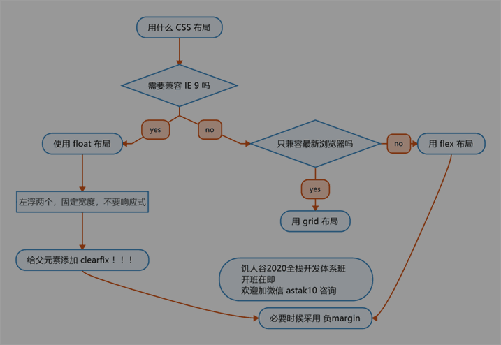

## 0. 其他

* Emmet:

    * bg
 
        > background: #000;

    * .images*4

        > 
</div\>

    * .a+.b+.c+.d+.e

        > 
</div\>
        >
        > 
</div\>
        >
        > 
</div\>
        >
        > 
</div\>
        >
        > 
</div\>

* 常用草图软件：
    
    * Balsamiq
    * Figma
    * 墨刀
    * Adobe XD

## 1. 目标：

* CSS布局

## 2. 主体

### 1) 布局

1. 布局是什么

    > 把页面分成一块一块，按左中右、上中下等排列

2. 布局分类

    * 两种：
        
        * 固定宽度布局

            > 一般宽度为 960 / 1000 / 1024 px

        * 不固定宽度布局

            > 主要靠文档流的原理来布局
            >
            > 文档流本来就是自适应的，不需要加额外的样式

        * 第三种布局
  
            > 响应式布局
            >
            > 意思是PC上固定宽度，手机上不固定宽度
            >
            > 也就是一种混合布局

3. 布局的两种思路
  
    * 从大到小

        > 老手用，因为熟练有大局观

    * 从小到大

        > 新人推荐，因为小的简单

4. 布局需要用到哪些属性

### 2) float 布局

1. 步骤

    1. 子元素上加 float: left 和 width
    2. 在父元素上加 .clearfix

2. 经验

    * 有经验者会留一些空间或者最后一个不设 width
    * 不需要做响应式，因为手机上没有 IE ，而这个布局是专门为 IE 准备的
    * IE 6/7 存在双倍 margin bug，解决办法有两个

        * 一是将错就错，针对 IE 6/7 把 margin 减半
        * 二是神来一笔，再加一个 display: inline-block

3. 实践

    * 不同布局

        * 用 float 做两栏布局（如顶部条）
        * 用 float 做三栏布局（如内容区）
        * 用 float 做四栏布局（如导航）
        * 用 float 做平均布局（如产品展示区）

    * 经验

        * 加上头尾，即可满足所有 PC 页面需求
        * 手机页面不用 float
        * float 要程序员自己计算宽度，不灵活
        * float 用来应付 IE 足矣

### 3) flex 布局
  
> 教程来自 [CSS Tricks](https://css-tricks.com/snippets/css/a-guide-to-flexbox/)

> [青蛙游戏](https://flexboxfroggy.com/)

1. Properties for the Parent (flex container)

    > 父级（弹性容器）的属性

    * display: flex
    * flex-direction
    * flex-wrap 
    * flex-flow

        > flex-direction flex-wrap

    * justify-content

        > 默认主轴 (main axis) 是横轴
        >
        > 除非你改变了 flex-direction 方向

    * align-items

        > 默认交叉轴 (cross axis) 是纵轴

    * align-content

        > 多行，交叉轴有多余空间
        >
        > 很少用

2. Properties for the Children (flex items)

    > 儿童（弹性项目）的属性

    * order

        > 默认为 0

    * flex-grow

        > 默认为 0

    * flex-shrink

        > 默认为 1
        >
        > 0: 防止变瘦

    * flex-basis

    * flex: flex-grow flex-shrink flex-basis

    * align-self

3. 实践

    * 不同布局

        * 用 flex 做两栏布局（如顶部条）
        * 用 flex 做三栏布局（如内容区）
        * 用 flex 做四栏布局（如导航）
        * 用 flex 做平均布局（如产品展示区）
        * 用 flex 组合使用

    * 经验

        * 永远不要把 width 和 height 写死，除非特殊说明
        * 用 min-width / max-width / min-height / max-height
        * flex 可以基本满足所有需求
        * flex 和 margin-xxx: auto 配合有意外的效果

    * 什么叫写死
  
        * 写死

            * width: 100px;

        * 不写死

            * width: 50%
            *
            * max-width: 100px
            *
            * width: 30vw
            *
            * min-width: 80%
            *
            * 特点：不使用 px，或者加 min max 前缀

### 4) Grid 布局

> 功能最强大的布局方案
>
> 二维布局用 Grid，一维布局用 Flex
>
> 教程来自 [CSS Tricks](https://css-tricks.com/snippets/css/complete-guide-grid/)
>
> [Grid Garden](https://cssgridgarden.com/#zh-cn)

1. Properties for the Parent (Grid Container)

    > 父级（网格容器）的属性

    * display: grid
    * grid-template-columns / grid-template-rows
    * grid-template-areas
    * grid-gap

2. 实践
    
    * 布局

        * Grid 尤其适合不规则布局

    * 经验

        * 等到 Grid 普及了，前端对 CSS 的要求会进一步降低

