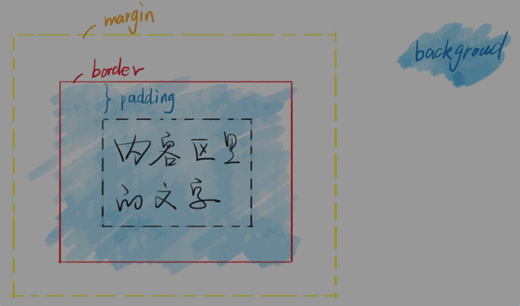
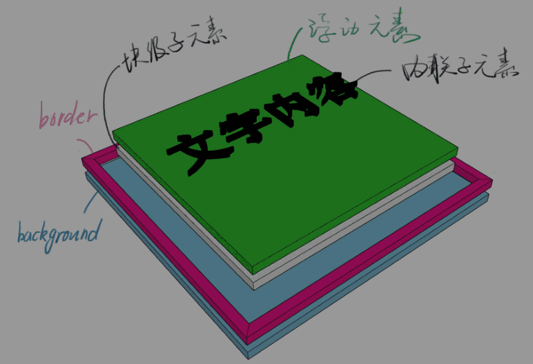
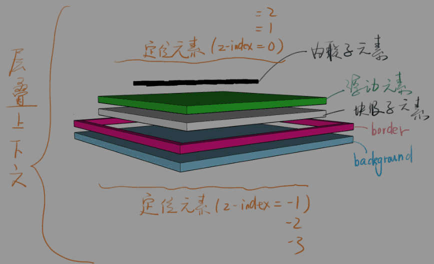

## 1 布局和定位的区别

* 布局是屏幕平面上的
* 定位是垂直于屏幕的

## 2 还得从文档流和盒模型说起

??? note "盒模型"

    

* 背景的范围是从哪到哪？

    > border 外边沿围成的区域
    >
    > border 半透明试试

## 3 一个 div 的分层

??? note "分层"

    > 浮动元素脱离文档流
    >
    > 其实就是浮起来了一点点

    

    

    

## 4 新属性 - position

??? note "position"

    * static 默认值，待在文档流里
    * relative 相对定位，升起来，但不脱离文档流
    * absolute 绝对定位，定位基准是祖先里的非 static

        > absolute 是相对于祖先元素中最近的一个定位元素（position 不是 static）定位的

    * fixed 固定定位，定位基准是 viewport (有诈)
    * sticky 粘滞定位，不好描述直接举例

??? note "经验"

    * 如果你写了 absolute，一般都得补一个 relative
    * 如果你写了 absolute 或 fixed，一定要补 top 和 left
    * sticky 兼容性很差，主要用于面试装逼

### 4.1 position: relative

??? note "使用场景"

    * 用于做位移 （很少用）
    * 用于给 absolute 元素做爸爸 （一会讲）

??? note "配合 z-index"

    * z-index: auto 默认值，不创建新层叠上下文
    * z-index: 0 / 1 / 2
    * z-index: -1 / -2

??? note "经验"

    * 写 z-index: 9999 的都是彩笔
    * 学会管理 z-index

### 4.2 position: absolute

??? note "使用场景"

    * 脱离原来的位置，另起一层，比如对话框的关闭按钮
    * 鼠标提示

!!! note "配合 z-index"

??? note "经验"

    * 很多彩笔都以为 absolute 是相对于 relative 定位的
    * 某些浏览器上如果不写 top / left 会位置错乱
    * 善用 left: 100%
    * 善用 left: 50%; 加负 margin

### 4.3 position: fixed

??? note "使用场景"

    * 烦人的广告
    * 回到顶部按钮

!!! note "配合 z-index"

??? note "经验"

    > 手机上尽量不要用这个属性，坑很多
    >
    > 不信你搜索一下“移动端 fixed”

## 5 层叠上下文

??? note "比喻"

    * 每个层叠上下文就是一个新的小世界（作用域）
    * 这个小世界里面的 z-index 跟外界无关
    * 处在同一个小世界的 z-index 才能比较

??? question "哪些不正交的属性可以创建它"

    * 需要记忆的有 z-index / flex / opacity / transform
    * 面试官也不太懂，不用花时间背
    * 忘了就搜 “层叠上下文 MDN”

!!! note "负 z-index 逃不出小世界"

