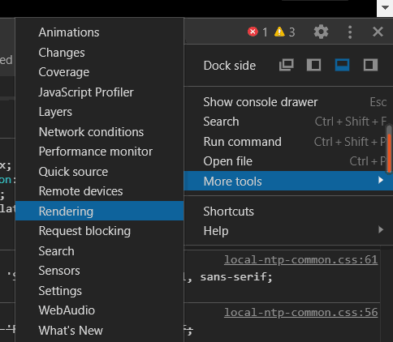
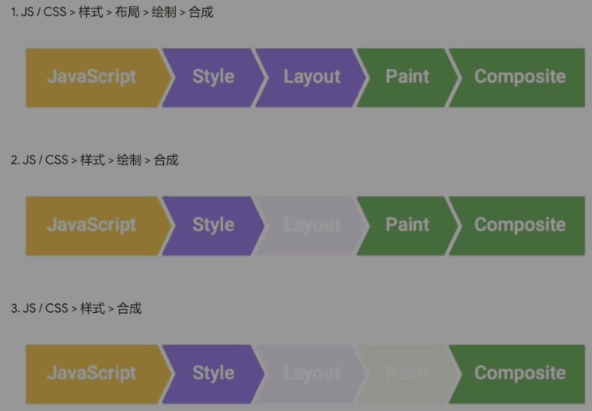

## 1. 目标

* CSS 动画

## 2. 主体

### 1) transform

> 并没有 repaint (重新绘制)
>
> 比改 left 性能好

### 2) 浏览器渲染原理

* google团队的文章

    * [渲染树构建、布局及绘制](https://developers.google.com/web/fundamentals/performance/critical-rendering-path/render-tree-construction)
    * [渲染性能](https://developers.google.com/web/fundamentals/performance/rendering/)
    * [坚持仅合成器的属性和管理层计数](https://developers.google.com/web/fundamentals/performance/rendering/stick-to-compositor-only-properties-and-manage-layer-count)

        > CSS 动画优化
        >
        >  * JS 优化: 使用 requestAnimationFrame 代替 setTimeout 或 setInterval
        >
        >  * CSS 优化: 使用 will-change 或 translate

* 查看 CSS 各属性触发什么

    > [CSS Triggers](https://csstriggers.com/) 

* 浏览器渲染过程

    1. 根据 HTML 构建 HTML 树 (DOM)
    2. 根据 CSS 构建 CSS 树 (CSSOM)
    3. 将两棵树合并成一棵渲染树 (render tree)
    4. Layout 布局 (文档流、盒模型、计算大小和位置)
    5. Paint 绘制 (把边框颜色、文字颜色、阴影等画出来)
    6. Composite 合成 (根据层叠关系展示画面)

    

    选中 Paint flashing

    > 绿色表示重新绘制 (repaint) 了
    >
    > CSS 渲染过程依次包含布局、绘制、合成
    >
    > 其中布局和绘制有可能被省略

* 如何更新样式

    * 一般我们用 JS 来更新样式
  
        * 比如 div.style.background = 'red'
        * 比如 div.style.display = 'none'
        * 比如 div.classList.add('red')
        * 比如 div.remove() 直接删掉节点

    * 这些方法有什么不同吗

        * 有三种不同的渲染方式 

            
            
            > * 第一种，如 div.remove()
            >
            > * 第二种，如 div.style.background = 'red'
            >
            > * 第三种，如 div.style.transform = 'translateX(100px)'

### 3) 其他属性 (property)

* perspective
    
    > determines the distance between the z=0 plane and the user

* transition

    * 并不是所有属性都能过渡

        > display: none -> block 没法过渡
        >
        > 一般改成 visibility: hidden -> visible

    * display 和 visibility 的区别自己搜一下
    * background 和 opacity 可以过渡

* 有中间点
    
    > 两种方法：

    1. 使用两次 transform

        > 如何知道到了中间点？
        >
        > 用 setTimeout 或者监听 transitionend 事件

    2. 使用 animation

        > animation, @keyframes

