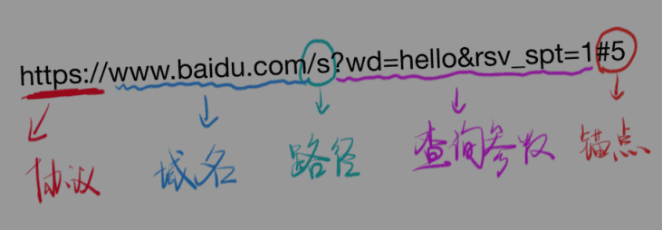
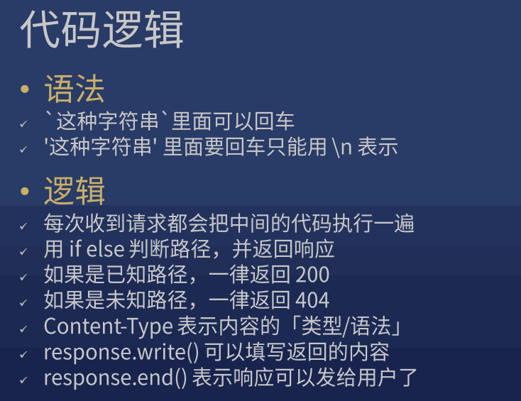
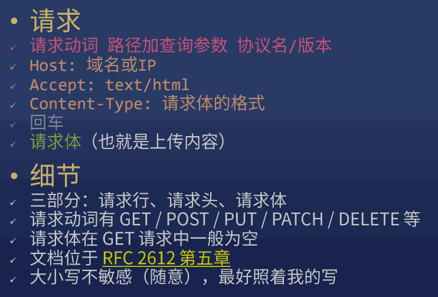
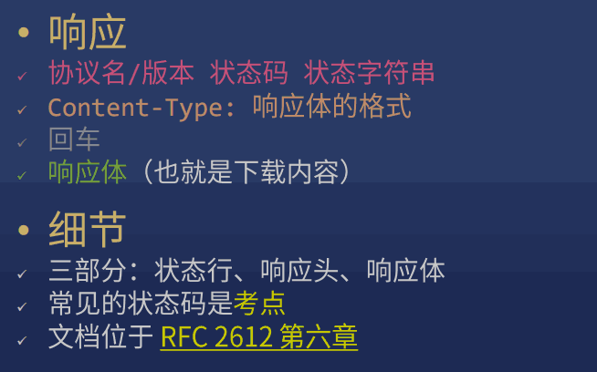
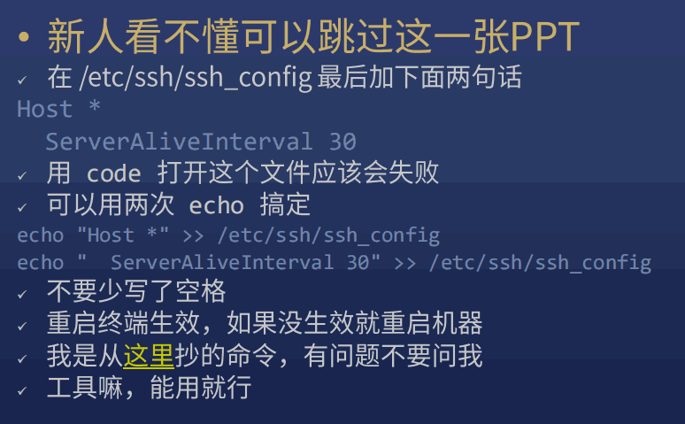

## 0. 其他

* hosts 文件在哪？

    > C:\Windows\System32\drivers\etc\hosts
    >
    > /etc/hosts (macOS / Linux)

* \$ hs -c-1 -p 1234
* \$ nslookup baidu.com
* 80端口是默认端口
* $ apt-get update

## 1. 目标

* HTTP 入门
* HTTP 请求与响应

## 2. 主体

### 1) IP: Internet Protocal

> 只要你在互联网中，就有至少一个独特的 IP

* 主要约定了两件事：

    1. 如何定位一台设备
    2. 如何封装数据报文，以跟其他设备交流

* IP 分为内网(路由器内)和外网(路由器外)

    * 如果重启路由器，很有可能被重新分配一个 外网 IP
    * 路由器会创建一个内网，内网中的设备使用内网 IP，一般格式是 192.168.xxx.xxx (一般路由的内网 IP：192.168.1.1)
    * 内网和外网就像两个隔绝的空间，无法互通，惟一的连接点就是路由器。所以路由器也叫网关。

* 几个特殊的 IP

    * 127.0.0.1：表示自己
    * localhost：通过 hosts 指定为自己
    * 0.0.0.0：不表示任何设备

### 2) IP 有了，还需要 端口
  
IP 和 端口 缺一不可

> 一台机器可以提供很多服务，每个服务一个端口号 port
>
> 比喻：麦当劳提供两个窗口：一号快餐，二号咖啡
>
> 一共有 65535 个端口（基本够用）

* 例子

    * HTTP 服务：80 端口
    * HTTPS 服务：443 端口
    * FTP 服务：21 端口

* 端口使用规则

    * 0 - 1023 号端口是留给系统使用的（需要管理员权限）
    * 其他端口可以给普通用户使用
    * http-server 默认使用 8080 端口
    * 如果一个端口被占用，只能换一个端口

### 3) 域名
  
* ping: 用于检测主机

    > ping 主机：
    >
    > ping host
    >
    > 如 ping qq.com

    > 指定次数：
    >
    > ping -c count host

* 域名是由一串用点分隔的字符组成的互联网上某一台计算机或计算机组的名称，用于在数据传输时标识计算机的电子方位。域名可以说是一个IP地址的代称，目的是为了便于记忆后者。

* 域名主要分为三类：

    *  第一类是通用顶级域名（general Top-Level Domains，简称gTLD）

        > 主要包括： 
        >
        > 1、.com代表商业机构
        >
        > 2、.net代表网络组织
        >
        > 3、.org代表非营利组织等一共22个通用顶级域名。 

    * 第二类是国家及地区代码顶级域名(country code Top-Level Domains，简称ccTLD)

        > 主要包括：
        >
        > 1、.cn中国域名
        >
        > 2、.us美国域名
        >
        > 3、.hk英国域名等一共308个国别域名 

    *  第三类是新增的新通用顶级域名（New generic Top-Level Domains，简称NewgTLD）

        > 主要包括：
        >
        > 1、.bike自行车域名
        >
        > 2、.car汽车域名
        >
        > 3、.run跑步域名等六、七百个新顶级域名（新顶域新增太快了，没具体的数） 

* 一个 域名 可以对应不同 IP （均衡负载，防止一台机器扛不住）
* 一个 IP 可以对应不同 域名 （共享主机）
* www.xiedaimala.com 和 xiedaimala.com 不是同一个域名

    > com 是顶级域名
    >
    > xiedaimala.com 是二级域名（俗称一级域名）
    >
    > www.xiedaimala.com 是三级域名（俗称二级） 
    >
    > 他们是 父子关系
    >
    > github.io 把 子域名 xxx.github.io 免费给你使用

### 4) URL

* DNS: 主要用于域名与 IP 地址的相互转换

* nslookup: 查询域名服务器

    * 非交互模式 (参考 $ tldr nslookup)

        > 从系统的默认 DNS 查询域名的 ip 地址(A 记录)：
        >
        > nslookup example.com

    * 交互模式

        > $ nolookup
        > 
        > 参考 \> help

* dig 更强大，需要下载安装

* URL   
  
    > 协议 + 域名或 IP + 端口号 + 路径 + 查询字符串 + 锚点

    

    * 不同的页面：路径
    * 同一个页面，不同内容：查询参数

        > www.baidu.com/s?wd=hello

    * 同一个内容，不同位置：锚点 

        > \+ \#教程
        >
        > 看起来有中文，实际不支持中文
        >
        > 锚点无法在 Network 面板看到，因为锚点不会传给服务器

* HTTP (协议)

    > 基于 TCP 和 IP 两个协议

* curl 命令

    * 用 curl 可以发 HTTP 请求
  
        > $ curl https://xiedaimala.com
        >
        > $ curl -v http://baidu.com
        >
        > $ curl -s -v -- https://www.baidu.com

    * 理解以下概念
  
        * url 会被 curl 工具重写，先请求 DNS 获得 IP
        * 先进行 TCP 连接，TCP 连接成功后，开始发送 HTTP 请求
        * \> 请求内容看一眼
        * < 响应内容看一眼
        * 响应结束后，关闭 TCP 连接（看不出来）
        * 真正结束

    * HTTP

        > 规定请求的格式是什么，响应的格式是什么

### 5) 请求与响应

* 如何发请求

    > 帮你发请求的工具叫 用户代理 (User Agent)
  
    1. 用 Chrome 地址栏
    2. 用 curl 命令
  
* 如何做出一个响应

    1. node.js 有一个 http 模块可以做到
    2. node-demo-1

        * 这些代码就是服务器代码，一般放在服务器上
        * path 是不带查询参数的路径 /x
        * query 是查询参数的对象形式 {a:'1'}
        * queryString 是查询参数的字符串形式 ?a=1
        * pathWithQuery 是带查询参数的路径，一般不用
        * request 是请求对象
        * response 是响应对象

    

### 6) RFC 2612

* 必须学会什么
    
    * 如何调试 (用的是 node.js，可以用 log / debugger)
    * 在哪查资料 (用的是 node.js，看 node.js 文档)
    * 标准制定者 (HTTP 规格文档：RFC 2612 等)

* HTTP 基础概念

    
    

    > google: http rfc 中文
    >
    > 或
    >
    > google: http spec

### 7) curl

* 用 curl 构造请求

    * 设置请求动词

        > -X POST

    * 设置路径和查询参数

        > 直接在 URL 后面加

    * 设置请求头

        > -H 'Name: Value' 或 --header 'Name: Value'

    * 设置请求体

        > -d '内容' 或者 --data '内容'

        $ curl -v http://localhost:8888/    // GET 请求
        $ curl http://localhost:8888/x
        $ curl -v -X POST -H 'Accept: text/html' http://localhost:8888/xxx?wd=hi#hi

        `-H 'Content-Type: text/plain;charset=utf-8'`

### 8) node.js

* 用 node.js 读取请求

    * 读取请求动词
  
        > request.method
    
    * 读取路径
  
        * request.url 路径，带查询参数
        * path 纯路径，不带查询参数
        * query 只有查询参数

    * 读取请求头

        > request.headers['Accept']

    * 读取请求体（比较复杂，先不讲）

* 用 node.js 设置响应

    * 设置响应状态码
  
        * response.statusCode = 200

    * 设置响应头
  
        * response.setHeader('Content-Type', 'text/html');

    * 设置响应体

        * response.write('内容')
        * 可追加内容

### 9) 如何调试

console.log 调试法

### 10) 购买阿里云服务器

* 如何防止 ssh 卡住

    
    [这里](https://unix.stackexchange.com/questions/200239/how-can-i-keep-my-ssh-sessions-from-freezing/200256#200256)

    > // sudo: super user do
    >
    > // 用 sudo 执行上一条命令
    >
    > $ sudo !!   

* ssh 远程登录

        echo '复制本地~/.ssh/id_rsa.pub内容' >> ~/.ssh/authorized_keys

* 防止 ssh 卡住

        echo "Host *" >> /etc/ssh/ssh_config
        echo "  ServerAliveInterval 30" >> /etc/ssh/ssh_config

* 创建应用账户

        adduser frank
        mkdir  /home/frank/.ssh
        cp ~/.ssh/authorized_keys /home/frank/.ssh/
        chmod 755 /home/frank/.ssh/authorized_keys
        chown frank:frank /home/frank/.ssh/authorized_keys

        adduser frank sudo

* 安装 Node.js 8

        curl -sL https://deb.nodesource.com/setup_8.x | sudo bash -
        sudo sed -i 's/deb.nodesource.com\/node_8.x/mirrors.tuna.tsinghua.edu.cn\/nodesource\/deb_8.x/g' /etc/apt/sources.list.d/nodesource.list
        sudo apt-get update
        sudo apt-get install -y nodejs
        node -v
        npm -v
        npx -v

        sudo apt install git
        // 遇到 [Y/n] 输入回车，或者 y 回车

* 部署应用

        git clone https://github.com/FrankFang/nodejs-test.git
        cd nodejs-test
        touch log
        启动命令：node server.js 8888 > log 2>&1 &
        把启动命令做成 start 文件
        添加执行权限 chmod +x ./start
        运行 sh ./start 得到一个进程号 pid
        tail log 看 log 内容
        kill -9 pid 可以关掉进程
        killall node 可以关掉所有 node 进程

* 如何重启应用

        ssh frank@实例ip
        cd nodejs-test
        git pull
        killall node（因为忘了进程号，实际上可以记下来）
        sh ./start

