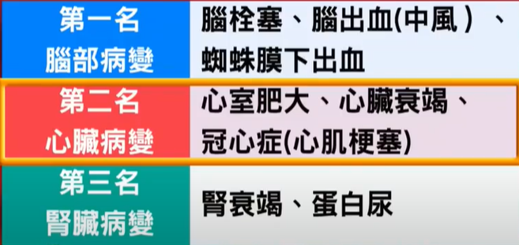
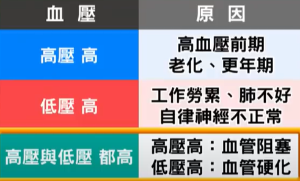
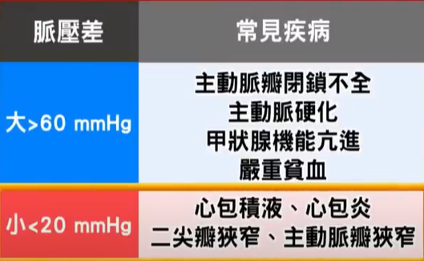
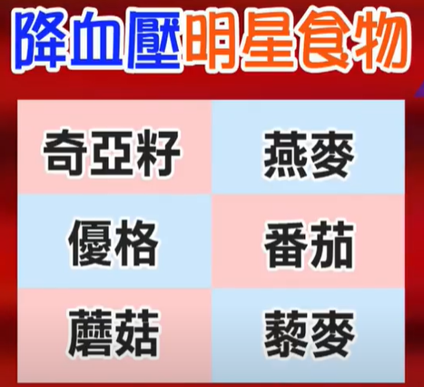

## youtube: 高血压

??? abstract "健康 2.0"

    ??? note "[別等中風倒下，才知道自己有高血壓！這樣吃8週降血壓！](https://www.youtube.com/watch?v=L0_5USLN3sE)"

        
        
        
        

        * 保钾利尿剂型药物 + 高钾食物（瓜类，如西瓜、香瓜、木瓜、香蕉）不能吃
        * 葡萄柚汁 （也有说柳橙汁） 有呋喃香豆素，抑制身体中代谢药物中的酵素，药物浓度会突然飙高，心跳加速等
        * 夏天喝果汁：柳橙（柳丁，含类黄酮，维生素C），青江菜（含钾+，钙+，维生素C），芹菜等，加水，胃寒凉的抓一点坚果或姜片
        * 内关穴：三根手指头
        * 量血压722原则：量一个礼拜两只手，取血压高的手
        * 脉压差=收缩压-舒张压：正常30-40，超过60或小于20，身体什么地方有问题
        * 这样吃8个礼拜有效：全谷根茎类要足够（如小米，燕麦，糙米，黑米，建议一天一碗以上）；天天5+5蔬果（）；多喝低脂乳；红肉改白肉（猪肉，牛肉，饱和脂肪较高 改成 鸡肉，鱼肉，豆类），每天一小把坚果，用好油
        * 得舒（DASH）饮食：40:28
        * 藜麦：43:38
        * 中医降血压食材：菊花，决明子，山楂
        * 目标：< 二期（一期）140 (130), 90 (80)

        * 转手腕，顺时针逆时针都可，左三圈右三圈
        
        

??? note "侯老师说食疗"

    * 地中海型饮食，低钠少盐 <7g，少辛辣刺激的食物
    * 三低一高饮食：少盐少油少糖，高纤的水果和蔬菜，富含钾离子的酪梨或深绿色的蔬菜
    * 禁忌: 高盐高糖（红烧肉 脂肪多糖分盐分多，鱼香肉丝；核桃粉，芝麻糊，成品加淀粉糊精等添加剂更快升高血糖；土豆，芋头等高淀粉蔬菜，淀粉迅速转化为葡萄糖；咸菜，酱类少吃，腌菜，腊肉，熏肉，烧烤，油炸，快餐，调料）
    * 能吃: 富含钾、纤维素、维生素，蔬菜水果和菌菇类；代替部分主食的食物：燕麦，薯类，粗粮，杂粮；低脂肪低胆固醇的蛋白来源：脱脂牛奶，鸡蛋清，鱼类，去皮的鸡鸭肉，瘦肉
    * 金牌食物：每天两三瓣大蒜，芹菜（高血压引起的头痛头胀），黑木耳（隔水蒸着吃，最方便吃法：用清水将黑木耳浸泡后，上屉蒸1-2小时，然后在其中放入适量的冰糖，每天吃一碗即可），香蕉（每天一根，丰富的钾），土豆，绿叶蔬菜
    * 多喝水：睡前（夜间血流缓慢容易形成血栓，稀释血液），起床喝适量的温开水（通便）

??? note "运动"

    * 毛巾操：三折卷起来；握起后手指不会相碰；用3成力握2分钟，放松手掌1分钟，做两次；左右手交替各做2次；每周至少3次，持续2-3个月；一氧化氮的浓度会上升
    * 规律的有氧运动（慢跑，快走，骑单车，游泳）和伸展
    * 走路脚趾着地
    * 手扶椅背原地左右交互踏20分钟，脚尖先着地
    * 内关穴，耳背沟

