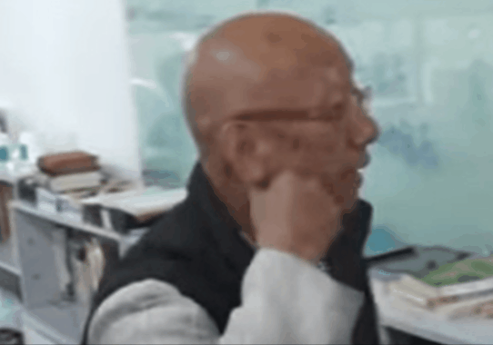

??? note "從耳垂看出心肌梗塞前兆"

    1. 捏一捏耳下脸颊的肉；张口压一压耳前的听宫穴。是嘴巴打開後，壓耳朵前面的三個穴道，耳門、聽宮、聽會，一定要打嘴巴，那三個穴道才會出現。

    
    

    2. 双手的中指头（心包经）、小指头（心经）用按摩棒或工具搓揉到完全不痛
    3. 做完后，请多喝水将卡在这两个地方的脂肪糜粒代谢掉
    4. 摄取 卵磷脂、维生素C 即可渐渐疏通心血管堵住的部位，若能加上亞麻仁油會更好

    此片為補充說明【心血管】影片中按摩棍打通末梢手法。
    許多朋友都說看不清楚老師按的方法。
    為此小編特地請苦行老師再示範一次。
    動作從指甲與肉的交接縫往下刮，
    因為從沒清過那位置，
    一開始會很痛，
    只要忍一下就會好了。
    十個手指，十個腳趾都要按開。
    若自己下不手，可以請別人代勞。
    自己的健康自己負責。
    加油！

