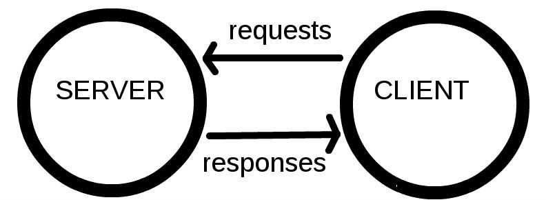

# [Web 入门](https://developer.mozilla.org/en-US/docs/Learn/Getting_started_with_the_web)

## 1) [文件](https://developer.mozilla.org/en-US/docs/Learn/Getting_started_with_the_web/Dealing_with_files)

* 文件夹和文件命名

    * 全部小写
    * 没有空格
    * 使用破折号 (dashes)

## 2) [HTML 基础](https://developer.mozilla.org/en-US/docs/Learn/Getting_started_with_the_web/HTML_basics)

1. HTML (Hypertext Markup Language)

    * not a programming language; it is a markup language (标记语言)

    * HTML 由一系列 elements (元素) 组成

        > wrap the content 的不同部分

    

2. Attributes (属性) 

    1. 空格
    2. attribute name =  
    3. "attribute value"  
    
        > 简单的属性值 (不包含 空格, ", ', `, =, <, >) 可以不加引号
    
    

3. Nesting elements (嵌套元素)

    > 把元素放进其他元素里

4. empty elements (空元素)

    > have no content, 如 

5. HTML 起手式

    1. <html\>

        * wraps 所有内容
        * 根元素

    2. <head\>

        * don't show 的容器
        * 包含:
        
            * 关键字 和 页面描述(出现在搜索结果中)
            * CSS
            * character set(字符集) 声明
            ...

    3. <title\>

        * 设置页面标题
        * 显示在 浏览器tab 上，也作为收藏网页的描述文字。

    4. <body\>

        * show

6. 标记文本的元素

    1. Heading (标题)  

        > <h1\> - <h6\>

    2. Paragraph (段落)  

        > <p\>

    3. List (列表)  

        * 标记列表总是至少包含2个元素。
        * 最常见的类型: 

            1. 有序列表 ordered list: <ol\>
            2. 无序列表 unordered list: <ul\>  
        
        * list item: <li\>

7. Links (链接)  

    * <a\>: anchor  
    * href: hypertext reference

## 3) [CSS 基础](https://developer.mozilla.org/en-US/docs/Learn/Getting_started_with_the_web/CSS_basics)

1. CSS (Cascading Style Sheets): 层叠样式表 

    * 不是 编程语言 和 标记语言
    * CSS is a style sheet language

2. CSS ruleset(规则集)

    

    * 整个结构称为 ruleset. (通常简称 rule)
    * 各部分：

        * Selector (选择器)

            > HTML 元素名
            >
            > 可以选择多个元素

        * Declaration (声明)

            > 一个规则，如 color: red;
            > 
            > 属性: 属性值;

3. 不同类型的选择器

    * 常用选择器类型:

    | 选择器名称                     | 例子                 |
    | ------------------------------ | -------------------- |
    | 元素 选择器 (类型 选择器)      | p                    |
    | ID 选择器                      | #my-id(FF: [id=xxx]) |
    | Class 选择器                   | .my-class            |
    | Attribute 选择器               | img[src]             |
    | Pseudo-class 选择器 (指定状态) | a:hover              |

    > Pseudo-class selector: The specified element(s), but only when in the specified state. (For example, when a cursor hovers over a link.)

4. 字体和文本

    * /\* 和 \*/ 之间的任何内容都是注释

5. CSS: 关于盒子的一切

    * CSS layout 主要基于盒模型 (box model)

        > CSS 布局主要就是基于盒模型的

    * 每个盒子都有属性 (property):

        1. padding (内边距)

            > content 周围的空间

        2. border (边框)

            > padding 外面的实线

        3. margin (外边距)

            > border 外面的空间
            >
            > 

        4. width

            > 元素的宽度

        5. background-color

            > 元素的 content 和 padding 背后的颜色

        6. color

            > 元素的 content 的颜色 (通常是文本)

        7. text-shadow 

            > 在元素的文本上设置阴影

        8. display 

            > 设置元素的显示模式

    * 浏览器给 h1 等元素设置 默认样式 (default styling)
    * <body\> 是块元素，意味着它占据页面空间
    * 一个块元素可以有 margin 和 其他 spacing value
    *  是内联元素，所以为了给  应用 margin，必须 display: block 给予其块级行为。

## 4) [JavaScript 基础](https://developer.mozilla.org/en-US/docs/Learn/Getting_started_with_the_web/JavaScript_basics)

1.  JavaScript

    * 成熟的动态编程语言，可以为网站增加交互性

        > 动态编程语言：操作除了在 编译时(compile-time) 执行，也可以在 运行时(run-time) 执行
        > 
        > 比如：程序运行时 改变 变量类型 或 给对象增加新的property或method
        
    * 多用途

        > 有了更多的经验，您将能够创建游戏，可动的2D和3D图形，全面的数据库驱动的 apps 等等！

    * 本身相对袖珍，但是非常灵活

        * 开发者已在核心JavaScript语言之上编写了各种工具，从而以最小的努力即可解锁大量功能。
        * 包括：

            * 浏览器内建 API

                > 如：动态创建 HTML 和 设置 CSS 样式; 收集和处理 用户网络摄像头的视频流; 生成3D 图形与音频样本 ...

            * 第三方 API

                > 允许开发者在网站 集成 其他内容提供商的功能（例如 Twitter 或 Facebook）

            * 第三方 框架 和 库

                > 快速构建网站和应用。

2.  JavaScript 快速入门

    > 本文介绍核心语言的某些方面，和一些 browser API features

    * JS 对大小写敏感
    * [JavaScript 变量名验证器](https://mothereff.in/js-variables)

    * 变量可以有不同的 数据类型 ：

        | 变量    | 例子                                                                          |
        | ------- | ----------------------------------------------------------------------------- |
        | String  | let myVariable = 'Bob';                                                       |
        | Number  | let myVariable = 10;                                                          |
        | Boolean | let myVariable = true;                                                        |
        | Array   | let myVariable = [1,'Bob','Steve',10];                                        |
        | Object  | let myVariable = document.querySelector('h1');  以及上面所有示例都是对象。 |

        > JavaScript 里一切皆对象，一切皆可储存在变量里。

    * Comments

            /*
            Everything in between is a comment.
            */

            // This is a comment

    * Operators (运算符)

        > 数学符号，根据 值（或变量）产生结果
        > 
        > JS console 中尝试

        * + (还可以连接两个字符串) 
        * -, *, /
        * =
        * ===: 返回 true/false（布尔值）
        * !, !==

                let myVariable = 3; 
                !(myVariable === 3); 

                let myVariable = 3;
                myVariable !== 3;
            

    * Conditional (条件语句)
    * Function (函数)

        > 用来封装可重复使用的功能

    * Events (事件)

        > 网站上的交互需要 events handlers
        >
        > event handler 监听浏览器的活动，并运行代码响应
        >
        > JS console 中尝试以下代码

            // onclick handler property = 匿名函数
            document.querySelector('html').onclick = function() {
                alert('Ouch! Stop poking me!');
            }
            
            // 等价于
            let myHTML = document.querySelector('html');
            myHTML.onclick = function() {};

        >  把 event handler 附加到元素的方法有很多

3. 其他

    * 在JS中，Null 是特殊值，表示引用的值不存在

## 5) [发布网站](https://developer.mozilla.org/en-US/docs/Learn/Getting_started_with_the_web/Publishing_your_website)

* 搜索 "web hosting" and "domain names"
* [GitHub Pages](https://docs.github.com/en/github/working-with-github-pages/getting-started-with-github-pages)

* 在线编程：

    * [JSFiddle](https://jsfiddle.net/)
    * [Glitch](https://glitch.com/)
    * [JS Bin](https://jsbin.com/)
    * [CodePen](https://codepen.io/)

## 6) [Web 如何工作](https://developer.mozilla.org/en-US/docs/Learn/Getting_started_with_the_web/How_the_Web_works)

1. Clients and servers (客户端和服务器) 

    

2. 比喻

    * web(万维网): 路
    * client: 家
    * server: 商店
    * internet connection: 家和商店的街道
    * TCP/IP: 交通工具 

        > 定义数据应如何在Web上传输的通信协议

    * DNS: 网站(商店)的通讯录
    * HTTP: 下订单用的语言

        > 定义 client 和 server 交流语言的 application protocol

    * Component files (组成文件): 买的商品的不同部分

        > 分为：
        >
        >   1. Code files (代码): HTML, CSS, and JavaScript ...
        >
        >   2. Assets (资源): images, music, video, Word documents, and PDFs ...

