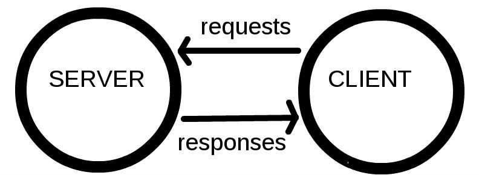

# [Web 入门](https://developer.mozilla.org/en-US/docs/Learn/Getting_started_with_the_web)

## 1 文件

??? note "文件夹和文件命名"

    * 全部小写
    * 没有空格
    * 使用破折号 (dashes)

## 2 HTML 基础 / CSS 基础

??? note "1. HTML element(元素)"

    

??? note "2. CSS ruleset(规则集)"

    

    * 整个结构称为 ruleset. (通常简称 rule)
    * 各部分：

        * Selector (选择器)

            > HTML 元素名
            >
            > 可以选择多个元素

        * Declaration (声明)

            > 单一规则，如 `color: red;`

??? note "3. 不同类型的选择器"

    * 常用选择器类型:

    | 选择器名称                                 | 例子      |
    | ------------------------------------------ | --------- |
    | 元素 选择器 (类型 选择器)                  | p         |
    | ID 选择器 (唯一)                           | #my-id    |
    | Class 选择器                               | .my-class |
    | Attribute 选择器                           | img[src]  |
    | Pseudo-class 选择器 (指定状态下的指定元素) | a:hover   |

??? abstract "5. CSS: 关于盒子的一切"

    ??? note "CSS layout 主要基于盒模型 (box model)"

        页面里大多数 HTML 元素可以看做放在其他盒子上的盒子

    ??? note "每个盒子都有属性 (property):"

        

        1. padding (内边距)

            > content 周围的空间

        2. border (边框)

            > padding 外面的实线

        3. margin (外边距)

            > border 外面的空间

    ??? note

        * 浏览器给 h1 等元素设置 默认样式
        * `margin: 0 auto;`

            * `margin` or `padding`
            * auto 是一个特殊值: 水平空间 左右平分 (evenly)

        * <body\> 是块元素

            * 块元素占据 页面的空间
            * 块元素 可以有 margin 和 其他 spacing values 应用在上面

        * 内联元素不行

            > 所以为了给  (内联元素) 应用 margin，必须 `display: block;` 给予其块级行为。

## 3 JavaScript 基础

??? note "成熟的动态编程语言，可以为网站增加交互性"

    动态编程语言：操作除了在 编译时(compile-time) 执行，也可以在 运行时(run-time) 执行
    
    比如：程序运行时 改变 变量类型 或 给对象增加新的 property 或 method
        
??? note "本身相对袖珍，但是非常灵活"

    * 开发者已在核心JavaScript语言之上编写了各种工具，从而以最小的努力即可解锁大量功能。包括：
    
        * 浏览器内建 API
    
            > 如：动态创建 HTML 和 设置 CSS 样式; 收集和处理 用户网络摄像头的视频流; 生成3D 图形与音频样本 ...
    
        * 第三方 API
    
            > 允许开发者在网站 集成 其他内容提供商的功能（例如 Twitter 或 Facebook）
    
        * 第三方 框架 和 库
    
            > 快速构建网站和应用。

* [JavaScript 变量名验证器](https://mothereff.in/js-variables)
* JavaScript 里一切皆对象，一切皆可储存在变量里。

??? note "Events (事件)"

    网站上的交互需要 events handlers
    
    events handler 是代码结构: 监听浏览器的活动，并运行代码作为响应

    ??? success "click event"

        ``` javascript
        document.querySelector('html').onclick = function() {
            alert('Ouch! Stop poking me!');
        }
        ```

        等价于

        ``` javascript
        let myHTML = document.querySelector('html');
        myHTML.onclick = function() {};
        ```

!!! note "在JS中，Null 是特殊值，表示引用的值不存在"

## 4 发布网站

* [GitHub Pages](https://docs.github.com/en/github/working-with-github-pages/getting-started-with-github-pages)

??? note "在线编程："

    * [JSFiddle](https://jsfiddle.net/)
    * [Glitch](https://glitch.com/)
    * [JS Bin](https://jsbin.com/)
    * [CodePen](https://codepen.io/)

## 5 Web 如何工作

??? note "1. Clients and servers (客户端和服务器)"

    

??? note "2. 比喻"

    * web(万维网): 路
    * client: 家
    * server: 商店
    * internet connection: 连接家和商店的街道
    * TCP/IP: 交通工具 

        > 定义数据应如何在Web上传输的通信协议

    * DNS: 网站(商店)的通讯录
    * HTTP: 下订单用的语言

        > 定义 client 和 server 交流语言的 application protocol

    * Component files (组成文件): 买的商品的不同部分

        > 分为：
        >
        >   1. Code files (代码): HTML, CSS, and JavaScript ...
        >
        >   2. Assets (资源): images, music, video, Word documents, and PDFs ...


