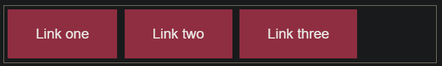
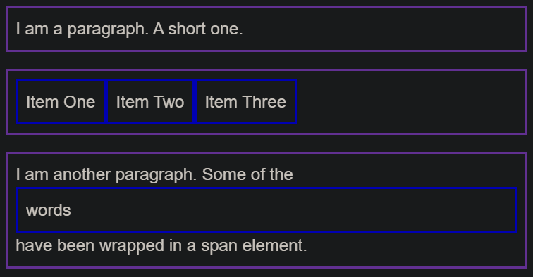

> [CSS 构建块(building blocks)](https://developer.mozilla.org/en-US/docs/Learn/CSS/Building_blocks)

## 1 层叠与继承 (Cascade and inheritance)

??? note "继承 (Inheritance)"

    一些属性 (properties) 是不能继承的，很大程度上由常识决定的。

    举个例子: 如果你在一个元素上设置 width 为 50% ，所有的后代不会是父元素的宽度的50% 。如果这个也可以继承的话，CSS就会很难使用了!

    像 widths (上面提到的), margins, padding, 和 borders 不会被继承。

* 理解 继承 (inheritance)

    ??? note "控制继承"

        CSS提供了四个特殊的通用属性值来控制继承。每个CSS属性都接受这些值。

        1. inherit: 使 选定元素 的属性值和父元素相同。实际上，就是 "开启继承".

        2. initial: 设置 选定元素 的属性值 为 该属性的初始值

        3. unset: 将属性重置为其自然值。这意味着，如果该属性是自然继承的，则其行为类似于inherit，否则，其行为类似于initial。

        !!! note "注: 还有一个新的属性, revert，只有很少的浏览器支持。"

    ??? note "重置所有属性值"

        CSS速记属性all可用于一次将这些继承值之一应用于（几乎）所有属性。其值可以是继承值中的任何一个（inherit，initial，unset，或revert）。这是撤消对样式所做的更改的便捷方法，以便您可以在开始新的更改之前回到已知的起点。

        ``` css
        .fix-this {
            all: unset;
        }
        ```

* 理解层叠 (cascade)

    要考虑三个因素，这里按重要性从高到低的顺序列出。前面的否决后面的

    1. Importance

        > 除非绝对必要，否则不要使用它

    2. Specificity

        ??? note "a class selector has more weight (权重) than an element selector"

            此行为有助于避免CSS中的重复。一种常见的做法是为基本元素定义通用样式，然后为那些不同的元素创建类。

        ??? abstract "一个选择器具有的特定性总数是使用四个不同的值（或分量 components）来衡量的，可以看做 "千，百，十，个""

            1. 千位：如果声明在 style 的属性（内联样式）内，则该位得一分。这样的声明没有选择器，所以特定性总是1000。
            2. 百位：整体的选择器中包含的每个 ID 选择器，则该位得一分。
            3. 十位：整体的选择器中包含的每个 类(class)选择器、属性(attribute)选择器 或者 伪类(pseudo-class)，则该位得一分。
            4. 个位：整体的选择器中包含的每个 元素(element)选择器、伪元素(pseudo-element)，则该位得一分。

            !!! note "Note: The universal selector (*), combinators (+, >, ~, ' '), and negation pseudo-class (:not) have no effect on specificity."

            ??? note "评估特异性的更准确方法是对特异性水平分别评分，从最高开始，必要时(平局)降低到最低。"

                实际上，每种选择器类型都有其自己的特定性，不能被较低特定性级别的选择器覆盖。例如，组合在一起的一百万个 class 选择器将无法覆盖一个 id 选择器的规则。


    3. Source order


## 2 CSS选择器


CSS 选择器规定了 CSS 规则会被应用到哪些元素上。

??? abstract "1 基本选择器 (Basic selectors)"

    ??? note "1.1 通用选择器（Universal selector）"

        > 选择所有元素。
        >
        > 语法：`*`

        ``` css
        /* 使选择器更易读 */
        /* 选择 <article\> 元素后代元素中的第一个孩子 */
        article *:first-child { 

        } 
        ```

    ??? note "1.2 类型选择器（Type selector, 个）"

        > 选择具有给定节点名称的所有元素。
        >
        > 语法：`elmentname`

    ??? note "1.3 类选择器（Class selector, 十）"

        > 选择具有给定 class 属性的所有元素。
        >
        > 如果元素被应用了两个类，只需将它们链接 (chaining) 在一起并且它们之间没有空格，便可以匹配该元素。
        >
        > 语法：`.classname`

        ``` css
        .notebox.danger {
          border-color: red;
          font-weight: bold;
        }
        ```

    ??? note "1.4 ID 选择器（ID selector, 百）" 

        > 根据其 id 属性值选择一个元素。文档中应只有一个具有给定 ID 的元素。
        >
        > 可以在ID之前添加类型选择器
        >
        > 语法：`#idname`

        ``` css
        h1#heading {
            color: rebeccapurple;
        }
        ```

        ??? note

            ID 具有很高的 specificity，并且会推翻大多数其他选择器。所以很难处理它们。在大多数情况下，最好是在元素中添加 class 而不是使用 ID，但是，如果使用 ID 是指定元素的唯一方法（也许是因为您无权访问标记，因此无法对其进行编辑），这会生效。

    ??? note "1.5 属性选择器（Attribute selector, 十）"

        > 选择具有给定属性的所有元素。
        >
        > 语法：`[attr]`, `[attr=value]`
        >
        > 例：`a[title] { }`

        ``` css
        // 匹配具有 attr 属性的元素，该元素的值恰好是 value，或者在其（空格分隔的）值列表中包含 value。
        [attr~=value]
        // 匹配具有 attr 属性的元素，该属性的值恰好是 value 或 以 value 开头，之后紧跟一个连字符。
        [attr|=value]
        ```

        ??? note "子字符串匹配选择器"

            ``` css
            // 属性的值以 "box-" 开头
            li[class^="box-"]  (or [class|="box"])
            // 属性的值以 "-box" 结尾
            li[class$="-box"]
            // 属性的值在字符串中的任何位置包含了 "box"。
            li[class*="box"]
            ```

        ??? note "大小写敏感"

            如果要不区分大小写地匹配属性值，则可以在右括号 (closing bracket) 之前用 i 。
            
            > 如果没有标记，则值将根据文档语言的 case-sensitivity 进行匹配--在 HTML 中将区分大小写。

            ``` css
            li[class^="a" i] {
                color: red;
            }
            ```


??? note "2 分组选择器 (Grouping selectors)"

    * 选择器列表（Selector list）

        > 语法：`A, B`

??? note "3 组合器 (Combinators)"

    * 后代组合器（Descendant combinator，空格）

        > 选择前一个元素的后代节点。
        >
        > 第一个元素可以是 parent's parent's parent
        >
        > 语法：`A B`

    * 直接子代组合器（Child combinator, >）

        > 选择第一个元素的 直接 子代的节点。
        >
        > 语法：`A > B`

    * 全体兄弟组合器（General sibling combinator）

        > 选择兄弟元素，这意味着第二个元素在第一个元素后面的任意位置，并且共享相同的父元素。
        >
        > 所有 all
        >
        > 语法：`A ~ B`

    * 紧邻兄弟组合器（Adjacent sibling combinator）

        > 选择相邻的兄弟元素。这意味着第二个元素直接跟随第一个元素，并且共享相同的父元素。
        >
        > 相同 level
        >
        > 语法：`A + B`


    ??? success "使用 combinators"

        ``` css
        /* select list items with a class of "a", which are direct children of a <ul> */
        ul > li[class="a"]  {  }
        ```

    ??? note "通常最好创建一个 class"

        就是说，如果您需要访问文档中的某些内容但是无法访问 HTML（可能因为是由 CMS 生成的），combinators 会非常有用。

??? note "4 伪选择器 (Pseudo)"

    * 伪类 (Pseudo classes, 十)

        > 允许基于不包含在 document tree 的状态信息 来选择元素
        >
        > 语法：:pseudo-class-name
        >
        > 例子: `a:visited`

        ??? note "作用"

            它们表现得会像是你向你的文档的某个部分应用了一个 class 一样，通常帮你在你的标记中减少过多的类，让你的代码更灵活、更易于维护。

        ??? success "简单 (simple) 伪类的例子"

            ``` css
            article p:first-child {
                font-size: 120%;
                font-weight: bold;
            }   
            ```

            `:last-child`
            `:only-child`
            `:invalid`

        ??? success "用户操作 (User-action) 伪类"

            表现得就像是一个类在用户和元素交互的时候加到了元素上一样。

            * `:hover`: 鼠标
            * `:focus`: the user focuses the element using keyboard controls.

            ``` css
            a:link,
            a:visited {
                color: rebeccapurple;
                font-weight: bold;
            }

            a:hover {
                color:hotpink;
            }   
            ```


    * 伪元素 (Pseudo elements, 个)

        > 表示无法用 HTML 语义表达的实体。
        >
        > 选择元素的某一部分而不是元素自身
        >
        > 语法：`::pseudo-element-name`
        >
        > 例子: `p::first-line` 匹配所有 <p\> 元素的第一行

        ??? note "作用"

            伪元素的行为类似，但是它们的行为就像您在标记中添加了一个全新的 HTML 元素一样，而不是将类应用于现有元素。

        ??? success "例子"

            ``` css
            article p::first-line {
                font-size: 120%;
                font-weight: bold;
            }   
            ```
    
    ??? note "结合伪类和伪元素"

        如果要使第一段的第一行 为粗体，可以将`:first-child`和`::first-line`选择器链接 (chain) 在一起。

        ``` css
        article p:first-child::first-line { 
          font-size: 120%; 
          font-weight: bold; 
        }
        ```

    ??? note "使用 ::before 和 ::after 生成内容"

        有几个特殊的伪元素，这些伪元素与 content 属性一起，使用 CSS 将内容插入文档中。

        > 但是，从 CSS 插入文本字符串实际上并不是我们在网络上经常要做的事情，因为某些屏幕阅读器无法访问该文本，并且将来别人很难找到和编辑。

        ??? success "更有效的用法是插入一个图标 (icon)"

            ``` css
            .box::after {
                content: " ➥"
            }   
            ```

        ??? success "这些伪元素还经常用于插入空字符串，然后可以像在页面上的任何元素一样设置其样式。"

            设置为 `display: block` 以便 style it with a width and height.

            ``` css
            .box::before {
                content: "";
                display: block;
                width: 100px;
                height: 100px;
                background-color: rebeccapurple;
                border: 1px solid black;
            }   
            ```

        ??? note

            在 CSS 中，将 `::before` 和 `::after` 伪元素与 content 属性的一起使用 称为 “生成的内容 (Generated Content)”，并且您经常会看到此技术用于各种任务。
            
            一个很好的例子是 [CSS Arrow Please](http://www.cssarrowplease.com/) 网站，它可以帮助您使用 CSS 生成箭头。

* [reference](https://developer.mozilla.org/en-US/docs/Learn/CSS/Building_blocks/Selectors/Pseudo-classes_and_pseudo-elements#Reference_section)


## 3 盒模型 (The box model)

Everything in CSS has a box around it, 理解这些 boxes 是用 CSS create layouts 或 align items with other items 的关键 

??? note "Block and inline boxes"

    在 CSS 中我们广泛地使用两种“盒子” —— 块级盒子 (block box) 和 内联盒子 (inline box)。这些特征是指 盒子在页面流（page flow）上的行为 和 与页面上其他盒子之间的关系

    ??? note "块级盒子的行为"

        * 盒子会换行
        * 盒子会在 inline 方向上 extend 以填充它的容器内的可用空间。

            > 在大多数情况下，这意味着盒子将变得和它的容器一样宽，将占据100％的可用空间。

        * The `width` and `height` properties are respected.
        * `Padding`, `margin` and `border` 将导致其他元素被推离盒子

    ??? note "If a box has an outer display type of inline"

        > <a\>, <span\>, <em\> and <strong\>
        >
        > 应用到元素的盒子的类型是由 display 属性值定义，如 block 和 inline, and relates to the outer value of display.

        * 盒子不会换行
        * The `width` and `height` properties 不会应用.
        * 垂直方向的 `padding`, `margins`, 和 `borders` 会应用，但是不会把其他 inline 盒子推开。
        * 水平方向的 `padding`, `margins`, 和 `borders` 会应用，并会把其他 inline 盒子推开。

??? abstract "inline boxes"

    > 例如由 <span\> 元素创建的那些。

    * width 和 height 被忽略
    * 垂直 margin, padding, and border 受尊重，但它们不会改变其他内容与我们的 inline box 的关系，因此 padding 和 border 与段落中的其他单词重叠。水平的 padding, margins, and borders 受尊重，这将导致其他 content 从盒移开。

    ??? note "用途"

        当您想要通过添加 padding 使链接具有更大的命中区域时，这是很有用的。
        
        <a\> 是像 <span\> 一样的 inline 元素；你可以使用 display: inline-block 来设置 padding，让用户更容易点击链接。

    ??? success "您在导航栏中经常看到这种情况。"

        === "html"

            ``` html
            <nav>
              <ul class="links-list">
                <li><a href="">Link one</a></li>
                <li><a href="">Link two</a></li>
                <li><a href="">Link three</a></li>
              </ul>
            </nav>    
            ```

        === "css"

            ``` css
            .links-list a {
              background-color: rgb(179,57,81);
              color: #fff;
              text-decoration: none;
              padding: 1em 2em;
              display: inline-block;
            }

            .links-list a:hover {
              background-color: rgb(66, 28, 40);
              color: #fff;
            }
            ```

        === "output"

            


??? note "使用 display: inline-block"

    display 有一个特殊值, 提供了 inline 和 block 之间的中间地带. 

    这对于以下情况非常有用: 您不希望 an item 切换到新行，但希望它尊重 width 和 height，并避免重叠 (overlapping)。

    一个元素应用 display: inline-block，做了 block 的事的子集:

    * width 和 height 属性受尊重
    * padding, margin, 和 border 会导致其他元素被推离盒子


??? info "Aside: Inner and outer display types"

    * outer display type

        > block 或 inline

        改变 display 属性的值可以改变盒子的 outer display type 是 block 或 inline。

        在本课程的其余部分中，我们将专注于外部显示类型。

    * inner display type

        指示盒子内部的元素如何布局。默认情况下，盒子内的元素按 normal flow 布局, 这意味着它们的行为与任何其他 block 和 inline 元素一样。

        但是，我们可以通过使用类似 flex 的 display 属性的值改变 inner display type。如果我们在元素上设置 `display: flex;`, the outer display type 是 block, 但是 the inner display type 变为 flex. 该盒子的所有直接子元素都会成为flex元素

    ??? success "例子"

        === "css"

            ``` css
            p, 
            ul {
              border: 2px solid rebeccapurple;
              padding: .5em;
            }

            .block,
            li {
              border: 2px solid blue;
              padding: .5em;
            }

            ul {
              /* display: inline-flex; */
              display: flex;
              list-style: none;
            }

            .block {
              display: block;
            }      
            ```

        === "html"

            ``` html
            <p>I am a paragraph. A short one.</p>
            <ul>
              <li>Item One</li>
              <li>Item Two</li>
              <li>Item Three</li>
            </ul>
            <p>I am another paragraph. Some of the <span class="block">words</span> have been wrapped in a <span>span element</span>.</p>
            ```

        === "output"

            


??? success "The alternative CSS box model"

    ``` css
    html {
      box-sizing: border-box;
    }
    *, *::before, *::after {
      box-sizing: inherit;
    }
    ```

??? note "Margin collapsing"

    理解外边距的关键是外边距折叠的概念

??? note "border"

    若要设置所有边的 width, style, or color, 请使用:

    * border-width
    * border-style
    * border-color

??? note "padding"

    与 margin 不同，您不能有负的 padding，因此该值必须为 0 或 正值。

    应用于元素的任何背景都将显示在 padding 的后面，通常用于将 content 推离 border。

## 4 Backgrounds and borders

* [cssgradient.io](https://cssgradient.io/)
* [例子](https://developer.mozilla.org/en-US/docs/Learn/CSS/Building_blocks/Test_your_skills_backgrounds_and_borders)

## 5 处理不同的文本方向

跳过

## 6 溢出的内容

??? note "您也可以使用 overflow-x 实现在x轴上滚动，尽管不建议使用这种方法来容纳长字！"

    如果在一个小框中有一个长字，则可以考虑使用 word-break 或 overflow-wrap 属性。此外，在 CSS "调整项目大小" 中讨论的某些方法可能有助于您创建可以和有变化容量的内容相协调的盒子。

??? note "Overflow establishes a Block Formatting Context"


    当你使用 a value of overflow such as scroll or auto, you create a Block Formatting Context (BFC). 您已更改 overflow 的值的盒子的 content 将获得一个独立的布局. 容器外面的 Content 无法戳入容器, 也无法将容器中的内容戳出容器到周围的布局. 这可以实现滚动行为，因为所有盒内容都需要被包含且不重叠，以便创建一致的滚动体验。

??? note "Unwanted overflow in web design"

    现代的布局方法 (在 CSS layout 中描述) 管理溢出.

    开发网站时，请始终牢记溢出。测试包含大量和少量内容的设计。增加文本的字体大小。通常，请确保 CSS 具有稳定的功能。更改 overflow 的值来隐藏内容或添加滚动条，会是你仅仅在少数特别情况下需要的。

## 7 值和单位 (values and units)

!!! note "CSS values = data types (数据类型)"

!!! note "CSS 值倾向于使用尖括号来表示，以将它们与 CSS 属性（例如，color 属性 (property) 与 <color\> 数据类型）区分开。"

??? abstract "1. 数字，长度和百分比"

    numeric (数字的) data types:

    * <integer\>: 整数
    * <number\>: 小数（可能没有小数部分）

        如 opacity: 0 - 1 

    * <dimension\>: <number\> + unit

        > 包含 <length\>, <angle\>, <time\>, <resolution\> 类型

        * Lengths

            分为 相对长度 和 绝对长度

            !!! note "绝对长度单位: px"

            ??? note "相对长度单位"

                相对于 something else, 比如 父元素字体的大小, 或者 viewport (视口) 的大小.

                * em: 如果是印刷属性如 font-size，相对于父元素的字体大小；如果是其他属性如 width，相对于元素本身的字体大小。
                * rem: 相对于根元素的字体大小
                * lh: 元素的 line-height
                * vw: 视口宽度的 1%
                * vh: 视口高度的 1%

    * <percentage\>

??? note "2. color"

    * 颜色关键字

        这些关键字被更准确地描述为标识符 (identifiers)，CSS 可以理解的一个特殊值。因此它们没有使用引号括起来——它们不被当作字符串。

    * 十六进制 RGB 值

        a hash/pound symbol (#) + 6 个十六进制数字

    * RGB and RGBA 值

        RGB 值是一个函数— rgb()，有 3 个参数，十进制数字表示

        Alpha通道，该值控制不透明度。

    * HSL和HSLA值

        hsl() 函数接受 hue (色调), saturation (饱和度), and lightness (亮度) 值:

        * Hue: The base shade of the color. 0 - 360, 代表色轮周围的角度
        * Saturation: 0–100%, 0: 无颜色 (显示为灰色阴影), 100%: full color saturation
        * Lightness: 0–100%, 0: 没有光 (显示为完全黑色), 100%: full light (显示为完全白色), 50% lightness is “normal”.

!!! note "3. images (图片)"

!!! note "4. Strings (字符串) and identifiers (标识符)"

!!! note "5. Functions (函数)"


## 8 调整项目大小 (Sizing items in CSS)

* max-width 的例子

## 9 Images, media, and form (表单) elements

略

## 10 样式化表格 (Styling tables)

略

## 11 Debugging CSS

略

## 12 组织 CSS

略

## 3 [样式化文本(styling text)]()

略