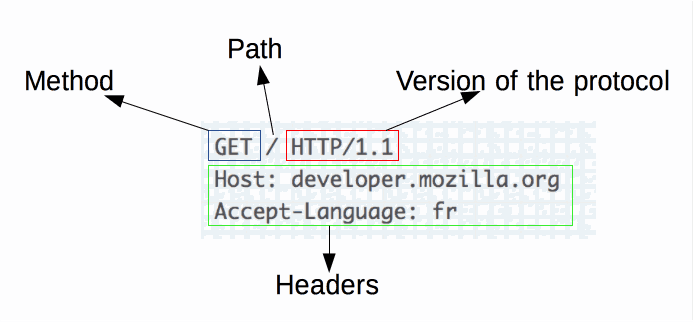
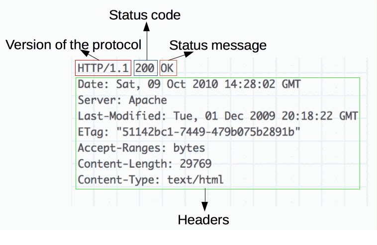

??? quote "HTTP 术语表"

    The current version of the HTTP specification is called HTTP/2.


??? info "[HTTP](https://developer.mozilla.org/en-US/docs/Web/HTTP)"

    超文本传输​​协议（HTTP, Hypertext Transfer Protocol）是用于传输 (transmit) 超媒体文档（例如 HTML）的应用层协议。它是为 Web 浏览器和 Web 服务器之间的通信 (communication) 而设计的，但也可以用于其他目的。HTTP 遵循经典的客户端-服务器模型 (follows a classical client-server model)，客户端打开连接以发出请求 (opening a connection to make a request)，然后等待直到收到响应 (response)。HTTP 是无状态协议 (stateless protocol)，这意味着服务器在两个请求之间不保留任何数据 data（状态 state）。尽管通常基于 TCP / IP 层，但是它可以在任何可靠的传输层 (transport layer) 上使用，可靠即该协议不会像 UDP 那样静默 (silently) 地丢失消息。RUDP — the reliable update of UDP — 是合适的替代方法。

## Tutorials

??? abstract "HTTP 概述"

    ??? quote "Protocol 术语表"

        协议是定义了数据如何在计算机内和之间进行交换的规则的系统。设备之间的通信 (Communications) 要求设备就正在交换的数据格式达成一致。定义格式的规则集称为协议。

    HTTP 是一个协议，其允许资源，诸如 HTML 文档的获取 (fetching)。它是 Web 上任何数据交换的基础，是一种 client-server 协议，这意味着请求是由接受者（recipient, 通常是 Web 浏览器）发起的。从获取的不同子文档中重构出完整的文档，例如文本，布局描述，图像，视频，脚本等。

    客户端和服务器通过交换单独的消息（与数据流正好相反）进行通信。客户端（通常是 Web 浏览器）发送的消息称为 requests，而服务器作为 answer 发送的消息称为 responses。

    ??? note "HTTP flow"

        当客户端要与服务器（最终服务器或中间代理）进行通信 (communicate) 时，它将执行以下步骤：

        !!! info "1. Open a TCP connection：TCP 连接用于发送一个或多个请求，并接收 an answer。客户端可以打开一个新连接，重用现有的连接，或打开到服务器的多个 TCP 连接。"

        ??? info "2. Send an HTTP message：HTTP 消息（在 HTTP/2 之前）是人类可读的。使用 HTTP/2，这些简单的消息被封装在帧(frames)中，使其无法直接读取，但是原理保持不变。例如："

            ```
            GET / HTTP/1.1
            Host: developer.mozilla.org
            Accept-Language: fr
            ```

        ??? info "3. 读取服务器发送的响应，例如："

            ```
            HTTP/1.1 200 OK
            Date: Sat, 09 Oct 2010 14:28:02 GMT
            Server: Apache
            Last-Modified: Tue, 01 Dec 2009 20:18:22 GMT
            ETag: "51142bc1-7449-479b075b2891b"
            Accept-Ranges: bytes
            Content-Length: 29769
            Content-Type: text/html

            <!DOCTYPE html... (here comes the 29769 bytes of the requested web page)
            ```

        !!! info "4. 关闭或重用连接以进行进一步的请求。"

        如果激活了 HTTP pipelining (流水线)，则可以发送几个请求，而无需等待第一个响应被完全接收。事实证明，HTTP 流水线难以在现有网络中实现，因为在现有网络中，旧软件与现代版本共存。HTTP pipelining has been superseded in HTTP/2 with more robust multiplexing requests within a frame.

    ??? note "HTTP Messages (报文)"

        HTTP messages, as defined in HTTP/1.1 and earlier, are human-readable. In HTTP/2, these messages are embedded into a binary structure, a frame, allowing optimizations (优化) like compression of headers and multiplexing. 即使在此版本的 HTTP 中仅发送原始 HTTP 消息的一部分，每个 message 的语义也不会改变，并且客户端会（虚拟地）重组原始 HTTP/1.1 请求。因此用 HTTP/1.1 格式来理解 HTTP/2 messages 仍旧有效。
        
        HTTP messages 有两种类型，即 requests 和 responses，每种都有其自己的格式。

        ??? info "Requests"

            

            请求包含以下元素：

            * An HTTP method, usually a verb like GET, POST or a noun like OPTIONS or HEAD that 定义了客户端要执行的操作. 通常，客户端希望获取资源（使用GET）或 post the value of an HTML form (using POST), 尽管在其他情况下可能需要更多操作。
            * 要获取的资源的路径; the URL of the resource stripped from elements that are obvious from the context, for example without the protocol (http://), the domain (here, developer.mozilla.org), or the TCP port (here, 80).
            * The version of the HTTP protocol.
            * Optional headers that convey additional information for the servers.
            * Or a body, for some methods like POST, similar to those in responses, which contain the resource sent.

        ??? info "Responses"

            

            响应包含以下元素：

            * The version of the HTTP protocol they follow.
            * A status code, indicating if the request was successful, or not, and why.
            * A status message, a non-authoritative short description of the status code.
            * HTTP headers, like those for requests.
            * Optionally, a body containing the fetched resource.

        ??? info "基于 HTTP 的 APIs"

            基于 HTTP 的最常用的 API 是 [XMLHttpRequest](https://developer.mozilla.org/en-US/docs/Web/API/XMLHttpRequest) API ，可用于在用户代理和服务器之间交换数据。现代 [Fetch API](https://developer.mozilla.org/en-US/docs/Web/API/Fetch_API) 提供了相同的功能，具有更强大，更灵活的功能集。

            Another API, [server-sent events](https://developer.mozilla.org/en-US/docs/Web/API/Server-sent_events), is a one-way service that 允许服务器使用 HTTP 作为传输机制将事件发送到客户端. Using the [EventSource](https://developer.mozilla.org/en-US/docs/Web/API/EventSource) interface, the client opens a connection and establishes event handlers. The client browser automatically converts the messages that arrive on the HTTP stream into appropriate Event objects, delivering them to the event handlers that have been registered for the events' type if known, or to the onmessage event handler if no type-specific event handler was established.

    * [HTTP message monitor](https://developer.mozilla.org/en-US/docs/Tools/Network_Monitor)

