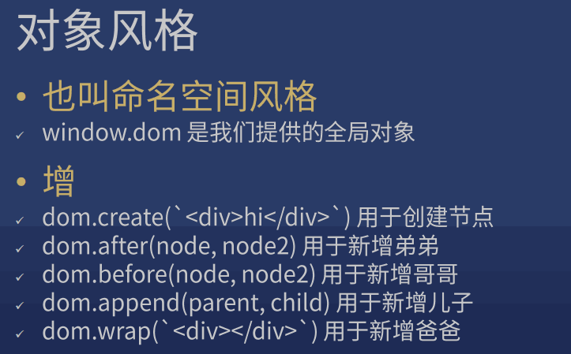
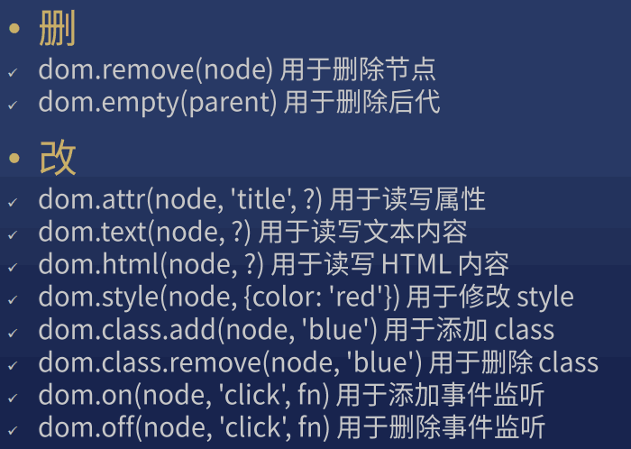
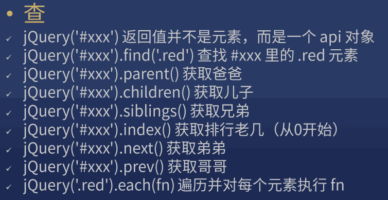
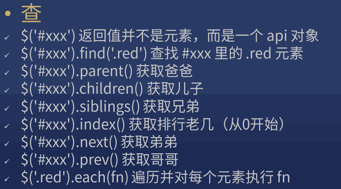
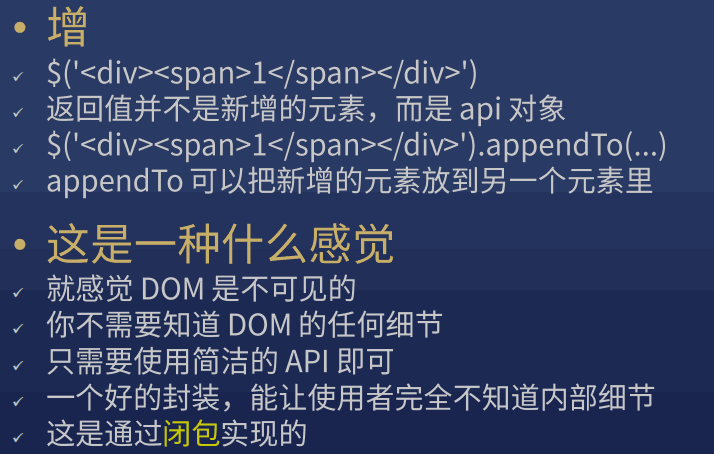
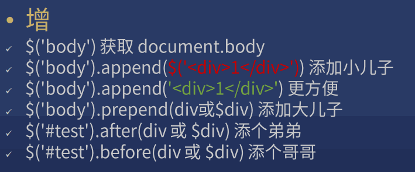
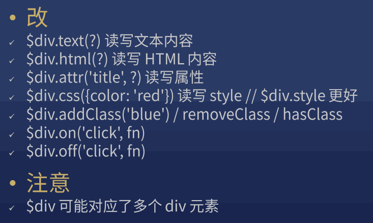
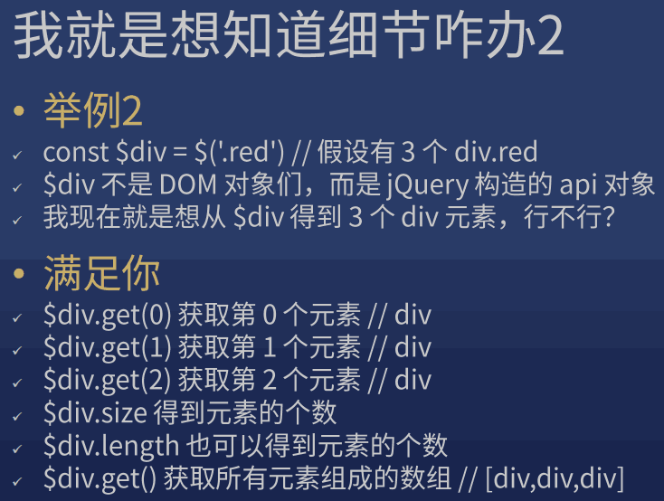
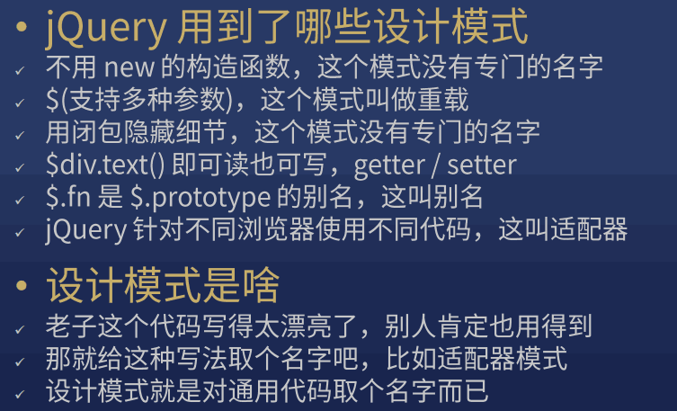
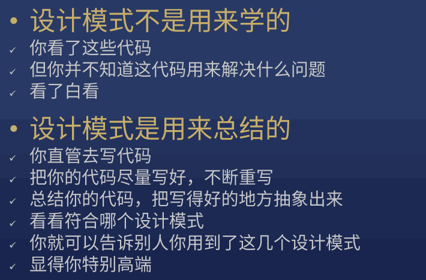

> 从入门到工作：JS 编程接口

??? abstract "用两种风格封装 DOM 操作"

    * 对象风格

        > 也叫 命名空间风格

        ??? note "增"

            

        ??? note "删，改"

            

        ??? note "查"

            

    * jQuery 风格

        > 也叫 链式风格

        ??? note "查"

            
            

        ??? note "增"

            
            

        ??? note "删"

            * `$div.remove()`
            * `$div.empty()`

        ??? note "改"

            


??? question "jQuery 是构造函数吗？"

    是也不是

    * 是

        > 因为 jQuery 函数确实构造了一个对象

    * 不是

        > 因为不需要写 new jQuery() 就能构造一个对象

    * 结论

        > jQuery 是一个不需要加 new 的构造函数，这是因为 jQuery 用了一些技巧（目前没必要讲）

??? note "jQuery 对象 是指 jQuery 函数构造出来的对象"

    * Object 对象: 表示 Object 函数构造出来的对象
    * Array 对象 / 数组对象: 表示 Array 函数构造出来的对象
    * Function 对象 / 函数对象: 表示 Function 函数构造出来的对象

??? note "jQuery 函数结构"

    ```
    $ (jQuery) 函数
    |- elements 数组
    |- createElement 函数
    |- api 对象: 能操作 elements
       |- __proto__: jQuery.fn
       |- elements: elements
    
    jQuery.fn (jQuery.prototype) 对象
    ```
    
    闭包，链式操作

??? note "细节"

    
    

    简化: $div.get(0) => $div[0]


!!! note "命名风格"

    * 普通 DOM 对象：el 开头 或者 没有
    * jQuery 对象 (jQuery 构造的 API 对象)：$ 开头

??? note "设计模式"

    
    


