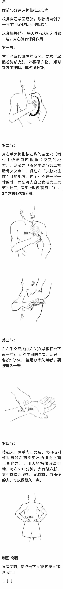

??? important "他说：心理平衡的作用超过一切保健措施的总和。"

    但是，有两条健康老人都一样，第一条每个健康老人都心胸开阔，性格随和，心地善良，没有一个健康老人心胸狭隘，脾气暴躁，鼠肚鸡肠，钻牛角尖。为什么呢？因为心胸狭隘、脾气暴躁的人活不到100岁，五六十岁就一个一个死了，要么得癌，要么得心血管病死了。
    
    第二条，没有一个健康老人懒惰，这是真的。要么爱劳动，要么爱运动。正好印证了英国一句谚语：“没有一个长寿者是懒汉。”那么，为什么心理平衡这么重要？我们平常讲的动脉硬化、冠心病、脑卒中，其实都是慢性病，动脉不是一下子硬化的，动脉硬化要几年、十几年甚至几十年才把血管堵死。

??? quote "脱发和头发灰白"

    分析结果显示，患有冠状动脉疾病的年轻男性通常更有可能头发过早灰白和脱发。在调整了年龄和其他心血管疾病的风险因素之后，脱发的年轻男性患上冠心病的风险高出了5.6倍，头发过早灰白的年轻男性患上冠心病的风险性高出了5.3倍。相比之下，肥胖的年轻男性患上冠心病的风险只高出了4.1倍。有糖尿病、高血压、早发性冠心病的家族病史、中心性肥胖、身高体重指数高、血脂异常和吸烟都是冠心病的风险因素，但它们的相关性都不及脱发、头发颜色变灰和肥胖那么强。

    在印度心脏病学会年会上宣读的这项研究成果认为，脱发和头发灰白与血管的生物年龄老化紧密相关，而无论实足年龄如何；它们是预测冠心病的更合理的风险因素。这些男性应当通过改变生活方式（如饮食健康、勤锻炼和减轻压力）来降低他们患上冠心病的风险。

??? quote "背心，帽子"

    我会在夏秋之交多穿一件布背心，在秋冬之交多穿一件毛线背心，在冬春之交多穿一件棉背心或羽绒背心。

    陈教授还建议外出时最好能戴个帽子。头部散发的热量占身体的1/3，稍一受寒就可能会患病，而对心血管病患者来说，哪怕是一场小小的感冒，都可能诱发基础疾病。

??? note "睡前40分钟心脏按摩操"

    
