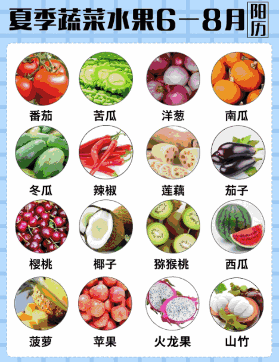
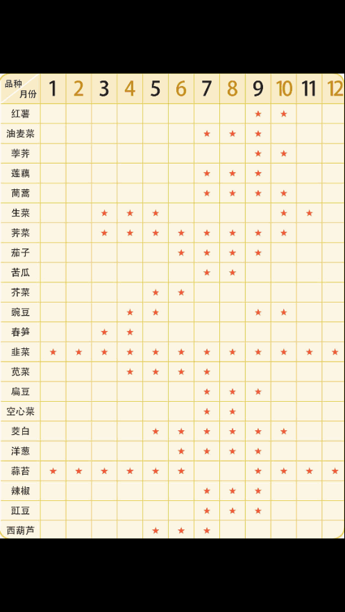
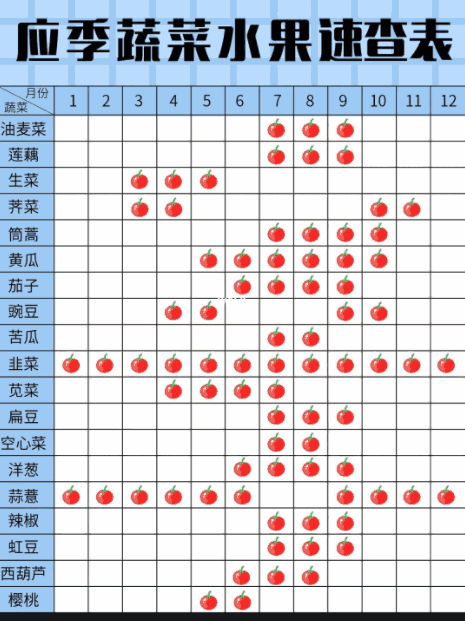
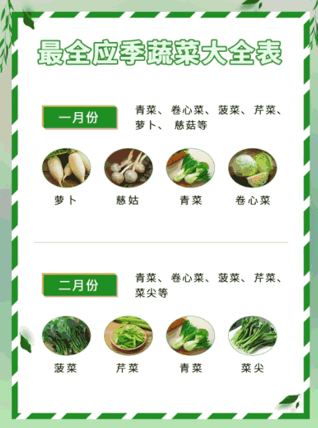
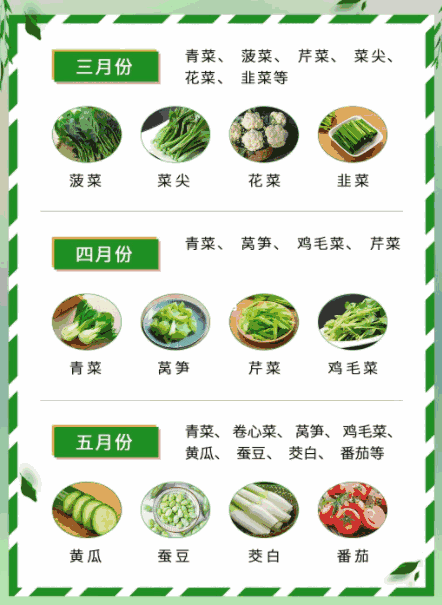
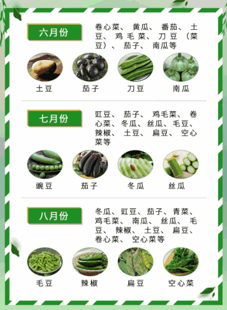
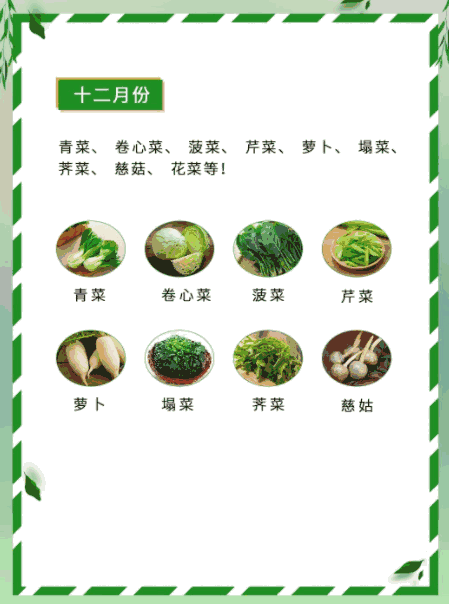
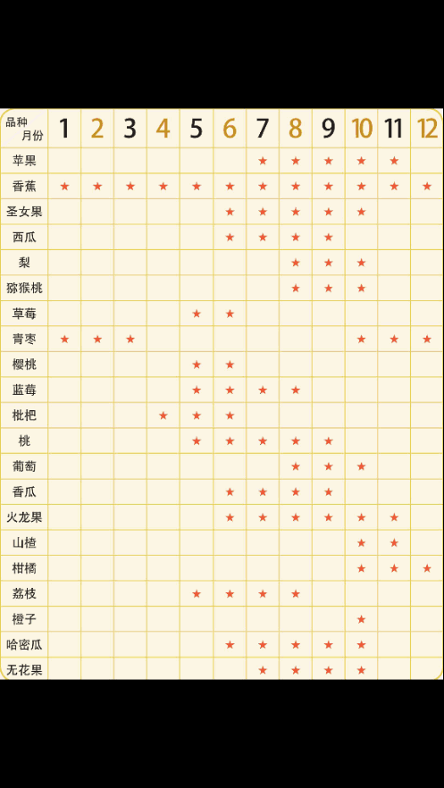
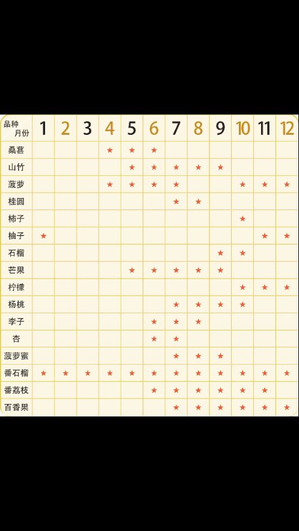

??? note "应季蔬菜水果"

    
    
    
    

??? note "应季蔬菜"

    
    
    
    
    
    
    
    
    

??? note "应季水果"

    
    
    
    

??? question "如何选购反季节蔬果"

    > 不买这样的

    1. 尽量少买形状奇怪的蔬果，比如长着尖儿的西红柿、硕大的草莓。
    2. 不选颜色出奇亮丽、味道出奇甜蜜的水果。为了让水果看起来漂亮，吃起来很甜，有人会用加了明矾、甜蜜素、味精的水给水果“洗澡”—这样既增加重量，又能使还没成熟、味道酸涩的水果变得清脆香甜。
    3. 不买颜色不完整的蔬果。经过催熟的蔬果，果皮或其他地方会留下青涩的痕迹。
    4. 切开后中间还有空腔的一切蔬菜水果，下次一定不要再买—这种现象，是因为施用膨化剂、增红剂和催熟剂等化学激素造成的。

    > 最好买

    1. 首选栽种方式上农药残留物较少的，比如洋葱、胡萝卜、茄子等。
    2. 选带皮的，比如黄瓜、红薯、山药等，可以削皮去掉皮上的残存有害物质。
    3. 绝对无污染的农产品几乎是不存在的，但通过国家的相关检测，就可以放心食用。所以，最安全的是购买有明确标志的有机蔬菜、绿色蔬菜和无公害蔬菜。

    > 买回后的处理程序

    1. 要光照，阳光紫外线照射至少10分钟。
    2. 有皮的削皮，叶类菜要流水浸泡最少10分钟，让农药充分溶解。或者淘米水中浸泡10分钟，淘米水中的生物碱对农药有很好的溶解作用。
    3. 最好用开水汆烫一下。
    4. 大火爆炒。

??? tip "注意"

    1. 除了冬季，我们还是提倡食用时令蔬果为主，反季节蔬果为辅。
    2. 如果有可能的话，优先选择本地出产的农产品。本地产品不仅成熟度好，营养价值损失小，而且不需要用保鲜剂处理，污染较小，运输费用、包装费用、冷藏费用等也较低。盲目追求那些漂洋过海远道而来的进口水果是不明智的。
    3. 尽管皮的营养价值较高，但吃长途跋涉而来的洋水果，或者表皮特别光艳美丽的水果，一定要注意削皮。它们不仅肯定打了蜡，而且极可能经过保鲜剂处理。
    4. 高山反季节栽培—利用山区立体气候资源进行夏秋季反季节蔬菜生产。比如我国的广东北部山区和其他高寒山区，夏秋季节利用高山区自然凉爽气候资源和昼夜温差大的特点，发展夏秋反季节蔬菜生产。这类菜在8～10月份蔬菜淡季上市，有大白菜、甘蓝、芹菜、花菜、萝卜、胡萝卜、西红柿、菜椒、四季豆，等等。
    5. 大棚菜，此栽培方式最为人工可控，市场上最常见的也是这类反季节蔬果，常在早春抢早上市或晚秋延后供应，种类更加应有尽有：黄瓜、西红柿、茄子、甜椒、四季豆、豇豆、毛豆、木耳菜、空心菜，等等。此类反季节蔬菜需谨慎挑选和清洁。
    6. 吃反季节蔬果注意：

        > 反季节蔬菜中重金属含量和农药残留易偏高，可多吃有助排毒的食物。比如：
    
        1. 木耳、猪血：有很强的滑肠作用，经常食用可将肠内的大部分毒素带出体外。
        2. 苹果、柑橘、柿子、大蒜等：有利排铅。
        3. 绿豆：可解砷毒，一周喝一次绿豆粥。
        4. 茶叶：有解金属毒的功效，每天喝3～4杯茶。
    
        > 专家指出：反季节蔬果中矿物质含量相对较低，别忘了补充矿物质。比如：
    
        1. 多吃乳制品、虾皮、酥鱼、蛋黄等来补钙。
        2. 多吃粗粮、杏仁、核桃等来补镁。
        3. 多吃豆类、香蕉、猪肾等来补钾。
        4. 多吃黑木耳、海带、芝麻酱等来补铁。

