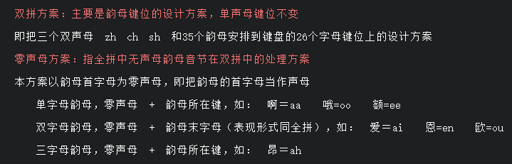

* 本地便签 -> 云笔记 -> mkdocs
* 工作日：云听；周末：B站，youtube
* 世界：虚拟矩阵

??? note "健康三要素：起居有常，食疗，运动"

    > 网址：[健康-人民网](http://health.people.com.cn/) | [强心复健操](https://mp.weixin.qq.com/s/poOsmAu7AOxDCkkvd5-m9w)

    1. 自我同情
    2. 元宇宙（自然+医院+广播）
    3. 松弛疗法（正念呼吸）：放松肌肉，调整呼吸，集中意念

??? note "小鹤双拼"

    * [打字训练](https://dytiger.github.io/index.html)

    
    
    

??? abstract "学习途径"

    ??? note "1. 网上资料"

        查询 / 博客 / 公众号 (查漏补缺): google 搜索 "前端 学习"

    ??? note "2. 电子书 (PDF / 微信读书 / 掌阅)"

    ??? note "3. 视频 (看项目实践)"

        * youtube
        * [哔哩哔哩](https://space.bilibili.com/143487021/fans/follow)

    

