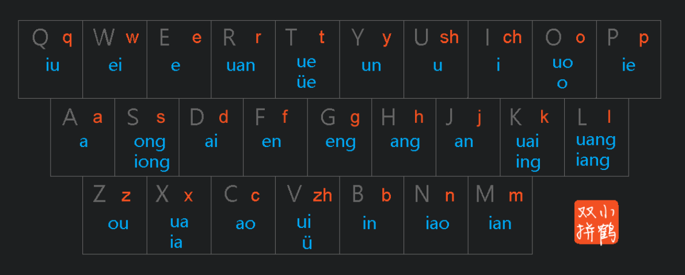
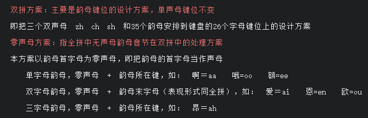
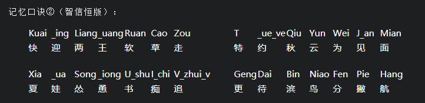

??? note "小鹤双拼"

    * [打字训练](https://dytiger.github.io/index.html)

    
    
    

??? abstract "学习途径"

    ??? note "1. 网上资料"

        查询 / 博客 / 公众号 (查漏补缺): google 搜索 "前端 学习"

    ??? note "2. 电子书 (PDF / 微信读书)"

    ??? note "3. 视频 (看项目实践)"

        * youtube

??? abstract "笔记内容"

    * Learn

        * 八方汇的笔记
        * 书籍总结
        * 项目总结

    * 技能

        * 计算机语言
        * 工具
        * 英语单词

