## youtube: 高血压

* 收缩压：心脏的收缩力跟大血管的阻力
* 舒张压：末梢周边血管的阻力
* EPA / DHA：大型深海鱼少吃，吃 秋刀鱼，鲭鱼，鲑鱼，沙丁鱼
* 水果一起洗，蔬菜一起洗；菜不切除蒂头，一叶一叶拨开洗，菜叶的梗搓干净；花椰菜上下动一动；洗脸刷刷玉米；
* 高血压患者走路，步速以中速为宜，行走时上身要挺直，否则会压迫胸部，影响心脏功能。走路时要充分利用足弓的缓冲作用，要前脚掌先着地，不要后脚跟先落地，否则会使大脑处于不停的振动，容易引起一过性头晕。
* 玩过山车、看恐怖电影、泡温泉、剧烈运动等能够导致血压升高，有高血压、心脑血管病史等人群最好不要尝试。
* 长时间打麻将造成的情绪波动能够导致血压的变化，如果有人吸烟，长时间打麻将后室内空气污浊，能够影响血管健康，如果时间过长、不注意补充水分造成体内缺水，能够诱发脑血栓。
* 另外，有的人习惯打麻将时憋尿，这样一旦排尿后会造成腹压的突然下降，引起血压变化，增加心血管病意外发生的风险。
* 玩过山车、跳楼机、海盗船等这类大型刺激的游乐项目时，瞬间的快速移动、方向变化会导致血压的突然升高，如果本身有脑血管病很容易引发脑出血，并且过度的紧张可能会引起心脏不适，如果有基础疾病就有诱发急重症的危险。
* 泡温泉时水温过高，会使心率加快、血流速度过快、血压升高，这样对心脏造成负担，增加患心脑血管病的风险。尤其要注意的是，这类人群不要在冬季泡温泉，冬季室外寒冷，冷热交替能够引起血管痉挛、血压升高，很容易诱发脑出血。
* 与看恐怖片类似，看球赛时如果比赛过于胶着，紧张的气氛会致心率加快，心脏耗氧量增大，如果是熬夜看球，那对心脏的负担将会进一步加重。

??? abstract "买菜"

    * 黑木耳，香菇，豆腐
    * 秋葵（水溶性纤维素）

    ??? note "香菇"

        * 泡发

    ??? note "鸡蛋"

        * 挑选

            * 外壳光滑，挑小，没有斑点
            * 摇晃没有液体流动感
            * 冷藏尖端朝下
            * 在水里浮起来不新鲜，不要吃了
            * 吃之前再洗

        * 清洗
    
    ??? note "芹菜"

        * 挑选

            * 根部翠绿色，饱满，无斑点，黄色是放久了
            * 清香
            * 叶柄肥厚，较直且整齐，4个左右
            * 叶子平直没有翘起，不能浓绿

        * 清洗

??? abstract "做菜"

    ??? note "[煮面条](https://www.youtube.com/watch?v=Tdmql341hoI)"

    ??? note "[西红柿鸡蛋汤](https://www.youtube.com/watch?v=9e_Lo_TCCq8)"

        * 西红柿切十字（几个），用开水烫几分钟方便去皮（小葱切成葱花），用金属大碗（在里面滚）
        * 西红柿切成丁，炒出汤汁后加清水大火烧开，等锅中水烧开加入食盐，改为小火，搅拌均匀
        * 成细线状淋入鸡蛋液（关火试一下），不要动，让它凝固，形成蛋花后用勺子轻轻推动

    ??? note "芹菜，胡萝卜，黑木耳"

        * 小葱切葱花
        * 去掉根须后清洗，太大的茎片开
        * 胡萝卜斜切后切成条，泡好的木耳切成条
        * 锅中水烧开，加盐加油，加入芹菜焯水20-30秒捞出，放入凉水中过凉；再倒入木耳焯水1分钟捞出
        * 加油，油热后加葱花爆香后加入胡萝卜木耳，炒出香味，炒香后加入芹菜，翻炒几下，加入盐，翻炒均匀
        * 滑锅，将锅四周润上油，热锅凉油炒猪肉不粘锅
        * 倒入芹菜翻炒几下，加盐，大火炒至30秒

??? note "喝茶"

    * 莲心茶（莲子心茶）
    * 玉米须: 在选择玉米须的时候，那些颜色发红和干燥的玉米须是比较好的，具有的利尿、平肝、利胆、泻热等功效会更好，而选择新鲜的和绿黄色的玉米须则效果没有那么明显。不要选择发霉有异味的玉米须泡水。
    * 山楂茶：山楂所含的成分可以助消化，扩张血管，降低血糖、降低血压，经常饮用山楂茶，对于治疗高血压具有明显的辅助疗效。每天数次用鲜嫩山楂果1～2枚泡茶饮用即可。

??? abstract "健康 2.0"

    ??? note "[別等中風倒下，才知道自己有高血壓！這樣吃8週降血壓！](https://www.youtube.com/watch?v=L0_5USLN3sE)"

        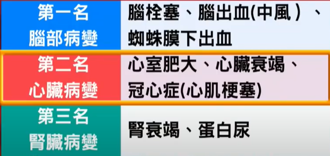
        
        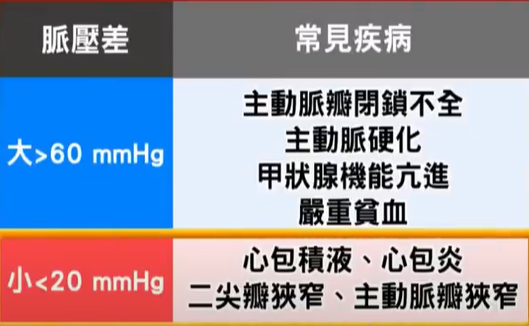
        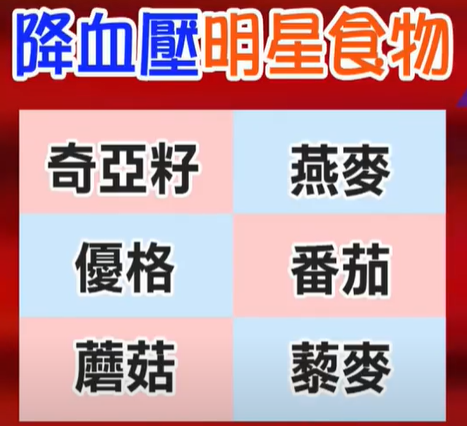

        * 保钾利尿剂型药物 + 高钾食物（瓜类，如西瓜、香瓜、木瓜、香蕉）不能吃
        * 葡萄柚汁 （也有说柳橙汁） 有呋喃香豆素，抑制身体中代谢药物中的酵素，药物浓度会突然飙高，心跳加速等
        * 夏天喝果汁：柳橙（柳丁，含类黄酮，维生素C），青江菜（含钾+，钙+，维生素C），芹菜等，加水，胃寒凉的抓一点坚果或姜片
        * 脉压差=收缩压-舒张压：正常30-40，超过60或小于20，身体什么地方有问题
        * 这样吃8个礼拜有效：全谷根茎类要足够（如小米，燕麦，糙米，黑米，建议一天一碗以上）；天天5+5蔬果（强调蔬菜）；多喝低脂乳（补钙，或者香椿，绿豆芽，芝麻等等）；红肉改白肉（猪肉，牛肉，饱和脂肪较高 改成 鸡肉，鱼肉，豆类），每天一小把坚果，用好油
        * 晚餐时间6点左右，不要超过8点，只要吃七八分饱即可
        * 地瓜（番薯，有丰富的黏蛋白，能保护黏膜，促进胆固醇的代谢，保持血管壁弹性；含有膳食纤维可帮助肠胃蠕动，避免便秘）
        * 牛蒡（高钾低钠，钙含量高，牛蒡甙能扩张血管）
        * 鲑鱼（omega-3脂肪酸）
        * 藜麦：43:38
        * 目标：< 二期（一期）140 (130), 90 (80)

        
        

??? abstract "57健康同學會"

    ??? note "[不怕血壓高！中醫降壓法寶大公開！](https://www.youtube.com/watch?v=XCY_NpuqTpk&t=1212s) / [8種全年「必吃的」降血壓好食物！](https://www.youtube.com/watch?v=SZevD-MLuCg) / [揭開隱形殺手 高血壓的恐怖真相](https://www.youtube.com/watch?v=HDGH5iQcaRk)"

        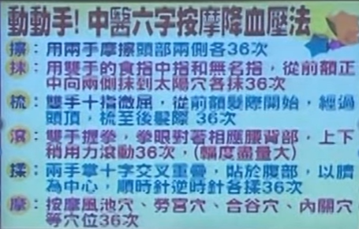

        * 舒压最好的食物：莲子
        * 8种：莲藕，九层塔煎蛋
        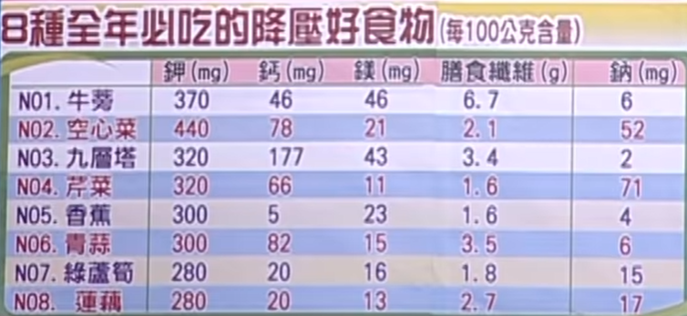
        * 好的：五谷米饭，荞麦面，凉拌山药，原味优格，清炒高丽菜

??? note "侯老师说食疗"

    * 地中海型饮食，低钠少盐 <7g，少辛辣刺激的食物
    * 三低一高饮食：少盐少油少糖，高纤的水果和蔬菜，富含钾离子的酪梨或深绿色的蔬菜
    * 能吃: 富含钾、纤维素、维生素，蔬菜水果和菌菇类；代替部分主食的食物：燕麦，薯类，粗粮，杂粮；低脂肪低胆固醇的蛋白来源：脱脂牛奶，鸡蛋清，鱼类，去皮的鸡鸭肉，瘦肉

??? note "运动"

    1. 等长肌肉收缩：核心肌群训练的基本式，站直，髋关节往后，手伸到前面，全身肌肉紧绷一点；吸气时尽量手往前臀部往后，吐气时臀肌腹部缩紧，3分钟后手会开始抖有点出汗。

        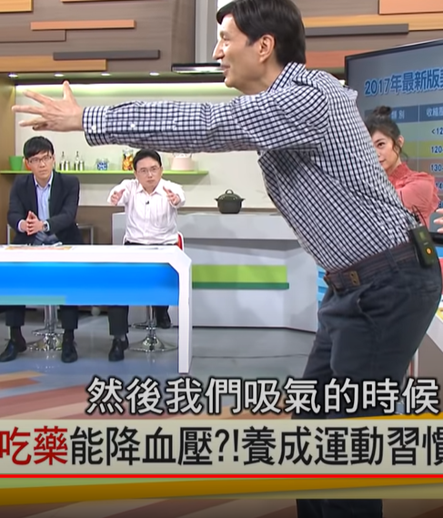

    2. 猜拳体操

        
        

    3. 内关穴（取穴方法：将右手三个手指头并拢，把三个手指头中的无名指，放在左手腕横纹上，这时右手食指和左手手腕交叉点的中点，就是内关穴。为说明准确位置：可以攥一下拳头，攥完拳头之后，在内关穴上，有两根筋，实际上，内关穴就在两根筋之间凹陷的位置。取穴时应要患者采用正坐或仰卧，仰掌的姿势。）

        按摩内关穴时，可沿着手腕上下方向或用硬币侧轮滚动按揉，每天按揉半小时。左手食指压在同侧外关上，按捏10～15分钟，每日2～3次。100~200次

        内关穴是心包经上的穴位，这条经脉跟心脏联系在一起，很多心脏上的病就是心包方面的病，针灸临床中间发现：心包经上的穴位反而比心脏本身用的穴位还多，效果还好，心包经的作用：生理上代表心完成的任务，病理上代替心接受病邪。内关穴可以说是治疗心血管病第一要穴。

        用左手的拇指尖按压，两秒钟一次，按压时可左右揉动，力度以稍有疼痛感为宜，然后换手进行，每次10-15分钟，每日2-3次，长期坚持可调理精气、促进血液循环，有利于降低血压。

    4.  耳背沟

        按摩方法：用双手食指或食指及中指的指腹，从上而下按摩双耳背之降压沟6分钟，频率为每分钟约90次，以红热为度

        按摩耳背下耳根有升压作用，应禁压

    5. 手指微微弯曲，两手指尖互相叩打30次

        

    6. 转手腕，顺时针逆时针都可，左三圈右三圈

    * 健走：手臂与腰部平行，一秒两步，建议用大腿的力量 / 规律的有氧运动（慢跑，快走，骑单车，游泳）和伸展
    * 走路脚趾着地 / 手扶椅背原地左右交互踏20分钟，脚尖先着地
    * 足三里穴，阳陵泉穴（前两个甚至可以轻轻地捶），太冲穴，风池穴（手不够力，用两个手指）
    * 关元穴，涌泉穴

* google: 高血压 运动 冥想 舒张压高 晚上血压高

    40-50 差异较理想

    * 缓慢起床：早晨醒来,不要急于起床,先在床上仰卧,活动一下四肢和头颈部,使肢体肌肉和血管平滑肌恢复适当张力,以适应起床时的体位变化,避免引起头晕。然后慢慢坐起,稍活动几次上肢,再下床活动,这样血压不会有大波动。 
    * 饮水一杯：漱口后饮白开水一杯,既有冲洗胃肠道的作用,又可稀释血液,降低血液粘稠度,通畅血循环,促进代谢,降低血压。     
    * 只宜散步、柔软体操、打太极拳,可增强血管的舒缩能力,缓解全身中小动脉的紧张,有利降压。    
    * 生活要有規律，避免過度勞累和精神刺激，早睡早起，並養成睡午覺的好習慣。白天多喝水，晚餐少吃，睡前用熱水泡腳，可以促進血液循環，起床時速度宜緩，避免引起頭暈。
    * 推薦食物：山楂、蘆筍、蘑菇、黃豆、海帶、綠豆、南瓜、芝麻
    * 中午小睡：午餐后稍活动,应小睡一会儿(半小时—1小时)。无条件睡时,可坐在沙发上闭目养神或静坐,这样有利于降压。
    * 晚餐宜少：晚餐宜吃易消化性良物,除干饭外,应配些汤类,不要怕夜间多尿而不敢饮水或进粥食。进水量不足,可使夜间血液粘稠,促使血栓形成。
    * 下棋、打扑克、打麻将要限制时间,特别要控制情绪,不可过于认真、激动。切记不能随意发脾气，要保持良好的心情。  

## google：高血压 饮食；高血压 食谱

??? note "高血压 饮食"

    * 口味淡一點:　重口味的飲食含鹽量較多，不利血壓。為了降低食鹽攝取，又不會淡而無味，烹調中可添加香菜、九層塔、檸檬汁或調味料(黑胡椒粉、大蒜粉、咖哩粉等)取代部分用鹽量。
    * 不伴有肾病或痛风病的高血压病人，可多吃大豆、花生、黑木耳或白木耳及水果。
    * 水果类（苹果、桃、柚子、梨、葡萄和西瓜等），大豆制品（豆腐、黄豆粉、豆腐丝等）
    * 钾在体内能缓冲纳的食物有：黄豆、小豆、番茄、西葫芦、芹菜、鲜蘑菇及各种绿叶蔬菜；水果有橘子、苹果、香蕉、梨、猕猴桃、柿子、菠萝、核桃、西瓜等。
    * 美国医学专家认为，高血压患者每天坚持食入高钙食物，能使2/3左右的人受到明显的降压效果。含钙的食物很多，如奶制品、豆制品、芝麻酱、虾皮、海带、骨头汤、黑木耳、核桃、沙丁鱼、鸡蛋等均含钙丰富。
    * 蔬菜类（菠菜、白菜、百合根、南瓜、茄子、黄瓜等
    * 芹菜粥，准备120g连根的芹菜以及250g粳米，将芹菜切成小段，粳米洗干净，一起下锅煮，熟之后加入适量的盐和味精搅拌均匀即可。
    * 每天早餐只吃1碗燕麦粥，持续8星期就可使人体血液中“坏胆固醇”浓度降低10%。由于经常摄入燕麦能有效地控制体重和减轻超重者的体重，促进血脂高者恢复正常水平，适合肥胖、高脂血症、冠心病患者及健康者日常保健。（小贴士：煮燕麦粥时水宜稍多放，煮开后宜用文火再煮约10分钟。如果是老人或青少年，也可加牛奶食用）
    * 每天中午只要吃半碗豆类，就可以在8周内使“坏胆固醇”浓度降低20%。（有的人食用豆类后会产生胃肠道的不适，例如肠道排气增多或腹胀。防止这一情况出现的办法是烹调前一定要浸泡充分，浸泡可以使豆类中某些糖类降解，减少对消化道的不良刺激。）
    * 每天吃3瓣大蒜，持续8周也能使血中“坏胆固醇”浓度下降10%。而且不论是生吃或熟吃，效果都不错。大蒜中含有的大蒜素等营养成分可缓解血小板凝结从而防止血栓的形成，故经常食用大蒜有防治高血脂症、冠心病、高血压的作用。科学家给大蒜的另一个外号是“血管清道夫”，长期吃大蒜的人血管内壁里的沉积比不吃的人要轻很多，而血管壁沉积是心血管病的一大诱因，时间长了会让动脉阻塞、弹性变差，引起中风或心肌梗死。（大蒜萝卜汁可降血脂：大蒜3瓣，白萝卜100克。先将大蒜切碎捣成大蒜汁。将萝卜除去根、须洗净，切碎，捣烂取汁，用洁净纱布过滤，将白萝卜汁与大蒜汁充分搅和均匀即可。早晚两次分别服用。主要治疗中老年人湿浊内蕴、气滞血瘀型高脂血症。）
    * 每周两次清蒸海鱼
    * 每周一碗姜汤，每天吃半个洋葱（据临床营养学观察，一般冠心病患者每日食用50克左右洋葱（约半个），其作用比一些降血脂药还要明显。小贴士：醋泡洋葱降脂减肥。洗净一个洋葱，剥去外皮切成薄片，放到微波炉里加热大约两到三分钟，再将洋葱放到容器里，加入五大汤匙的食用醋，然后放在冰箱里，第二天早晨食用。每天早餐用这种洋葱佐餐，可有效降低血糖。）

??? note "高血压 食谱"

    * 在服用降壓藥期間，不要吃柚子或飲用柚子汁，否則可產生血壓驟降等嚴重的毒副作用。
    * 據測定每100 克牛奶中含鈣量高達120 毫克，且易被人體吸收利用。所以，高血壓患者飲用牛奶對穩定高血壓是有利的。但是高血壓常合併動脈硬化，而一般市售牛奶中所含的脂類可使動脈硬化加重，甚至會導致血壓升高，但若因此主張不喝牛奶，就以偏概全了。
    * Tips：高血壓患者應選擇脂肪含量分別為0.1%、0.5%、1% 脂肪的牛奶，而不宜飲用脂肪含量大於2.8% 的普通牛奶。
    * 茄子, 红萝卜, 羊角豆, 菠菜, 荠菜（对高血压、眼底出血、牙龈出血和肾炎水肿等均有较好疗效，高血压、眼底出血、眩晕头疼者，可以用鲜荠菜六克～九克，煎汁代为茶饮。）, 海带, 荞麦（荞麦秧、叶包含比较多量的维他命P，以其做食物或者煮水常饮，可预防高血压导致的脑出血。）, 奇异果, 桔子, 苹果, 香蕉 
    * 早餐：一袋鲜奶，一碗小米粥或八宝粥或豆腐脑，一个鸡蛋(隔日一次)，一两主食(馒头、花卷、窝头、面包片等)，咸菜尽量少吃。
    * 茄子粥：1 将茄子择洗干净，切细丝；2 大米淘净，放入锅中，加清水适量煮粥；待沸时调入茄子丝，煮至粥熟时，略入盐调味服食；茄子连皮吃更好。茄子去皮后容易发黑，这是因为其含有的铁元素被空气氧化，会影响人体对铁的吸收。
    * 早餐：茄子粥（大米+茄子），馒头（面粉），黄豆豆浆（黄豆），橘子1个，大枣乌梅粥（大枣+乌梅+大米），无糖牛奶250毫升，葱花卷（面粉+大葱），豆沙包（面粉+红小豆），玉米粥（玉米），素包子（韭菜+虾皮+鸡蛋）
    * 午餐：凉拌土豆丝（土豆+水发海带丝），菠菜拌粉丝（菠菜+绿豆粉丝），蒜香油菜（油菜+大蒜），荞麦饭（大米+荞麦），黑木耳炒芹菜（黑木耳+芹菜+杜仲+胡萝卜），香菇冬瓜汤（鲜香菇+冬瓜），茭白五丝（茭白+胡萝卜+青椒+豆腐干+牛肉丝）
    * 午餐：一碗米饭或一个馒头或玉米饼(2～3两) 菜类：小葱拌豆腐；炒豆角、茄子、黄瓜、香菇炖鸡；冬瓜汤；饮料：一杯橙汁。
    * 晚餐：一碗米饭或一个馒头或玉米饼(2两)，一碗小米粥菜类：凉拌海蜇；芹菜、西红柿、菠菜、清蒸鱼；木耳汤；饮料：一杯酸奶。
    * 晚餐：肉末豆腐（瘦猪肉末+北豆腐），拌黄瓜（黄瓜+香菜），清炒茼蒿（茼蒿），萝卜丝虾皮汤（白萝卜+虾皮+香菜），蒜蓉苦瓜（苦瓜+大蒜）
    * 大蒜，海带
    * 早餐不可过饱；午餐可以丰盛些，应荤素搭配，但不宜太油腻，也不可过饱，进餐后稍微活动一下；晚餐应吃易消化的食物，可以喝些粥或汤。
    * 应减少饱和脂肪酸的摄入，增加和补充不饱和脂肪酸。肥肉、动物脂肪等食物富含饱和脂肪酸；鱼肉、豆类等食物富含不饱和脂肪酸。
    * 尽量选择燕麦米或纯燕麦片，升糖指数（约40）比速食燕麦片低。燕麦片可以用来熬粥或者和牛奶搭配，粗细搭配，一般来说，粗粮和细粮的摄入比例为1:4。燕麦米可以开水焖烧一下，然后加入糙米大米杂粮杂豆薯类一起做饭，每次一小碗就行。
    * 黑米、糙米、全麦等粗粮，绿豆、玉米、荞麦等杂粮，绿叶及豆荚类蔬菜，苹果、桃、梨、火龙果、奇异果等水果，这些都是膳食纤维的良好来源，建议多选择。

* 寒露，霜降开始重视

??? note "泡脚"

    * 把双脚浸入到40℃的热水中，约15~20分钟
    * 饭后不宜马上泡脚。由于饭后胃部的消化需要供血，泡脚会将血液引流到身体其他部位，为了避免导致消化不良，建议饭后一小时再泡脚。

??? note "2. 动动脚"

    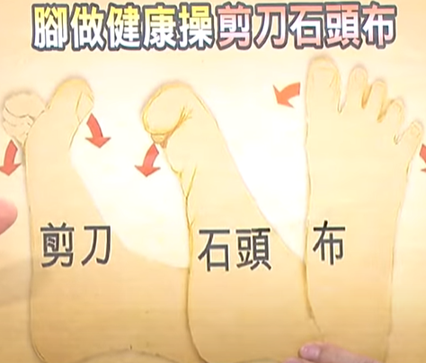

??? note "3. [七巧手](https://www.youtube.com/watch?v=LPP9YDvW1_0), [2](https://www.youtube.com/watch?v=fMp9LDFxpuY)"

    * 边缘

        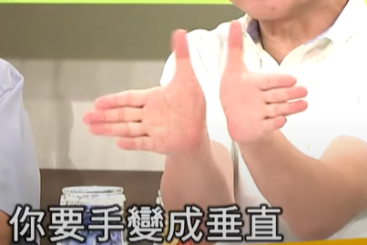
        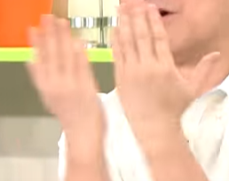
        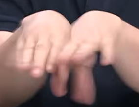

    * 凹陷

        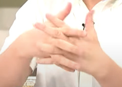
        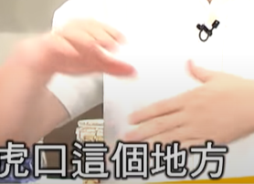

    * 正反：劳宫，手掌打正中的地方

        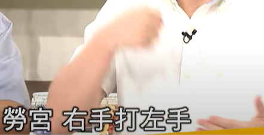
        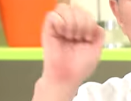
        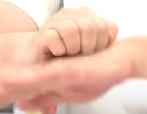

    * 井穴

        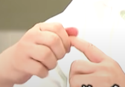

    * 两手放松拍打没声音，也可以用力打
    * 指甲下缘的左右两侧，左右搓
    * 把手指往后往前拉，甚至中间让它折一折，动到穴道

