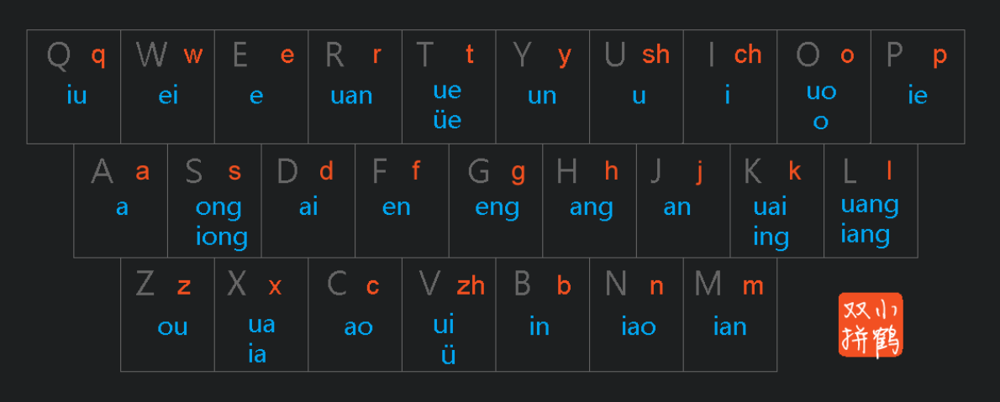
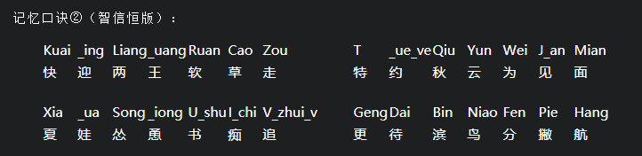

* 本地便签 -> 云笔记 -> mkdocs

??? note "小鹤双拼"

    * [打字训练](https://dytiger.github.io/index.html)

    
    
    

??? abstract "学习途径"

    ??? note "1. 网上资料"

        查询 / 博客 / 公众号 (查漏补缺): google 搜索 "plc 学习"

    ??? note "2. 电子书 (PDF / 微信读书 / 掌阅)"

    ??? note "3. 视频 (看项目实践)"

        * 淘宝
        * B站
        * youtube

