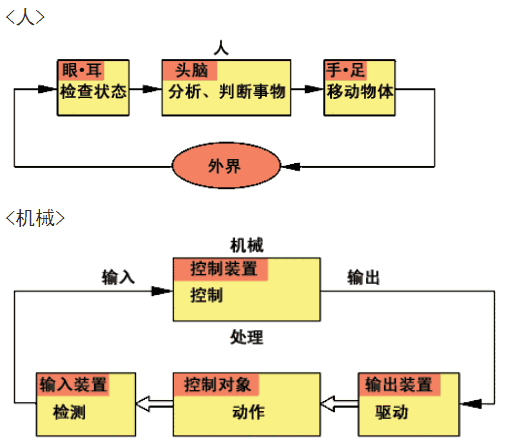
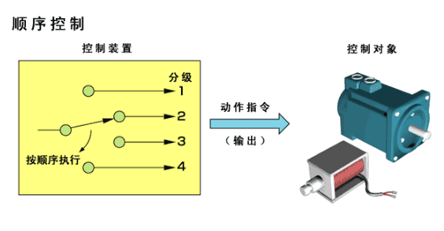
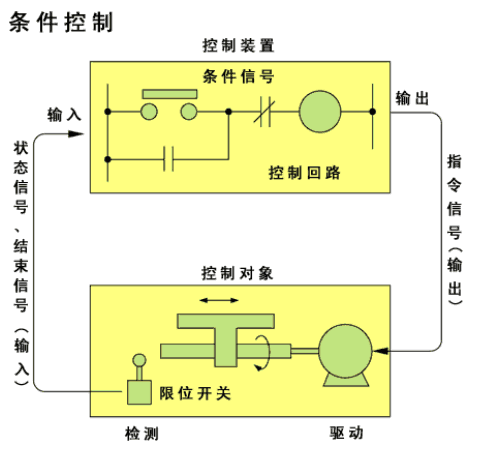
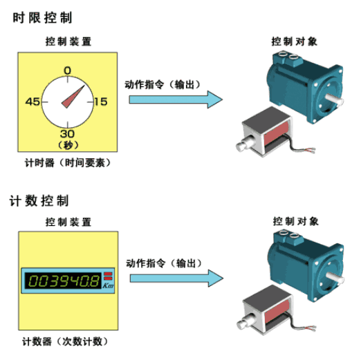
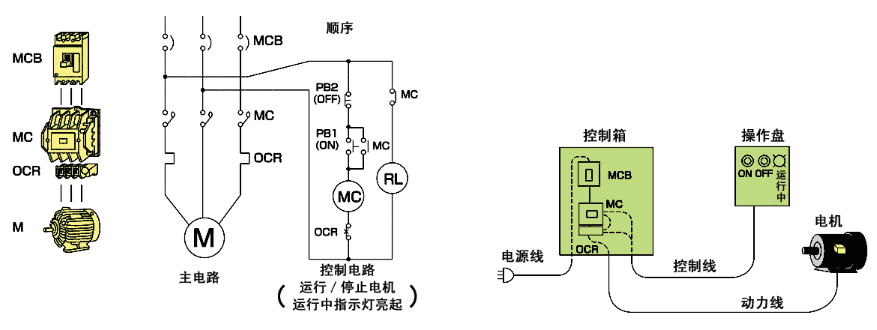
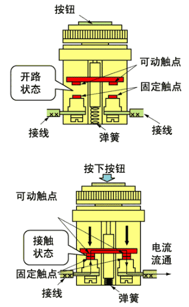
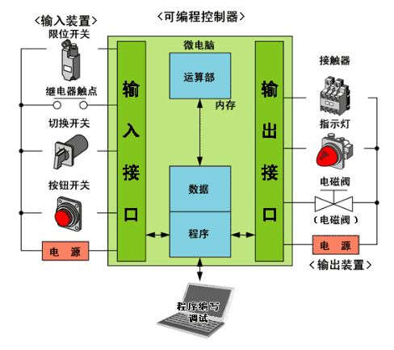
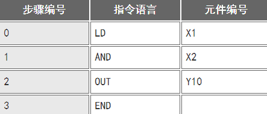

## PLC入门

### 第1章 什么是PLC控制

* 学习“顺序控制”的含义、如何实现顺序控制以及基本的顺序控制。

#### 1.1 “顺序”的含义

!!! quote "顺序（sequence）"

    换言之，顺序控制也可以说是将机械装置执行的各动作、顺序预先存储在控制装置中，按顺序推进机械运行，以实现一连串目标动作的控制。

#### 1.2 顺序控制的实现者

??? summary "图"

    

    !!! example "输入装置"

        * 人操作的装置（启动开关、停止开关等）
        * 检测机器状态的装置（位置检测限位开关、无触点开关等）

    !!! example "输出装置"

        * 驱动机器的装置（电机、电磁阀等）
        * 向人通知机器状态的装置（指示灯、报警蜂鸣器等）

#### 1.3 基本顺序控制

??? summary "基本顺序控制由以下内容组合实现"

    ??? note "1. 顺序控制"

        是指按预先设定的顺序运行机器的控制，也叫分级(STEP)控制。

        

    ??? note "2. 条件控制"

        是指综合控制对象的状态信号、结束信号，若满足既定条件，则控制机器动作。

        > 设定一定条件，利用信号的组合，在不需要时禁止机器动作的控制称为联锁(Interlock)控制。

        

        如图所示，控制装置模块化后，来自控制对象的状态信号及结束信号作为“输入”，向控制对象发出的动作指令作为“输出”。“输入”条件决定“输出”，由此使控制对象动作，并决定下一个“输入”条件。

        通过这样的条件控制，控制装置和控制对象之间会形成由状态信号、结束信号和指令信号组成的环。

    ??? note "3. 时限控制、计数控制"

        时限控制是指向控制对象发出的动作指令由时刻或时间来决定的控制。

        同样，计数控制就是根据对产品个数或机器动作次数的计数来决定控制对象动作的控制。

        时限控制需要具备计时器功能，计数控制需要具备计数器功能。

        

    > 顺序控制曾经是由继电器构成并实现的，因此很多用语也来源于继电器。但，现在也有很多人把顺序控制理解为直接通过可编程控制器自身来控制，而不是通过继电器实现。这里，我们也基本上不把顺序控制看做由继电器实现，而是以直接介绍可编程控制器为主。

??? note "动作顺序的表示方法"

    这里所说的顺序图是指按照动作顺序以规定的图形及符号（电气标志）描绘的触点、线圈、电阻、电机等各类电气装置的电气连接图，该图与这些装置的实际配置无关。

    顺序图一般被称为“展开连接图”。

    按照实际配置描绘的图叫做“电路连接图”。

    

??? summary "触点的基础知识"

    ??? note "触点简介"

        通过触点的开闭动作，可以切断或导通电流。

        开关、继电器、计时器、计数器等电气装置都带有触点。

        另外，不光是在实际的电气装置中，可编程控制器的内部元件如计时器、计数器也有被称为触点的类似构造。

    ??? note "a触点简介"

        a触点是指通常呈开启状态的触点，给予指令后才会闭合。

        此处所谓的指令是“使之动作”的意思，如果是按钮，按下按钮的动作即相当于指令。

        a触点的名称由英文arbeit contact（动作触点）得来，又称为“常开触点”。

        > 以按钮开关为例

        

    ??? note "b触点简介"

        b触点是指通常呈闭合状态的触点，给予指令后才会开启。

        b触点的名称由英文break contact（中断触点）得来，又称为“常闭触点”。

        > 以按钮开关为例

        

### 第2章 什么是PLC

* 学习PLC的作用、PLC的操作、使用PLC的优点以及PLC的历史。

#### 2.1 可编程控制器的作用

??? note "可编程控制器"

    可编程控制器是根据输入装置指令信号的ON/OFF，使输出装置ON/OFF，从而实现顺序控制的专用控制器（计算机）。

    以哪个输入装置信号ON/OFF为条件，控制哪个输出装置动作或停止（ON/OFF）的控制内容，由专用指令语言编写成程序预先写入可编程控制器内部（更准确地说应该是可编程控制器CPU）。

    

??? note "梯形图"

    在通常的可编程控制器程序开发中，多用便于直观理解的梯形图来代替由指令语言编写的程序。

    > 可编程控制器CPU从步骤编号0开始按顺序执行指令。执行到END指令后，将返回最初的步骤编号0，并继续运算。这被称为循环运算。
    >
    > 一个循环所需的时间叫做扫描时间，通常为数毫秒至20毫秒不等。

    

    * 初期的可编程控制器只有继电器顺序的置换功能，因此只能处理ON/OFF状态。但现在的可编程控制器已经拥有非常高级的功能，比如可以处理数值数据、还可以连接电脑和网络等等。

#### 2.2 可编程控制器的动作
 
??? note "PLC"

    

    输入装置连接在可编程控制器内部的输入侧，输出装置通过 外部输出用触点 连接。

    输入ON/OFF信号和输出ON/OFF信号的关系由内部程序决定。

    可编程控制器拥有的要素（亦称为软元件）除了输入、输出装置以外，还有以下软元件。

    | 软元件编号 | 内容                                                                             |
    | :--------- | :------------------------------------------------------------------------------- |
    | X0         | 输入继电器                                                                       |
    | Y0         | 输出继电器                                                                       |
    | M0         | 内部的辅助继电器                                                                 |
    | T0         | 每个计时器软元件编号都拥有相应的线圈及触点。到达设定的时间后，触点可变为ON状态。 |
    | C0         | 每个计数器软元件编号都拥有相应的线圈及触点。达到设定的次数后，触点可变为ON状态。 |

    * 以上所举的都是具有代表性的软元件，实际上还备有更多的要素（软元件）。

## GX Works2基础