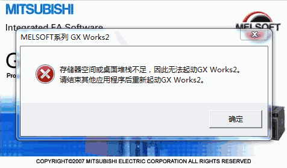

## 三菱

* GX Works3对MELSEC iQ-R/iQ-F系列通用。
* GX Works2对MELSEC-Q/L/F系列通用。

??? summary "搜索：三菱 PLC"

    * [三菱PLC官网](https://www.mitsubishielectric.com/fa/cn_zh/products/cnt/plc/index.html)(服务支持->在线选型，e-learning线上学习；资料中心)
    * [技成培训网-三菱PLC](https://www.jcpeixun.com/knowledge/index.aspx?id=101)
    * [电工学习网-三菱PLC](https://www.diangon.com/wenku/plc/sl/)
    * [PLC之家-三菱PLC](http://www.plc100.com/sanling/)
    * [电工天下-PLC](https://www.dgjs123.com/plc/)

??? note "微信读书 搜索"

    * 中间继电器 接线
    * 锁机模式 plc
    * mcr n1

??? question "GX Works2 存储器空间或桌面堆栈不足"

    

    > 1-3步也许不是必须的

    1. 按下`Win+R`，输入`regedit`，回车
    2. 找到`HKEY_CURRENT_USER\Software\MITSUBISHI`右键删除。
    3. 卸载软件，重启电脑
    4. 安装官网下载的最新版本

??? help "GX Works2 序列号"

    > 来源：系统城

    * 917-505764844
    * 570-986818410
    * 070-360817410
    * 017-360767844
    * 161-998941269
    * 570-986818410
    * 904-099559933
    * 917-500761844
    * 804-999559933
    * 570-986818410
    * 804-999559933
    * 998-598638072

## 松下

??? summary "搜索：松下 PLC"

    * [松下PLC官网](https://device.panasonic.cn/ac/c/fasys/plc/)
    * [我要自学网](https://www.51zxw.net/list.aspx?cid=720&isappinstalled=0)
    * [电工学习网](https://www.22plc.com/xuexi/rumen/863.html)
    * [工控论坛](http://bbs.gongkong.com/product/PanasonicPLC.htm)
    * [PLC之家-松下PLC](http://www.plc100.com/songxia/)