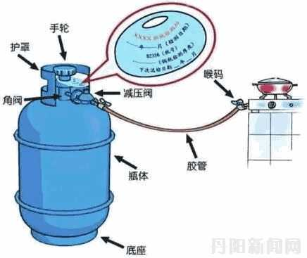
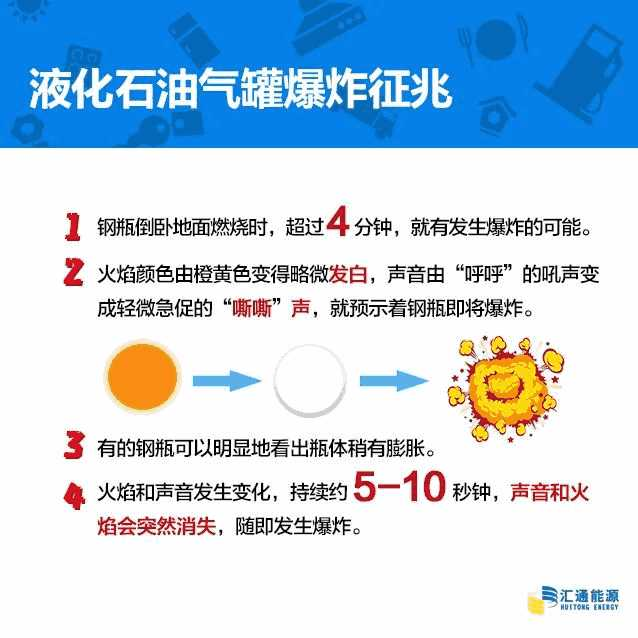
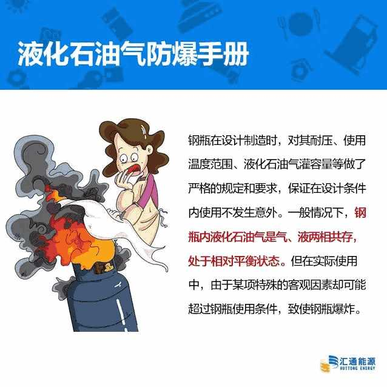
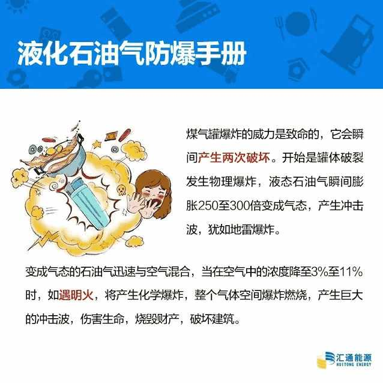
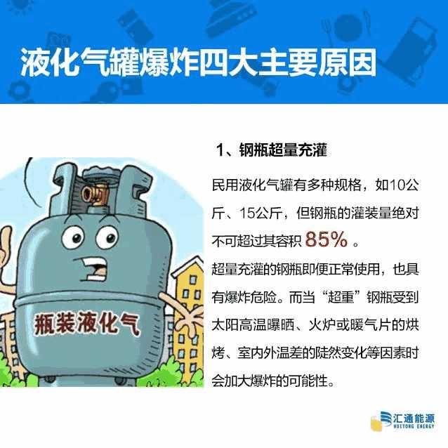
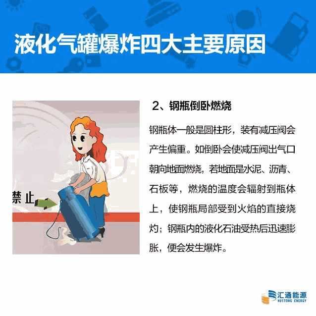
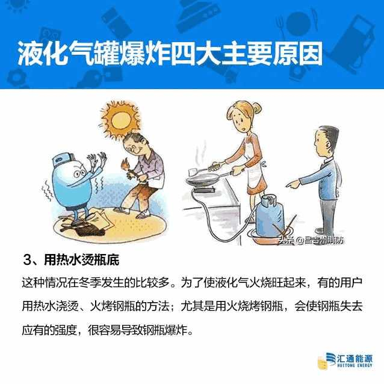
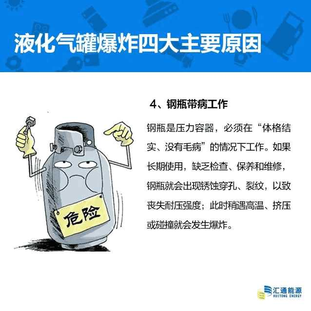
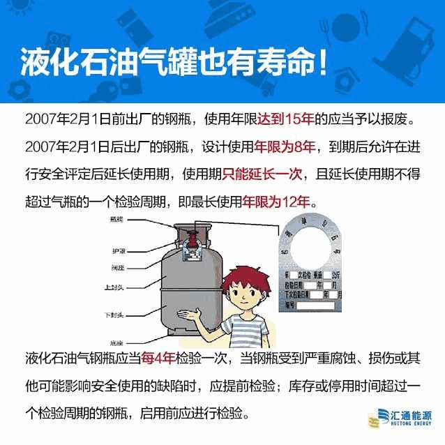
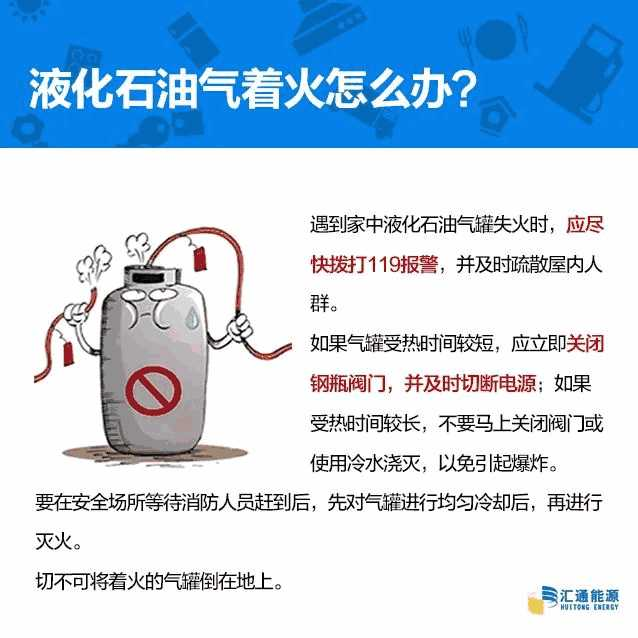

!!! info "来源"

    * 百度/公众号：煤气 充装
    * B站

??? note "记者探访煤气站充装全过程"

    记者观察到，煤气站内共有3个定量电子灌装秤(下称“灌装秤”)，2台公平秤。据工作人员介绍，这些设备均经过县质量技术监督检测所检测。 工作人员将煤气瓶放到灌装秤上，再将充装枪对准煤气瓶充装口，机器便开始自动充装，等到煤气瓶总重达到30.51kg时，充装自动停止。据工作人员介绍，南峰煤气站内煤气充装的量都是电脑板内设定好的，不需要充一次按一次。“标准的煤气瓶空瓶重量为16.5kg，一些经过检修的空瓶重量会减轻，我们在充装前就在煤气瓶阀门上放上砝码，将煤气瓶重量加至16.5kg再进行充装。”

    “由于煤气充装过程存在压力的变化，加上充装枪的枪口大小不一，充量不同，都会导致重量的变化，使灌装秤产生误差。”工作人员解释称，为防止误差，充装量都设定在30.5kg以上，保证煤气瓶内充足足量的煤气。

    在记者观察其间，其中一位市民的煤气瓶因年份到期进行了换瓶，新瓶自重为16.2kg，充装好后工作人员将煤气瓶进行了放气，“新瓶内空气较多，为保证煤气使用时质量更高，需要放气。”放气后，煤气瓶重量从30.18kg减轻到了30.14kg，煤气净重为13.94kg。

??? quote "其他"

    * 胶管使用2年要更换一次
    * 凡是瓶颈接口处为螺丝瓶一定是过期瓶，2007年就已禁止使用，目前均为焊接瓶。
    * 15公斤装钢瓶连瓶带气全重为31公斤左右，12公斤装（黄瓶）全重为25.8公斤。若重量相差较大则可能是黑煤气。

    

    做了２０多年液化气充装工作的沈阳东泉液化石油气有限公司安全员姚礼权总结说，液化气罐爆炸事故大多是由于胶管老化或者脱落之后漏气导致的，单纯罐体爆炸极其少见。用户使用液化气罐时，应先关炉具后开阀门，使用之后先关阀门，后关炉具。他特别提醒，燃气软管最好每年更换一次，以避免由于老化而出现问题。还有，由于液化气罐的使用年限是８年，老旧钢瓶一定不要再继续使用。

??? note "燃气气瓶充装操作规程"

    一、准备工作

    1、打开室内通风设备进行室内通风。

    2、调整校验充装秤，使其空秤指示回到零位。

    3、检查充装秤的检验有效期和静电接地导线是否良好。

    4、打开液相阀门，检查有无漏气；检查充装枪接头密封圈、液相管是否密封良好，如有问题及时更换。

    5、通知运行人员启动烃泵输送液化石油气，注意压力是否正常。

    二、充装操作

    1、将检查合格的气瓶放在充装秤台板中央。

    2、将充装枪接头与气瓶角阀连接，先打开气瓶角阀，检查连接处是否密封良好，再打开充装枪阀门，根据气瓶规格选择合适的充装量，用充装枪自带的扫描仪扫描气瓶上的二维码，开始充装。

    3、达到设定充装量后，充装秤自动停止充装，先关闭充装枪阀门，再关闭气瓶角阀。

    4、卸下充装枪，移出气瓶，继续充装下一个气瓶。

    三、注意事项

    1、经充装前检查合格的气瓶方可进行充装，充装后经检查合格方可出站。

    2、认真填写充装记录。

    3、工作人员应穿棉质不起静电的工作服和鞋子，带防护手套，戴工作证。

    4、充装过程中，如发生漏气、变形、异常响动，应立即停止充装，并采取处置措施。

    5、搬运气瓶时严禁拖、滚、抛、碰撞。

    6、充装结束后，通知运行人员关闭烃泵，依次关闭充装各路阀门和总阀。

    7、下班前确保关闭各阀门，只允许一只回流阀门，并做好卫生清洁工作。

??? danger "防爆手册"

    
    
    
    
    
    
    
    
    

??? question "解决煤气罐失火"

    1. 阀门完好：关闭阀门
    2. 阀门损坏：把液化气罐竖着转移到空旷地带，让它自行燃烧，对瓶身降温，及时拨打119
    3. 钢瓶横向倒地燃烧：立即撤离到安全区域

??? question "遇到液化气罐泄漏怎么办"

    1. 闻到液化石油气泄漏，要立即切断气源，关闭管线上游阀门和钢瓶角阀；
    2. 立即打开门窗进行通风换气；
    3. 用肥皂水检查泄漏点，发现泄漏点时，要用湿毛巾捂住；
    4. 燃气大量泄漏且无法关闭阀门时，远离后可拨打119报警电话。

??? question "遇到液化气罐着火怎么办"

    1. 遇到家中液化石油气罐着火时，立即打开门窗通风换气，并及时疏散屋内人群；
    2. 如果气罐受热时间较短时，应立即关闭煤气罐阀门，并及时切断电源；如果受热时间较长，不要马上关闭阀门或使用冷水浇灭，以免引起爆炸；
    3. 要在安全场所尽快拨打119报警，等待消防人员赶到后，先对气罐进行均匀冷却后，再进行灭火；
    4. 切不可将着火的气罐倒在地上；
    5. 泄漏的场所严禁使用电器、打火机、火柴等火源。

